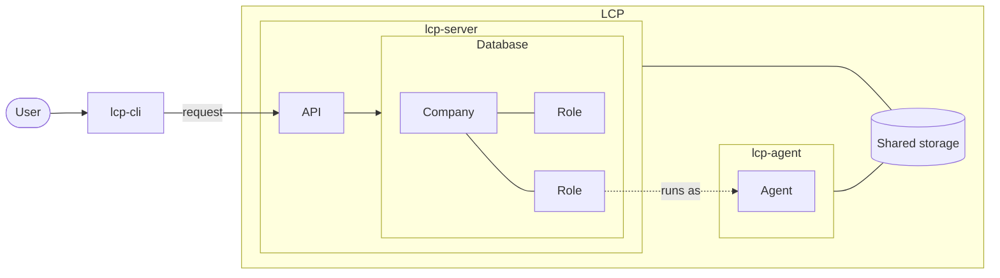
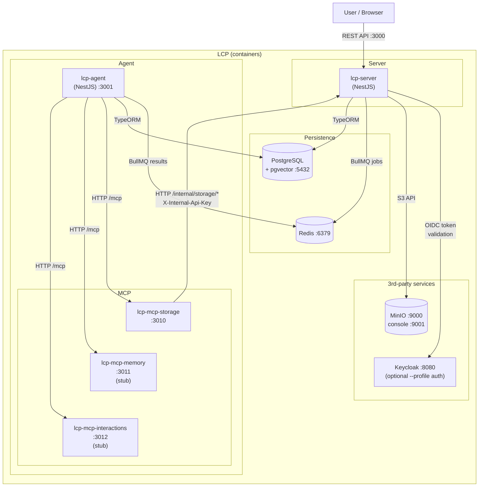
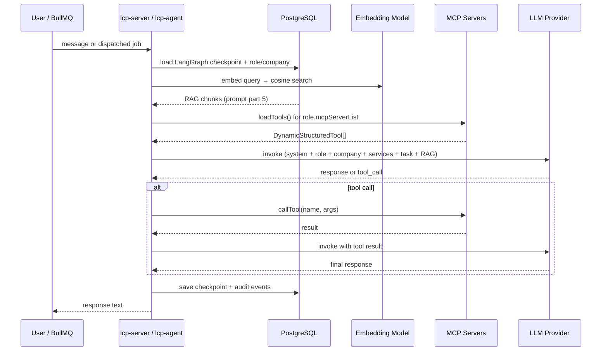
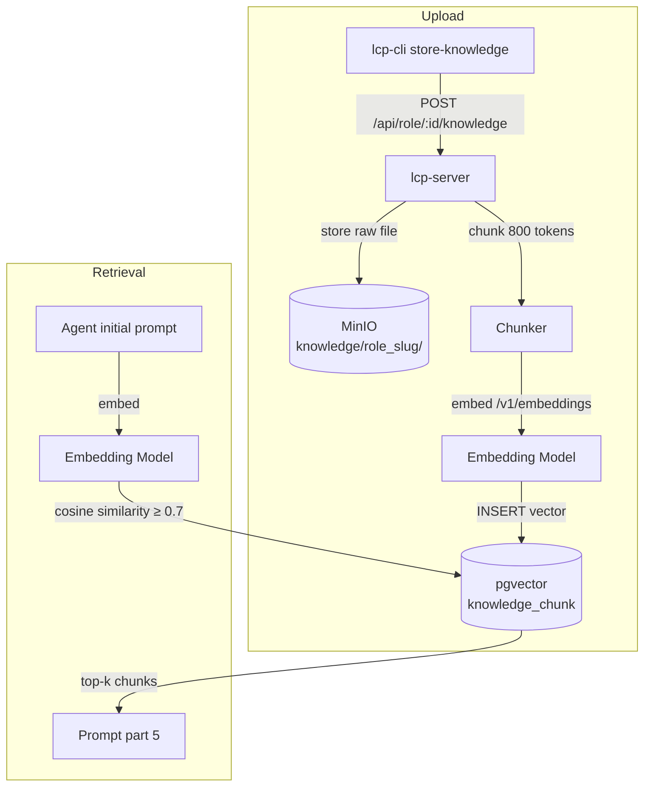

# LCP server

LCP manages one or more companies of AI agents that collaborate to complete tasks.

[](https://github.com/instantiator/lcp-server/actions/workflows/ci.yml)

## Key concepts

| Entity     | Definition                                                                      |
| ---------- | ------------------------------------------------------------------------------- |
| Company    | A collection roles, with shared resources, that can be tasked.                  |
| Role       | A dataset giving an agent a set of expertise to draw from.                      |
| Agent      | An instance of an LLM, given a role, and an assignment.                         |
| Task       | A high level task for a company to achieve.                                     |
| Plan       | A series of assignments designed to complete a task.                            |
| Assignment | A smaller piece of a task, given to an agent with a specified role to complete. |

| Application          | Purpose                                                                                           |
| -------------------- | ------------------------------------------------------------------------------------------------- |
| lcp-cli              | User-facing CLI interface to simplify interactions with lcp-server.                               |
| lcp-server           | API and orchestration service for the system.                                                     |
| lcp-agent            | Manages agents and the agent loop. Interacts with lcp-server to receive and complete assignments. |
| lcp-mcp-interactions | MCP tools allowing agents to interact with assignments and task plans.                            |
| lcp-mcp-memory       | MCP tools allowing agents to retrieve memory from their stored expertise.                         |
| lcp-mcp-storage      | MCP tools allowing agents interact with shared storage.                                           |



> A user talks to LCP through `lcp-cli`, which calls lcp-server's API. Companies and their roles are persisted in the database; an agent is a running instance of one role, executing in lcp-agent.

## Getting started

See **[Setup checklist](docs/setup-checklist.md)** for a step-by-step first-time setup guide.

**Quick start** (prerequisites: Docker, Node.js 24):

> [!NOTE]
> The `start-dev.sh` script builds and launches LCP with an instance of Keycloak to manage authorisation. This will be configured with an `lcp` realm, and a default user. It can take several minutes to launch.
>
> - **Username:** `test`
> - **Password:** `test`

```bash
git clone --recurse-submodules https://github.com/instantiator/lcp-server.git && cd lcp-server
cp .env.example .env
npm install
scripts/run-dev.sh
```

### Tutorial

Follow the steps in **[Your first company](docs/your-first-company.md)** to populate and interact with a simple agent in a company.

---

## System architecture

| Concern               | Technology                     |
| --------------------- | ------------------------------ |
| Framework             | NestJS 11                      |
| ORM                   | TypeORM                        |
| Database (production) | PostgreSQL 16 + pgvector       |
| Database (unit tests) | better-sqlite3 (in-memory)     |
| Auth                  | OAuth2/OIDC (Keycloak default) |
| Object storage        | MinIO                          |
| Task queue            | Redis (BullMQ)                 |
| Schema export         | ts-json-schema-generator       |

See [docs/ADRs/](docs/ADRs/) for decisions on upcoming components (agent runner, memory, orchestration).

### Main service

The main service topology.



> ### Service overview
>
> - **lcp-server** is the REST API and orchestration layer
> - **lcp-server** communicates directly with the authorisation service, and storage service
> - **lcp-server** and **lcp-agent** use Postgres to store and manage state, and Redis with BullMQ queues to communicate
> - **lcp-agent** consumes BullMQ jobs and runs the LangGraph agent loop.
> - Three MCP servers provide tool access to agents:
>   - **lcp-mcp-storage** proxies file operations to lcp-server's internal storage endpoints
>   - **lcp-mcp-memory** manages RAG access to embeddings from role-knowledge and company-knowledge, and memories
>   - **lcp-mcp-interactions** manages interactions between
> - **PostgreSQL** (with pgvector) stores entities, agent checkpoints, and knowledge embeddings
> - **MinIO** stores knowledge documents, task files, and context-overflow data
> - **Keycloak** is an optional auth service, which starts if the `auth` profile is specified (ie. with `--profile auth`)

### Agent loop

How a single agent turn flows through the system.



> #### Agent turn flow
>
> The agent receives a message or is dispatched as a background job. The system loads the LangGraph checkpoint (conversation history) from PostgreSQL, retrieves relevant RAG chunks via pgvector, and loads MCP tools for the role. The LLM is invoked with the assembled prompt. If the model requests a tool call, the tool is executed via the appropriate MCP server and the result is fed back. The final response and checkpoint are persisted.

### RAG subsystem

How knowledge documents flow from upload to retrieval.



> RAG subsystem: knowledge documents are uploaded via the CLI, chunked into ~800-token segments, embedded using the company's embedding model, and stored as vectors in PostgreSQL (pgvector). When an agent runs, the initial prompt is embedded and the most similar chunks above the 0.7 cosine threshold are retrieved and injected into the prompt. The embedding model is configured separately from the chat LLM via `company.embeddingConfig`.

### Documentation

Key architectural decisions are documented as ADRs in [docs/ADRs/](docs/ADRs/).

See [docs/index.md](docs/index.md) for the full list with implementation status.

---

## Testing

See **[Testing](docs/testing.md)** for the testing strategy and full tier descriptions.
See **[Scripts](docs/scripts.md)** for all available scripts.

Quick reference:

```bash
./scripts/run-unit-tests.sh         # no services required
./scripts/run-integration-tests.sh  # starts postgres, redis, minio
./scripts/run-smoke-tests.sh        # starts full stack including Keycloak
./scripts/run-e2e-tests.sh          # starts postgres, redis, minio
```

## Commands reference

| Command                      | Purpose                                                |
| ---------------------------- | ------------------------------------------------------ |
| `npm run build`              | Compile both apps to `dist/`                           |
| `npm run build lcp-server`   | Compile lcp-server only                                |
| `npm run build lcp-agent`    | Compile lcp-agent only                                 |
| `npm run start:dev`          | Start lcp-server with hot reload                       |
| `npm run lint`               | ESLint with auto-fix                                   |
| `npm run format`             | Prettier over `apps/`, `libs/`, and `docs/`            |
| `npm test`                   | Unit tests                                             |
| `npm run test:e2e`           | E2E tests                                              |
| `npm run test:integration`   | Integration tests (needs Docker)                       |
| `npm run test:smoke`         | Smoke tests (needs `docker compose up --profile auth`) |
| `npm run schema:generate`    | Regenerate [schemas/schema.json](schemas/schema.json)  |
| `npm run licenses:generate`  | Regenerate [docs/licenses.md](docs/licenses.md)        |
| `npm run migration:generate` | Generate a new TypeORM migration                       |
| `npm run migration:run`      | Run pending migrations                                 |
| `npm run migration:revert`   | Revert the last migration                              |
