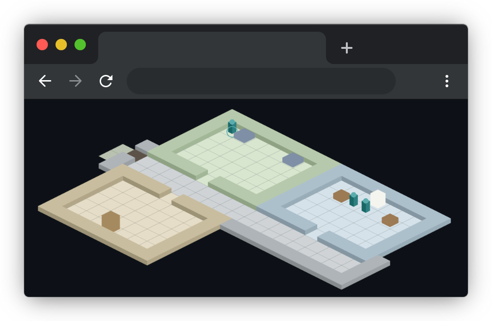

# Tiny Computer People

TCP manages one or more companies of AI agents that collaborate to complete tasks.

[](https://github.com/instantiator/tcp-server/actions/workflows/ci.yml)



## Quick start

Get started by cloning this repository and launching the setup wizard.

```bash
git clone https://github.com/instantiator/tcp-server.git
cd tcp-server ./scripts/setup-wizard.sh
```

The wizard checks your prerequisites, installs dependencies, asks a few configuration questions, and starts the stack — then prints the service URLs and sign-in credentials. See **[Your first company](docs/your-first-company.md)** for what to do next.

> [!TIP]
> To clear down your database and use pre-existing test data, use:
>
> ```bash
> ./scripts/start-dev.sh --reset
> ```

## Key concepts

| Entity     | Definition                                                                     |
| ---------- | ------------------------------------------------------------------------------ |
| Company    | A collection Roles, with shared resources, that can be tasked.                 |
| Role       | A dataset giving an Agent a set of expertise to draw from.                     |
| Agent      | An instance of an LLM, given a Role, and an Assignment.                        |
| Task       | A high level task for a company to achieve.                                    |
| Plan       | A series of Assignments designed to complete a task.                           |
| Assignment | A smaller piece of a Task, given to an Agent with a specific Role to complete. |

### How it fits together

Your part...

1. Create a new Company with a mission.
2. Add some Roles, and give each role an identity and some knowledge.
3. When ready, create a new Task for the Company.

The automated part...

4. An Agent with the assigned planning role will pick it up and create a Plan.
5. Agents start taking assignments.
6. When all Assignments in the Plan are complete, a finalisation Agent runs - checking and preparing the final outputs.

> [!NOTE]
> You'll find the result in the company's shared document store.

## Documentation

Good starting points...

- [Documentation index](docs/index.md)
- [Development](docs/development.md)

## AI assisted coding

This project is not vibe-coded, nor is it a fully human endeavour.

The code in this repository was created with a prompt / planning / implementation cycle, with human review points. Design and development prompts are documented in [docs/prompts](./docs/prompts/).

> [!NOTE]
> Some work required repeated development cycles, and many plans were refined multiple times until ready - so the prompt sequence here is not the full story.

### Coding standards

Code quality properties are enforced by [dev-qual](https://github.com/instantiator/dev-qual), a collation of tools, scripts, skills, and guidance to help AI assisted coding agents produce high quality, reliable code.

The code is written to be readable.

- All code is required to meet quality standards and guidance
- All code must be tested (with few exceptions)
- Pre-existing frameworks are used wherever possible
- Libraries are selected for maturity and maintenance tells
- Code quality is enforced by pre-commit, pre-push hooks, CI workflow and branch protections
