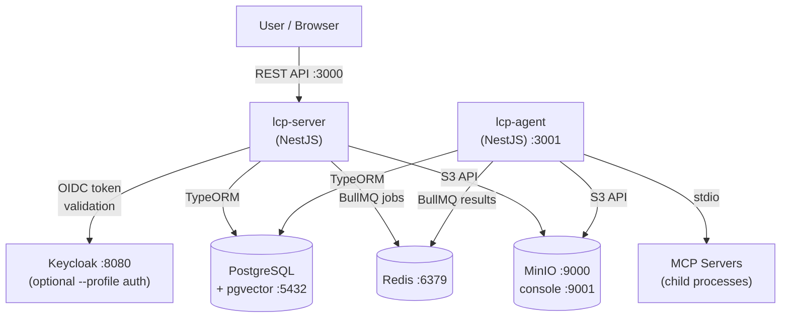

# Little Computer People (LCP) Server

LCP manages one or more companies of AI agents that collaborate to complete tasks.

[](https://github.com/instantiator/lcp-server/actions/workflows/ci.yml)

## Companies

A company consists of several specialists or generalists, each provided with:

- Overview of the organisation
- Identity prompt
- Reference material
- Personal knowledge database
- Access to tools
- Membership of a group where they can initiate conversations with other agents

## Tasks

Tasks are given to the company, who then work collaboratively to resolve them. A planner agent creates a plan incorporating knowledge of the company's roles and their skills. Each plan step is assigned to an agent role that executes it and reports back.

## System architecture



Key architectural decisions are documented as ADRs in [docs/ADRs/](docs/ADRs/). See [docs/index.md](docs/index.md) for the full list with implementation status.

## Getting started

See **[docs/setup-checklist.md](docs/setup-checklist.md)** for a step-by-step first-time setup guide.

**Quick start** (prerequisites: Docker, Node.js 24):

```bash
git clone --recurse-submodules <repo-url> && cd lcp-server
cp .env.example .env
npm install
docker compose up -d
```

## Testing

See **[docs/testing.md](docs/testing.md)** for the testing strategy and full tier descriptions.
See **[docs/scripts.md](docs/scripts.md)** for all available scripts.

Quick reference:

```bash
./scripts/run-unit-tests.sh         # no services required
./scripts/run-integration-tests.sh  # starts postgres, redis, minio
./scripts/run-smoke-tests.sh        # starts full stack including Keycloak
./scripts/run-e2e-tests.sh          # starts postgres, redis, minio
```

## Technologies

| Concern               | Choice                                       |
| --------------------- | -------------------------------------------- |
| Framework             | NestJS 11                                    |
| ORM                   | TypeORM                                      |
| Database (production) | PostgreSQL 16 + pgvector                     |
| Database (unit tests) | better-sqlite3 (in-memory)                   |
| Auth                  | OAuth2/OIDC (Keycloak default)               |
| Object storage        | MinIO                                        |
| Task queue            | Redis (BullMQ — configured, workers pending) |
| Schema export         | ts-json-schema-generator                     |

See [docs/ADRs/](docs/ADRs/) for decisions on upcoming components (agent runner, memory, orchestration).

## Commands reference

| Command                      | Purpose                                                |
| ---------------------------- | ------------------------------------------------------ |
| `npm run build`              | Compile both apps to `dist/`                           |
| `npm run build lcp-server`   | Compile lcp-server only                                |
| `npm run build lcp-agent`    | Compile lcp-agent only                                 |
| `npm run start:dev`          | Start lcp-server with hot reload                       |
| `npm run lint`               | ESLint with auto-fix                                   |
| `npm run format`             | Prettier over `apps/` and `libs/`                      |
| `npm test`                   | Unit tests                                             |
| `npm run test:e2e`           | E2E tests                                              |
| `npm run test:integration`   | Integration tests (needs Docker)                       |
| `npm run test:smoke`         | Smoke tests (needs `docker compose up --profile auth`) |
| `npm run schema:generate`    | Regenerate [schemas/schema.json](schemas/schema.json)  |
| `npm run licenses:generate`  | Regenerate [docs/licenses.md](docs/licenses.md)        |
| `npm run migration:generate` | Generate a new TypeORM migration                       |
| `npm run migration:run`      | Run pending migrations                                 |
| `npm run migration:revert`   | Revert the last migration                              |
