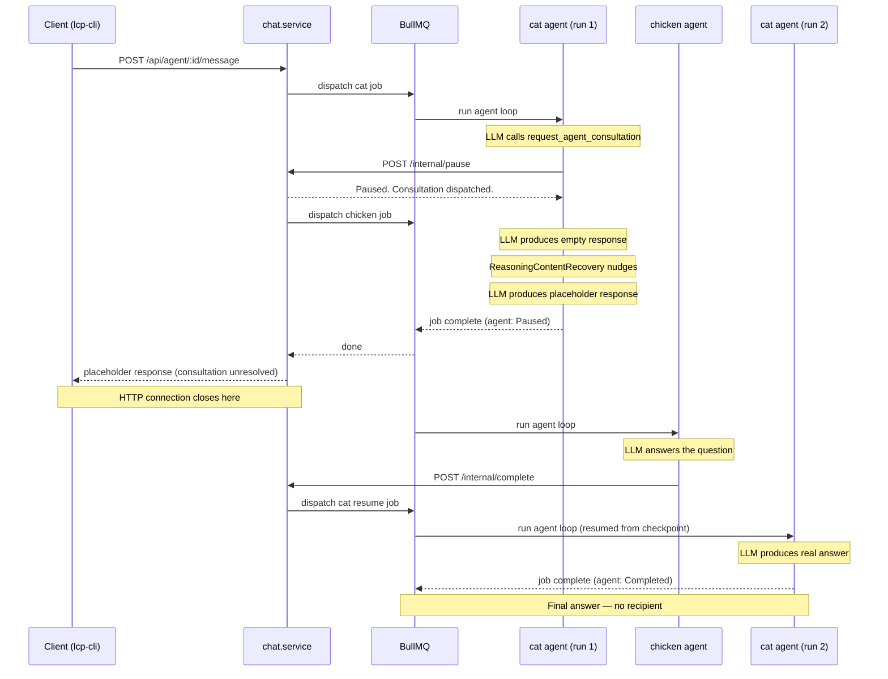
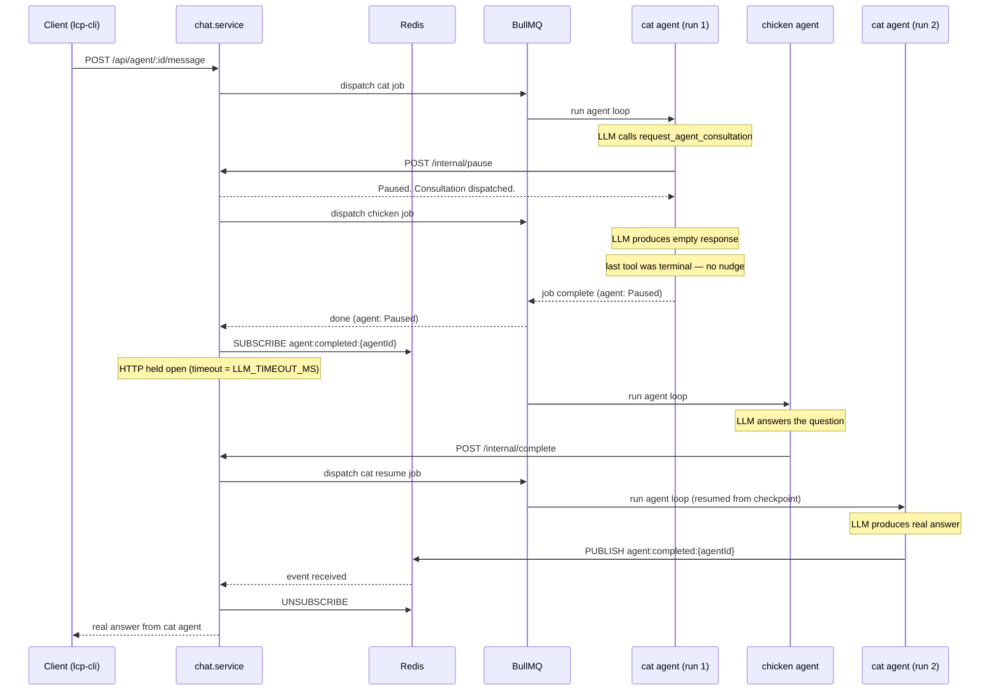

# ADR-012: Human-in-the-Loop and User-Agent Conversations

Status: Partially Implemented

## Context

LCP supports bidirectional interaction between users and agents:

1. **Agent-initiated pause**: a running agent needs input or clarification from a user before it can continue
2. **User-initiated conversation**: a user opens a thread with a role to teach it, ask it a question, or give it a direct task outside of the normal task pipeline
3. **User observation**: a user watches a task in progress — seeing the audit stream in real time

All conversations are **persisted** (for continuity and audit).

## Conversation modes

### 1. Agent-initiated pause

When a running agent needs user input:

1. Agent calls a `request_user_input(question, context?)` MCP tool
2. lcp-agent emits a `request_user_input` event to the `agent-results` queue
3. Orchestrator calls LangGraph's `interrupt()` on the current step — the graph is suspended
4. A `Conversation` record is created in the database, linked to the task step, with `status = awaiting_user`
5. The user is notified (visible via API polling or SSE subscription)
6. User responds via `POST /conversations/{id}/reply`
7. Orchestrator resumes the LangGraph graph, injecting the user's reply as the `interrupt` return value
8. Agent continues with the reply in its context

### 2. User-initiated conversation

A user can open a conversation thread with any role at any time, independent of a running task:

1. `POST /conversations` with `{ role_name, initial_message }`
2. Orchestrator spins up a short-lived lcp-agent job using the specified role's config
3. The agent loop runs until the conversation is idle or explicitly closed
4. Each reply: `POST /conversations/{id}/reply` → queued to the agent job → response returned via SSE or polling

#### Teaching a role

If the user wants to teach the role (add to its memory or knowledge base):

- User includes `{ teach: true }` in their message
- On completion of the conversation turn, the orchestrator identifies the learned content and calls the memory MCP server's `remember()` tool, tagged with `source: 'user-teaching'`
- If the content is better suited as a KB document, the user can indicate `{ teach: 'knowledge' }` — the content is written as an OKF document to company storage and re-indexed (see [ADR-006](./ADR-006-agent-memory-architecture.md))

### 3. User observation (real-time audit stream)

A user can subscribe to the live audit log for any task step:

`GET /tasks/{task_id}/audit/stream` — SSE endpoint that pushes new `audit_events` rows as they are written

## Transport options

| Option                       | Notes                                                                                      |
| ---------------------------- | ------------------------------------------------------------------------------------------ |
| **REST + polling**           | Simplest; user polls `/conversations/{id}` for new messages. Adequate but latency-limited. |
| **Server-Sent Events (SSE)** | Good for one-way streaming (agent output, audit log). Built into NestJS with `@Sse()`.     |
| **WebSockets**               | Full duplex; best for interactive conversation UX. More complex.                           |

## Decision

**SSE for streaming; REST for conversation turns** (initial implementation).

- Agent output and audit log observation: SSE (`@Sse()` in NestJS)
- Conversation message exchange: REST POST/GET — simple enough; no WebSocket needed initially
- LangGraph `interrupt()` is the mechanism for agent-initiated pause

WebSocket upgrade is a natural future extension when a real-time conversation UX is required.

## Conversation data model

```typescript
interface Conversation {
  id: UUID;
  company_id: UUID;
  role_name: string;
  task_id?: UUID; // set if agent-initiated during a task step
  step_id?: UUID;
  status: 'awaiting_user' | 'awaiting_agent' | 'closed';
  created_at: Date;
  messages: ConversationMessage[];
}

interface ConversationMessage {
  id: UUID;
  conversation_id: UUID;
  author: 'user' | 'agent';
  content: string;
  timestamp: Date;
  teach?: 'memory' | 'knowledge'; // set by user to trigger teaching flow
}
```

## Implementation status

### What changed from the original plan

**LangGraph `interrupt()` was not used.** The implementation uses a different, simpler mechanism:

1. The MCP tool calls `POST /internal/pause` on lcp-server
2. lcp-server sets `LcpAgent.status = paused` and creates the pending record
3. lcp-agent detects the `paused` status on the next iteration of its event loop and exits the stream cleanly
4. The BullMQ job completes normally (the agent is paused, not failed)
5. On resume, lcp-server re-enqueues a new BullMQ job; lcp-agent resumes from the LangGraph checkpoint with the reply injected as a `HumanMessage`

This avoids LangGraph's `interrupt()` mechanism entirely. The checkpoint store (PostgresSaver) handles state persistence naturally between the pause and resume BullMQ jobs.

**`Conversation` links to `agentId`, not `task_id/step_id`.** `Task` and `TaskStep` entities do not yet exist. Conversations are linked to `LcpAgent.id` instead.

**`complete_task` is a mandatory tool call, not a passive flow.** Agents must call `complete_task` (on lcp-mcp-interactions) as their final action. This writes the agent's `output` field and triggers consultation resume if applicable. lcp-agent enforces this via `LcpAgent.requiredToolCalls`: when the stream ends without every required call having fired (default `['complete_task']`; an empty array opts out), the agent is re-prompted with an explicit reminder up to `AGENT_REQUIRED_TOOL_RETRIES` times (default 2) before the run is failed. Narrated text is never accepted in place of the required calls for enforced agents.

**Consultations target a role id, not a role name.** Role names aren't unique within a company, so `request_agent_consultation` looks the role up by `roleId` (from `list_available_contacts`), scoped to `companyId`. `roleName` is accepted only as an optional label for logging.

**`request_user_input` can target specific users.** An optional `userIds` argument (from `list_available_contacts`) routes the question directly to those users, bypassing the keyword-matching heuristic. Any one of the targeted users replying resolves the request.

**Resume is gated and aggregates multiple responses.** `LcpAgent.pausedAt` is set whenever an agent transitions to `Paused`. `AgentOrchestrationService.resumeAgent` — the single choke point both pause flows call into — only re-enqueues the agent once it has no remaining outstanding `PendingConsultation` (`status: 'pending'`) or `Conversation` (`status: 'awaiting_user'`) rows. When the gate passes, the resume message combines every response received since `pausedAt`, not just the one that happened to resolve last. This lets an agent raise multiple requests (e.g. consult a role and ask a user) before pausing and see every answer on resume.

> **Note (008.6):** clearing `pausedAt` is now an atomic conditional `UPDATE ... WHERE id = :agentId AND pausedAt = :pausedAt` (via `createQueryBuilder`), not a plain read-then-write. Two near-simultaneous resume triggers for the same pause episode (e.g. a retried fire-and-forget completion notification) used to both pass the outstanding-requests check and both enqueue a duplicate `resume` job carrying the same aggregated reply — the observed "duplicate Consultation response message" bug. Only the caller that wins the conditional update (`affected: 1`) proceeds; the loser (`affected: 0`) no-ops and returns the agent unchanged. See [ADR-013 Amendments](ADR-013-prompt-assembly-context-management.md#amendments-as-implemented-0086).

### Implemented

- `Conversation` entity: `(id, slug, agentId, companyId, roleName, roleId, question, context, status, routedToIdentifiers, createdAt, closedAt)`
- `ConversationMessage` entity: `(id, conversationId, author, authorIdentifier, content, timestamp)`
- `PendingConsultation` entity: `(id, callingAgentId, consultationAgentId, status, result, createdAt)`
- `LcpAgent` entity: added `output` field (set by `complete_task`) and `pausedAt` field (scopes responses to the current pause episode for resume aggregation)
- `LcpRole` entity: added `queryIndex` field (incremented per query to generate slug suffixes)
- `PauseAndResumeService` in lcp-server — shared logic for both pause flows
- `POST /internal/pause` — creates Conversation or PendingConsultation, sets agent to paused
- `POST /internal/agent/:agentId/complete` — sets status completed, stores output, triggers consultation resume (subject to gating, see above)
- `AgentOrchestrationService.resumeAgent` — internal-only choke point both `complete_task` and conversation replies call into; no separate REST endpoint
- `GET /api/conversation` — list conversations (filter by status, companyId)
- `GET /api/conversation/:slug` — full conversation + messages
- `POST /api/conversation/:slug/reply` — user reply; closes conversation; triggers agent resume
- Query routing in `ConversationService`: keyword match on question content against user `knowledgeDomains` and `roles`; falls back to all owners
- Slug generation: `{role-slug}-{queryIndex}` — `queryIndex` incremented atomically in a DB transaction
- CLI commands: `list-open-queries`, `read-query`, `respond` (see [lcp-cli.md](../lcp-cli.md))
- **Required tool call tracking** — `LcpAgent.requiredToolCalls?: string[]` (null → default `['complete_task']`, `[]` opts out); `AgentLoopService` tracks fired tool names during the stream and re-prompts up to `AGENT_REQUIRED_TOOL_RETRIES` (default 2) times when required calls are missing, then fails the run. Consultation agents are created with `requiredToolCalls: ['complete_task']` explicitly. Required tools absent from the loaded toolset are skipped with a warning.
- **Consultation failure propagation** — every failure exit in the agent loop notifies `POST /internal/agent/:agentId/fail` (via `AuditClientService.notifyFailed`, fire-and-forget like `notifyComplete`); `PauseAndResumeService.failAgent` marks the pending consultation `status: 'failed'` with the reason as `result` and resumes the calling agent, whose resume message renders it as `Consultation FAILED: <reason>…` with guidance to escalate via `request_user_input` if a response is essential. A lost `notifyFailed` HTTP call leaves the caller paused until the client's SSE timeout — the same exposure as `notifyComplete`. (Historically the failing run also published `''` on `agent:completed:{agentId}`; that channel was retired by [ADR-015](ADR-015-agent-completion-sse.md) — the terminal `failed` event now originates in `PauseAndResumeService.failAgent`.)

### Deferred

- User-initiated conversations (`POST /conversations` independent of a running task)
- WebSocket upgrade for real-time conversation UX
- Teaching flow (`{ teach: 'memory' | 'knowledge' }` in replies)
- `GET /tasks/{task_id}/audit/stream` SSE endpoint
- ~~**SSE-based completion delivery** — replace the current long-poll (`waitForAgentCompletion`) with `202 Accepted` + `completed` SSE event~~ — **done**, see [ADR-015](ADR-015-agent-completion-sse.md) (amended)

## Agent-to-agent consultation flow

### Current behaviour

The BullMQ job for the calling agent (cat) completes as soon as the agent
pauses. The `chat.service` HTTP handler returns at that point with whatever
the LLM said before pausing — typically a placeholder like "I've asked the
chicken…" — and the HTTP connection closes. The resumed run later produces the
real answer, but no one is waiting for it.

> **Note (008.6):** the "LLM produces empty response" / "ReasoningContentRecovery nudges" / "last tool was terminal — no nudge" steps shown in both diagrams below were, at the time of writing, a _suppressed symptom_ — the graph's `tools → agent` edge still routed back into one more (unwanted) model call after a terminal tool result, and `ReasoningContentRecovery` just papered over the resulting empty/placeholder response. Since 008.6 this no longer happens at all: `runSupervisedGraph` (`libs/lcp-shared/src/llm/run-supervised-graph.ts`) compiles the graph with `interruptAfterTools: true` and calls `abortController.abort()` as soon as a post-tool status check finds `Paused`/`Completed`, so the graph cannot reach that extra model call in the first place. The diagrams are left as historical record of the symptom this fix eliminates structurally; see [ADR-013 Amendments](ADR-013-prompt-assembly-context-management.md#amendments-as-implemented-0086) for the fix itself.



### Proposed improvement: Redis pub/sub notification

> **Superseded by [ADR-015](ADR-015-agent-completion-sse.md) (amended).** The
> Redis long-poll described below (`agent:completed:{agentId}` +
> `waitForAgentCompletion`, HTTP held open) was implemented and has since been
> replaced: `POST /message` now returns `202` immediately and the resumed run's
> answer is delivered over the agent's SSE event stream. The pause/resume
> mechanics (points 1–2) still hold; only the completion-delivery transport
> changed. The sequence diagram below is retained for historical context.

Two changes close the gap without holding any BullMQ thread open:

1. **Suppress the spurious nudge.** `ReasoningContentRecovery` checks whether
   the last `ToolMessage` in the conversation is a terminal one ("Paused." /
   "Task marked complete.") — if so, it returns the empty response as-is
   rather than nudging the LLM to produce a placeholder.

2. **Hold the HTTP request open across the pause/resume cycle.** After the
   first BullMQ job completes with the agent in `Paused` state, `chat.service`
   subscribes to `agent:completed:{agentId}` on Redis. When the cat's resumed
   run finishes, `AgentLoopService` publishes the final response text to that
   key. `chat.service` receives it, unsubscribes, and returns it to the client.
   The BullMQ jobs themselves are unaffected — they still start and finish
   normally; the only resource held open is the HTTP connection.



## Consequences

- `Conversation`, `ConversationMessage`, `PendingConsultation` entities in `libs/lcp-shared/src/models/`
- Pause/resume is BullMQ-based (checkpoint + re-enqueue), not LangGraph `interrupt()`
- Agents must call `complete_task` as their last action; lcp-agent enforces this via `requiredToolCalls` with up to `AGENT_REQUIRED_TOOL_RETRIES` (default 2) reminder prompts, then fails the run and propagates the failure to any waiting caller

## Open Questions / Assumptions

- Notification mechanism: the `routedToIdentifiers` field is populated but no push notification is sent — users poll `list-open-queries` or the API. SSE push and webhook notification are natural future extensions.
- Conversation history on resume: only the response(s) from the current pause episode are injected as a new `HumanMessage`; the full conversation thread is not re-injected (the LangGraph checkpoint already holds the prior context).
