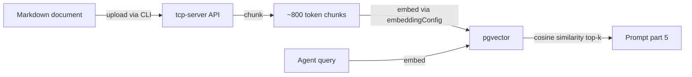
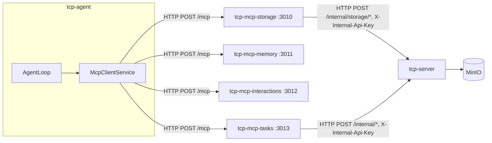

# Agent Services — RAG, MCP, and Storage

This document covers the three agent-facing service layers added in the 006 work stream:

- **RAG** — retrieval-augmented generation from role knowledge documents
- **MCP servers** — external tool access via the Model Context Protocol
- **Storage** — MinIO bucket layout and the storage MCP server

For manual testing steps, see [docs/manual-testing/start.md](manual-testing/start.md).

## RAG (Retrieval-Augmented Generation)

Relevant knowledge is retrieved from a per-role document store and injected into prompt part 5 before each LLM call.

### How it works



1. Knowledge documents (`.md`, `.txt`, `.html`, `.pdf`, `.docx`, `.csv`, `.json`, `.yaml`) are uploaded per role, or to a company's shared knowledge, via `tcp-cli store-knowledge` — the server converts non-`.md` formats to OKF Markdown before storing (see [tcp-cli.md → store-knowledge](tcp-cli.md#store-knowledge)).
2. Each document is split into ~800-token chunks, embedded via the company's `embeddingConfig` model, and stored in the `knowledge_chunk` PostgreSQL table (pgvector column) — `roleId` is `null` for company-shared chunks. Indexing is asynchronous and kept in sync with storage automatically (write hook + reconciliation poller); see [shared-storage.md → Automatic RAG sync](shared-storage.md#automatic-rag-sync-01022).
3. When an agent runs, the initial prompt is embedded and the top-k most similar chunks above a 0.7 cosine threshold are retrieved. Retrieval is scoped to the agent's **role plus its company's shared** chunks (`("roleId" = role) OR ("roleId" IS NULL AND "companyId" = company)`), and never another company's.
4. Retrieved chunks are injected as prompt part 5. If the RAG text exceeds the context budget, it is compacted or stored to MinIO (context overflow) before injection.

### Configuring the embedding model

Add an `embeddingConfig` to the company:

```json
{
  "embeddingConfig": {
    "provider": "lm-studio",
    "baseUrl": "http://localhost:1234/v1",
    "model": "nomic-embed-text",
    "contextWindow": 8192
  }
}
```

`embeddingConfig` follows the same shape as `llmConfig` but points to a model that supports `/v1/embeddings`. LM Studio with `nomic-embed-text` is the recommended local option. If `embeddingConfig` is absent, RAG is silently skipped.

### CLI commands

| Command                                                         | Description                                                         |
| --------------------------------------------------------------- | ------------------------------------------------------------------- |
| `store-knowledge (--role <id>\|--company <id>) --source <path>` | Upload and index a document (converted to OKF Markdown server-side) |
| `list-knowledge (--role <id>\|--company <id>)`                  | List indexed documents                                              |
| `get-knowledge (--role <id>\|--company <id>) --file <name>`     | Get a document's content                                            |
| `delete-knowledge (--role <id>\|--company <id>) --file <name>`  | Remove a document and its chunks                                    |
| `open-document-store`                                           | Print/open the MinIO console URL                                    |

### OKF document format

Stored documents are Markdown files with YAML front-matter containing at least a `title` field:

```markdown
---
title: Company Policies
author: Alice
---

# Policies

...content...
```

`.md` uploads must already be in this format and are rejected at upload time if not. Other supported formats are converted to it server-side — the title comes from the source (an HTML `<title>`, a DOCX heading), falling back to the first Markdown heading in the converted body, then the filename.

## MCP Servers

Agents access external tools via the Model Context Protocol. Four MCP servers run as Docker Compose services.

### Architecture



Each MCP server uses the **Streamable HTTP transport** with a stateless per-request model — a fresh MCP session is created for each tool call. The servers expose `GET /health` and `POST /mcp`.

### Available servers

| Server                                          | Port | Status      | Description                                                                                                      |
| ----------------------------------------------- | ---- | ----------- | ---------------------------------------------------------------------------------------------------------------- |
| [tcp-mcp-storage](tcp-mcp-storage.md)           | 3010 | Implemented | Read/write access to the shared MinIO object store, proxied through tcp-server                                   |
| [tcp-mcp-memory](tcp-mcp-memory.md)             | 3011 | Implemented | Hybrid pgvector search over episodic memory and role/shared knowledge (`recall`, `remember`, `search_knowledge`) |
| [tcp-mcp-interactions](tcp-mcp-interactions.md) | 3012 | Implemented | Request input from a human user or consult another agent by role                                                 |
| [tcp-mcp-tasks](tcp-mcp-tasks.md)               | 3013 | Implemented | Complete your assignment — plan a task, submit finished work, or assure QA (mode-gated)                          |

See the individual server docs for tool reference, argument details, and implementation status.

### Enabling MCP tools for a role

Add server names to the role's `mcpServerList`:

```json
{
  "mcpServerList": ["storage", "memory"]
}
```

At agent startup, `McpClientService` loads tools from each listed server. Tools are prefixed `{serverName}__` (e.g. `storage__list_files`) to avoid name collisions across servers. The LangGraph graph adds a conditional `ToolNode` when any tools are available.

The agent receives prompt part 3 listing available servers and is directed to call `describe_server` on each before using its tools.

**Tool-schema gating — removed in 010.2.8.2.** From 008.6 through 010.2.8, only each server's `describe_server` tool was bound to the model at first; a server's other tools became bound only after the agent called `describe_server`, tracked per-run by `ToolVisibilityTracker`. That mechanism (and `ToolVisibilityTracker`) is gone: all mode-filtered tools are now bound to the model from turn 1, since their schemas are compact and the gating cost extra round-trips and let weak models "forget" a tool. Mode filtering (`@tcp/shared` `mode-tools.ts`) still limits which servers/tools a mode gets. See [ADR-013 Amendments](ADRs/ADR-013-prompt-assembly-context-management.md#amendments-as-implemented-010282).

**Identity fields (`agentId`, `companyId`):** `loadTools` accepts an optional context (`{ agentId, companyId }`) for the agent currently running. Any tool parameter matching one of those names is removed from the schema the LLM sees and the real value substituted on every call, regardless of what (if anything) the LLM supplies — the LLM has no reliable way to know its own `agentId` (it's a DB id, not part of its context) and shouldn't be trusted to assert one. This is why `request_user_input`/`request_agent_consultation` in `tcp-mcp-interactions` and `create_plan`/`complete_assignment`/`assure_assignment` in `tcp-mcp-tasks` no longer need `agentId`/`companyId` filled in by the model, even though those fields are still part of the MCP server's published tool schema.

### MCP server URLs

MCP server URLs are resolved from environment variables:

| Variable               | Default (Docker Compose)               |
| ---------------------- | -------------------------------------- |
| `MCP_STORAGE_URL`      | `http://tcp-mcp-storage:3010/mcp`      |
| `MCP_MEMORY_URL`       | `http://tcp-mcp-memory:3011/mcp`       |
| `MCP_INTERACTIONS_URL` | `http://tcp-mcp-interactions:3012/mcp` |
| `MCP_TASKS_URL`        | `http://tcp-mcp-tasks:3013/mcp`        |

If a variable is unset, that server is silently skipped. Agents run with only the servers that resolved successfully.

## Storage layout

All company data is stored in a single MinIO bucket per company, namespaced by `company.slug`. See [Shared Storage → Folder structure](shared-storage.md#folder-structure) for the full, current layout (tasks, assignment working/completed areas, knowledge, audit), the toolset table, and context-overflow handling.
