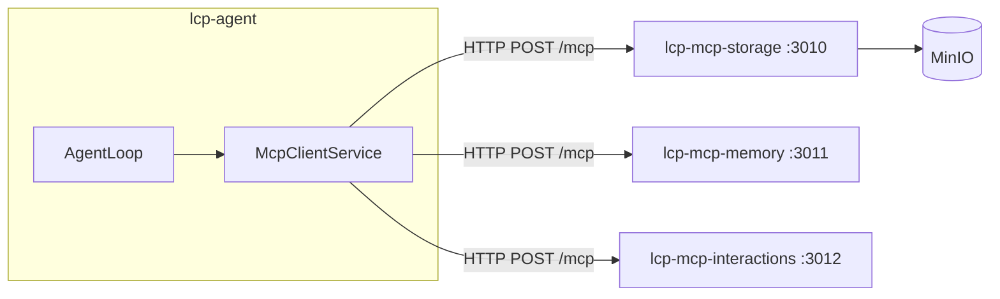

# Agent Services — RAG, MCP, and Storage

This document covers the three agent-facing service layers added in the 006 work stream:

- **RAG** — retrieval-augmented generation from role knowledge documents
- **MCP servers** — external tool access via the Model Context Protocol
- **Storage** — MinIO bucket layout and the storage MCP server

For manual testing steps, see [docs/manual-testing/start.md](manual-testing/start.md).

---

## RAG (Retrieval-Augmented Generation)

Relevant knowledge is retrieved from a per-role document store and injected into prompt part 5 before each LLM call.

### How it works


1. Knowledge documents (Markdown, OKF format) are uploaded per role via `lcp-cli store-role-documents`.
2. Each document is split into ~800-token chunks, embedded via the company's `embeddingConfig` model, and stored in the `knowledge_chunk` PostgreSQL table (pgvector column).
3. When an agent runs, the initial prompt is embedded and the top-k most similar chunks above a 0.7 cosine threshold are retrieved.
4. Retrieved chunks are injected as prompt part 5. If the RAG text exceeds the context budget, it is compacted or stored to MinIO (context overflow) before injection.

### Configuring the embedding model

Add an `embeddingConfig` to the company:

```json
{
  "embeddingConfig": {
    "provider": "lm-studio",
    "baseUrl": "http://localhost:1234/v1",
    "model": "nomic-embed-text",
    "contextWindow": 8192
  }
}
```

`embeddingConfig` follows the same shape as `llmDefault` but points to a model that supports `/v1/embeddings`. LM Studio with `nomic-embed-text` is the recommended local option. If `embeddingConfig` is absent, RAG is silently skipped.

### CLI commands

| Command                                             | Description                       |
| --------------------------------------------------- | --------------------------------- |
| `store-role-documents --role-id <id> --src <glob>`  | Upload and index `.md` documents  |
| `list-role-documents --role-id <id>`                | List indexed documents            |
| `remove-role-documents --role-id <id> --src <glob>` | Remove documents and their chunks |
| `open-document-store`                               | Print/open the MinIO console URL  |

### OKF document format

Documents must be Markdown files with YAML front-matter containing at least a `title` field:

```markdown
---
title: Company Policies
author: Alice
---

# Policies

...content...
```

Documents failing this validation are rejected at upload time.

---

## MCP Servers

Agents access external tools via the Model Context Protocol. Three MCP servers run as Docker Compose services.

### Architecture



Each MCP server uses the **Streamable HTTP transport** with a stateless per-request model — a fresh MCP session is created for each tool call. The servers expose `GET /health` and `POST /mcp`.

### lcp-mcp-storage (port 3010)

Real MinIO integration. Tools:

| Tool                        | Description                                             |
| --------------------------- | ------------------------------------------------------- |
| `describe_server`           | Overview of all tools and path conventions              |
| `describe_folder(path)`     | Purpose of a folder by path prefix (ADR-007 convention) |
| `list_files(path)`          | List files under a path prefix                          |
| `read_file(path)`           | Read file text content                                  |
| `write_file(path, content)` | Create or overwrite a file                              |
| `delete_file(path)`         | Delete a file                                           |

### lcp-mcp-memory (port 3011)

Stub implementation. Returns informative "not yet implemented" responses that direct agents to use RAG context instead.

### lcp-mcp-interactions (port 3012)

Stub implementation. Returns informative "not yet implemented" responses for agent-to-agent consultation and user input requests.

### Enabling MCP tools for a role

Add server names to the role's `mcpServerList`:

```json
{
  "mcpServerList": ["storage", "memory"]
}
```

At agent startup, `McpClientService` loads tools from each listed server. Tools are prefixed `{serverName}__` (e.g. `storage__list_files`) to avoid name collisions across servers. The LangGraph graph adds a conditional `ToolNode` when any tools are available.

The agent receives prompt part 3 listing available servers and is directed to call `describe_server` on each before using its tools.

### MCP server URLs

MCP server URLs are resolved from environment variables:

| Variable               | Default (Docker Compose)               |
| ---------------------- | -------------------------------------- |
| `MCP_STORAGE_URL`      | `http://lcp-mcp-storage:3010/mcp`      |
| `MCP_MEMORY_URL`       | `http://lcp-mcp-memory:3011/mcp`       |
| `MCP_INTERACTIONS_URL` | `http://lcp-mcp-interactions:3012/mcp` |

If a variable is unset, that server is silently skipped. Agents run with only the servers that resolved successfully.

---

## Storage layout

All company data is stored in a single MinIO bucket per company, namespaced by `company.slug`:

```
{company_slug}/
  tasks/
    {task_id}/
      materials/       ← user-submitted task inputs (read-only for agents)
      output/          ← files written during task execution (agent working area)
  knowledge/
    {role_name}/       ← OKF knowledge documents for RAG indexing
  finished/
    {category}/        ← reports | specifications | designs | code | other
      {task_id}/
        {filename}     ← stable artefacts promoted from tasks/*/output/
  audit/
    {task_id}/
      {step_id}.jsonl  ← append-only audit log per task step
```

`tasks/*/output/` is the agent's working area. Finalised artefacts are promoted to `finished/{category}/{task_id}/` by the reviewing agent or orchestrator once a task completes — this keeps in-progress work separate from stable outputs accessible to all agents.

### Context overflow

When incoming RAG data or MCP responses still exceed the context budget after compaction, the original content is written to:

```
{company_slug}/tasks/{agent_id}/context-overflow/{timestamp}.txt
```

A reference summary is injected into the prompt in its place, noting the overflow location. If MinIO is unreachable or the write fails, the compacted (truncated) version is used instead.
