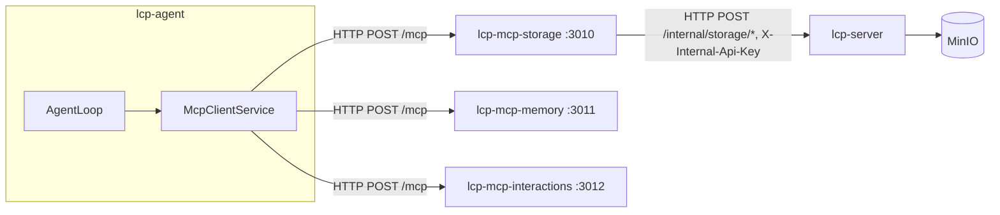

# Agent Services — RAG, MCP, and Storage

This document covers the three agent-facing service layers added in the 006 work stream:

- **RAG** — retrieval-augmented generation from role knowledge documents
- **MCP servers** — external tool access via the Model Context Protocol
- **Storage** — MinIO bucket layout and the storage MCP server

For manual testing steps, see [docs/manual-testing/start.md](manual-testing/start.md).

## RAG (Retrieval-Augmented Generation)

Relevant knowledge is retrieved from a per-role document store and injected into prompt part 5 before each LLM call.

### How it works


1. Knowledge documents (Markdown, OKF format) are uploaded per role via `lcp-cli store-role-documents`.
2. Each document is split into ~800-token chunks, embedded via the company's `embeddingConfig` model, and stored in the `knowledge_chunk` PostgreSQL table (pgvector column).
3. When an agent runs, the initial prompt is embedded and the top-k most similar chunks above a 0.7 cosine threshold are retrieved.
4. Retrieved chunks are injected as prompt part 5. If the RAG text exceeds the context budget, it is compacted or stored to MinIO (context overflow) before injection.

### Configuring the embedding model

Add an `embeddingConfig` to the company:

```json
{
  "embeddingConfig": {
    "provider": "lm-studio",
    "baseUrl": "http://localhost:1234/v1",
    "model": "nomic-embed-text",
    "contextWindow": 8192
  }
}
```

`embeddingConfig` follows the same shape as `llmConfig` but points to a model that supports `/v1/embeddings`. LM Studio with `nomic-embed-text` is the recommended local option. If `embeddingConfig` is absent, RAG is silently skipped.

### CLI commands

| Command                                             | Description                       |
| --------------------------------------------------- | --------------------------------- |
| `store-role-documents --role-id <id> --src <glob>`  | Upload and index `.md` documents  |
| `list-role-documents --role-id <id>`                | List indexed documents            |
| `remove-role-documents --role-id <id> --src <glob>` | Remove documents and their chunks |
| `open-document-store`                               | Print/open the MinIO console URL  |

### OKF document format

Documents must be Markdown files with YAML front-matter containing at least a `title` field:

```markdown
---
title: Company Policies
author: Alice
---

# Policies

...content...
```

Documents failing this validation are rejected at upload time.

## MCP Servers

Agents access external tools via the Model Context Protocol. Three MCP servers run as Docker Compose services.

### Architecture



Each MCP server uses the **Streamable HTTP transport** with a stateless per-request model — a fresh MCP session is created for each tool call. The servers expose `GET /health` and `POST /mcp`.

### Available servers

| Server                                          | Port | Status      | Description                                                                    |
| ----------------------------------------------- | ---- | ----------- | ------------------------------------------------------------------------------ |
| [lcp-mcp-storage](lcp-mcp-storage.md)           | 3010 | Implemented | Read/write access to the shared MinIO object store, proxied through lcp-server |
| [lcp-mcp-memory](lcp-mcp-memory.md)             | 3011 | Stub        | Semantic search over episodic memory and role knowledge base                   |
| [lcp-mcp-interactions](lcp-mcp-interactions.md) | 3012 | Stub        | Request input from a human user or consult another agent by role               |

See the individual server docs for tool reference, argument details, and implementation status.

### Enabling MCP tools for a role

Add server names to the role's `mcpServerList`:

```json
{
  "mcpServerList": ["storage", "memory"]
}
```

At agent startup, `McpClientService` loads tools from each listed server. Tools are prefixed `{serverName}__` (e.g. `storage__list_files`) to avoid name collisions across servers. The LangGraph graph adds a conditional `ToolNode` when any tools are available.

The agent receives prompt part 3 listing available servers and is directed to call `describe_server` on each before using its tools.

**Tool-schema gating (since 008.6):** only each server's `describe_server` tool is bound to the model from the start of a run; a server's other tools become bound only after the agent calls that server's `describe_server`, and stay bound for a small number of iterations before being hidden again. This is tracked per-run, in memory only (not checkpointed), by `ToolVisibilityTracker` (`libs/lcp-shared/src/llm/tool-visibility-tracker.ts`) and is orthogonal to the identity-stripping behaviour below — it changes _when_ a tool's schema is visible to the model, not what arguments it needs to supply. The `interactions` server is exempt (its tools are essential control-flow calls — e.g. `complete_task` — that must stay reachable at all times). See [ADR-013 Amendments](ADRs/ADR-013-prompt-assembly-context-management.md#amendments-as-implemented-0086).

**Identity fields (`agentId`, `companyId`):** `loadTools` accepts an optional context (`{ agentId, companyId }`) for the agent currently running. Any tool parameter matching one of those names is removed from the schema the LLM sees and the real value substituted on every call, regardless of what (if anything) the LLM supplies — the LLM has no reliable way to know its own `agentId` (it's a DB id, not part of its context) and shouldn't be trusted to assert one. This is why `request_user_input`/`request_agent_consultation`/`complete_task` in `lcp-mcp-interactions` no longer need `agentId`/`companyId` filled in by the model, even though those fields are still part of the MCP server's published tool schema.

### MCP server URLs

MCP server URLs are resolved from environment variables:

| Variable               | Default (Docker Compose)               |
| ---------------------- | -------------------------------------- |
| `MCP_STORAGE_URL`      | `http://lcp-mcp-storage:3010/mcp`      |
| `MCP_MEMORY_URL`       | `http://lcp-mcp-memory:3011/mcp`       |
| `MCP_INTERACTIONS_URL` | `http://lcp-mcp-interactions:3012/mcp` |

If a variable is unset, that server is silently skipped. Agents run with only the servers that resolved successfully.

## Storage layout

All company data is stored in a single MinIO bucket per company, namespaced by `company.slug`:

```
{company_slug}/
  tasks/
    {task_id}/
      materials/       ← user-submitted task inputs (read-only for agents)
      output/          ← files written during task execution (agent working area)
  knowledge/
    {role_name}/       ← OKF knowledge documents for RAG indexing
  finished/
    {category}/        ← reports | specifications | designs | code | other
      {task_id}/
        {filename}     ← stable artefacts promoted from tasks/*/output/
  audit/
    {task_id}/
      {step_id}.jsonl  ← append-only audit log per task step
```

`tasks/*/output/` is the agent's working area. Finalised artefacts are promoted to `finished/{category}/{task_id}/` by the reviewing agent or orchestrator once a task completes — this keeps in-progress work separate from stable outputs accessible to all agents.

### Context overflow

When incoming RAG data or MCP responses still exceed the context budget after compaction, the original content is written to:

```
{company_slug}/tasks/{agent_id}/context-overflow/{timestamp}.txt
```

A reference summary is injected into the prompt in its place, noting the overflow location. If MinIO is unreachable or the write fails, the compacted (truncated) version is used instead.
