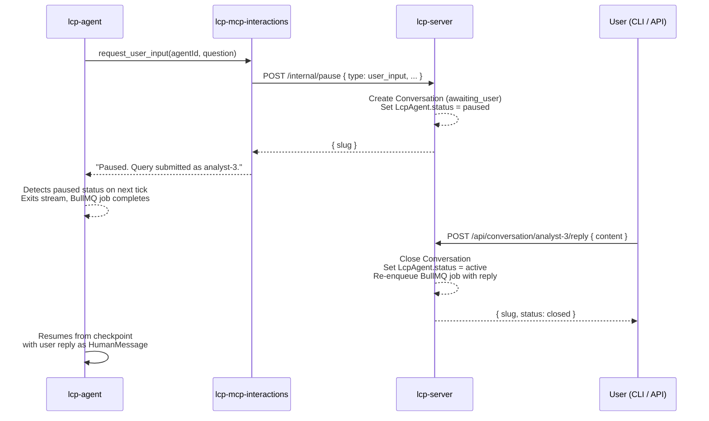
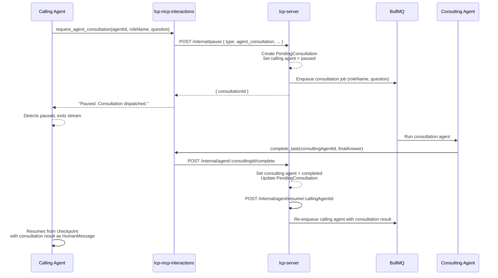

# Human-in-the-Loop Conversations

Agents can pause mid-task and request input — either from a human user or from another agent playing a different role. This document describes the end-to-end flow.

See [lcp-mcp-interactions.md](lcp-mcp-interactions.md) for the MCP tool reference and [lcp-cli.md](lcp-cli.md) for the CLI commands used to respond.

---

## Agent-to-human flow

### 1. Agent requests user input

The agent calls `request_user_input(agentId, companyId, question, context?)` on lcp-mcp-interactions.

```
Agent ──► interactions__request_user_input
            │
            └──► POST /internal/pause (lcp-server)
                  │
                  ├── Creates Conversation record (slug = role-3, status = awaiting_user)
                  ├── Routes to matched CompanyUsers (by knowledgeDomains / roles)
                  └── Sets LcpAgent.status = paused
            │
            ◄── Returns "Paused. Query submitted as analyst-3."
```

### 2. lcp-agent detects the pause

After the tool call returns, lcp-agent checks the agent's status on the next event loop tick. On detecting `paused`, it exits the LangGraph stream cleanly and the BullMQ job completes. No CPU or memory is consumed while the agent waits.

### 3. User sees and responds to the query

```bash
# See all open queries
./scripts/dev/lcp-cli.sh list-open-queries

# Read the full question
./scripts/dev/lcp-cli.sh read-query analyst-3

# Reply (triggers agent resume)
./scripts/dev/lcp-cli.sh respond analyst-3 "The budget is $50,000 for Q3."
```

Or via the API: `POST /api/conversation/analyst-3/reply`

### 4. Agent resumes

lcp-server closes the conversation, re-enqueues the BullMQ job with the reply injected as a `HumanMessage`, and lcp-agent resumes from the LangGraph checkpoint with the user's answer in context.

### Sequence diagram



---

## Agent-to-agent consultation flow

### 1. Agent requests consultation

The agent calls `request_agent_consultation(agentId, companyId, roleName, question, context?)`.

```
Calling Agent ──► interactions__request_agent_consultation
                    │
                    └──► POST /internal/pause (lcp-server)
                          │
                          ├── Creates PendingConsultation record
                          ├── Enqueues consultation agent BullMQ job
                          │     (with supplementary: "This is a consultation from X...")
                          └── Sets calling LcpAgent.status = paused
```

### 2. Consultation agent runs

The consultation agent runs as a normal agent job. When it calls `complete_task(agentId, finalAnswer)`:

```
Consulting Agent ──► interactions__complete_task
                       │
                       └──► POST /internal/agent/:agentId/complete
                             │
                             ├── Sets consulting agent status = completed
                             ├── Stores finalAnswer as LcpAgent.output
                             └──► POST /internal/agent/resume/:callingAgentId
                                   │
                                   └── Re-enqueues calling agent with
                                       consultation result as HumanMessage
```

### 3. Calling agent resumes

The calling agent resumes from its checkpoint with the consultation result injected into context. It then continues with that information — asking for clarification, writing files, or calling `complete_task` itself.

### Sequence diagram



---

## Conversation data model

| Entity                | Key fields                                                                                          |
| --------------------- | --------------------------------------------------------------------------------------------------- |
| `Conversation`        | `id`, `slug`, `agentId`, `companyId`, `roleName`, `roleSlug`, `question`, `context`, `status`, `routedToIdentifiers`, `createdAt`, `closedAt` |
| `ConversationMessage` | `id`, `conversationId`, `author` (`user`/`agent`), `authorIdentifier`, `content`, `timestamp`      |
| `PendingConsultation` | `id`, `callingAgentId`, `consultationAgentId`, `status`, `result`, `createdAt`                      |

**Slug generation:** `{role-slug}-{queryIndex}` where `queryIndex` is an atomic counter on the `LcpRole` entity, incremented in a transaction. This gives stable, human-readable conversation identifiers.

**Query routing:** lcp-server matches `knowledgeDomains` and `roles` from `CompanyUser` records against keywords in the question. If no match is found, the query is routed to all owners. If there are no owners, all company users receive it.

---

## API endpoints

| Method | Path                                | Description                                      |
| ------ | ----------------------------------- | ------------------------------------------------ |
| `GET`  | `/api/conversation`                 | List conversations (filter: `status`, `companyId`) |
| `GET`  | `/api/conversation/:slug`           | Get full conversation + messages                 |
| `POST` | `/api/conversation/:slug/reply`     | Submit a user reply; triggers agent resume       |
