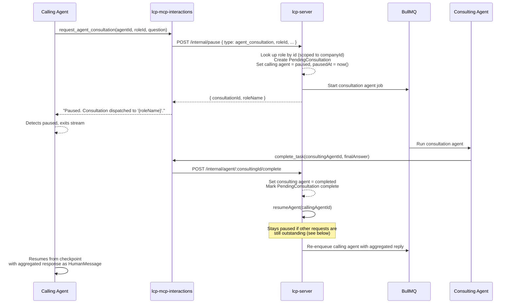

# Cross-Agent Consultations

An agent can pause mid-task and ask another role's agent a question, then resume once it gets an answer. This document describes the end-to-end flow.

See [lcp-mcp-interactions.md](lcp-mcp-interactions.md) for the MCP tool reference and [user-input-conversations.md](user-input-conversations.md) for the agent-to-human equivalent of this flow.

---

## Flow

### 1. Agent requests consultation

The agent calls `request_agent_consultation(agentId, companyId, roleId, question, context?, roleName?)`. `roleId` is the unambiguous lookup key — get it from `list_available_roles` first. Role names aren't unique within a company, so a name-only lookup can target the wrong role; `roleName` is accepted only as an optional label for friendlier logs and error messages.

```
Calling Agent ──► interactions__request_agent_consultation
                    │
                    └──► POST /internal/pause (lcp-server)
                          │
                          ├── Looks up the role by id (scoped to companyId)
                          ├── Creates PendingConsultation record
                          ├── Starts a new consultation agent for that role
                          │     (with supplementary: "This is a consultation from X...")
                          └── Sets calling LcpAgent.status = paused, pausedAt = now()
```

### 2. Consultation agent runs

The consultation agent runs as a normal agent job. When it calls `complete_task(agentId, finalAnswer)`:

```
Consulting Agent ──► interactions__complete_task
                       │
                       └──► POST /internal/agent/:agentId/complete
                             │
                             ├── Sets consulting agent status = completed
                             ├── Stores finalAnswer as LcpAgent.output and PendingConsultation.result
                             └──► AgentOrchestrationService.resumeAgent(callingAgentId)
                                   │
                                   └── See "Resume conditions" below
```

### 3. Calling agent resumes

Once the calling agent has no other outstanding requests (see below), it resumes from its checkpoint with the consultation result — and any other responses from the same pause episode — injected into context. It then continues with that information: asking for clarification, writing files, or calling `complete_task` itself.

### Sequence diagram



---

## Resume conditions

Both this flow and the [agent-to-human flow](user-input-conversations.md) go through the same choke point, `AgentOrchestrationService.resumeAgent`, regardless of which one triggers it:

- **Gating:** an agent only resumes once it has *no* remaining outstanding requests — no `PendingConsultation` with `status: 'pending'` and no `Conversation` with `status: 'awaiting_user'` linked to it. If an agent raised more than one request before pausing, resolving any single one of them leaves it paused until the rest are resolved too.
- **Aggregation:** `LcpAgent.pausedAt` is set whenever an agent transitions to `Paused`. When the gate finally passes, the resume message is built by collecting every consultation result and user reply received since `pausedAt` — not just whichever one happened to resolve last — so the agent sees every answer it asked for.
- `pausedAt` is cleared once the resume is dispatched, so the next pause episode starts scoping fresh.

If an agent only ever raises one request before pausing — the common case today — this behaves exactly like a single-response resume.

---

## Data model

| Entity                | Key fields                                                                       |
| ---------------------- | --------------------------------------------------------------------------------- |
| `PendingConsultation` | `id`, `callingAgentId`, `consultationAgentId`, `companyId`, `status`, `result`, `createdAt` |
| `LcpAgent`            | (relevant fields) `id`, `status`, `pausedAt`                                     |

---

## API endpoints

Consultations are dispatched and resolved entirely through the internal endpoints used by lcp-mcp-interactions (`POST /internal/pause`, `POST /internal/agent/:agentId/complete`) — there is no public REST surface for consultations the way there is for conversations.
