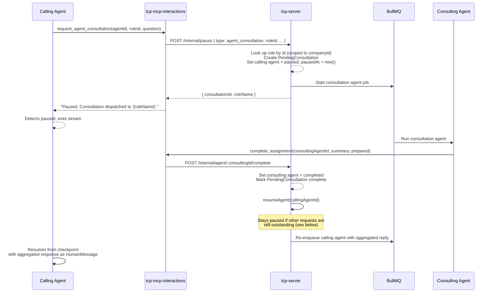

# Cross-Agent Consultations

An agent can pause mid-task and ask another role's agent a question, then resume once it gets an answer. This document describes the end-to-end flow.

See [tcp-mcp-interactions.md](tcp-mcp-interactions.md) for the MCP tool reference and [user-input-conversations.md](user-input-conversations.md) for the agent-to-human equivalent of this flow.

---

## Flow

### 1. Agent requests consultation

The agent calls `request_agent_consultation(agentId, companyId, roleId, question, context?, roleName?)`. `roleId` is the unambiguous lookup key — get it from `list_available_contacts` first. Role names aren't unique within a company, so a name-only lookup can target the wrong role; `roleName` is accepted only as an optional label for friendlier logs and error messages.

```
Calling Agent ──► interactions__request_agent_consultation
                    │
                    └──► POST /internal/pause (tcp-server)
                          │
                          ├── Looks up the role by id (scoped to companyId)
                          ├── Creates PendingConsultation record
                          ├── Starts a new consultation agent for that role
                          │     (with supplementary: "This is a consultation from X...")
                          └── Sets calling TcpAgent.status = paused, pausedAt = now()
```

### 2. Consultation agent runs

The consultation agent runs as a normal agent job, created with `requiredToolCalls: ['complete_assignment']` — its answer is only delivered via `complete_assignment`, so tcp-agent will not accept a narrated (text-only) ending. If the stream ends without the call, the agent is reminded up to `AGENT_REQUIRED_TOOL_RETRIES` times (default 2) before the run is failed. When it calls `complete_assignment(agentId, summary, prepared)`:

```
Consulting Agent ──► tasks__complete_assignment
                       │
                       └──► POST /internal/agent/:agentId/complete
                             │
                             ├── Sets consulting agent status = completed
                             ├── Stores finalAnswer as TcpAgent.output and PendingConsultation.result
                             └──► AgentOrchestrationService.resumeAgent(callingAgentId)
                                   │
                                   └── See "Resume conditions" below
```

### 3. Calling agent resumes

Once the calling agent has no other outstanding requests (see below), it resumes from its checkpoint with the consultation result — and any other responses from the same pause episode — injected into context. It then continues with that information: asking for clarification, writing files, or calling `complete_assignment` itself.

### Consultation failure

If the consultation agent fails — an LLM error, a timeout or max-iterations abort, or exhausting its required-tool reminders without calling `complete_assignment` — the failure propagates instead of leaving the caller paused forever:

```
tcp-agent (failing run) ──► POST /internal/agent/:agentId/fail { reason }
                              │
                              ├── Sets failing agent status = failed (never clobbers Completed)
                              ├── Marks PendingConsultation status = 'failed', result = reason
                              └──► AgentOrchestrationService.resumeAgent(callingAgentId)
```

The resume message renders failed consultations as:

> `Consultation FAILED: <reason>. Use your own judgement about how to proceed; if a response is essential, consider escalating to a user via request_user_input.`

The calling agent decides what to do — retry with a different role, continue without the answer, or escalate to a human. An agent that merely _declines_ to answer is not a failure: it says so via `complete_assignment` and the refusal flows back as a normal consultation response.

### Sequence diagram



---

## Resume conditions

Both this flow and the [agent-to-human flow](user-input-conversations.md) go through the same choke point, `AgentOrchestrationService.resumeAgent`, regardless of which one triggers it:

- **Gating:** an agent only resumes once it has _no_ remaining outstanding requests — no `PendingConsultation` with `status: 'pending'` and no `Conversation` with `status: 'awaiting_user'` linked to it. If an agent raised more than one request before pausing, resolving any single one of them leaves it paused until the rest are resolved too. A consultation resolving as `'failed'` opens the gate the same way `'complete'` does.
- **Aggregation:** when the gate finally passes, the resume message is built by collecting every consultation result (complete or failed) and every user reply the agent has **not yet been given** — not just whichever one happened to resolve last — so it sees every answer it asked for. Where a user answered across several messages, all of them are included, oldest first.
- **Delivery is tracked as state, not as a time window.** Once the resume job is queued, each consultation moves to `status: 'consumed'` and each conversation gets a `repliesDeliveredAt` stamp. That is what stops a later resume repeating an answer the agent has already seen.
- `pausedAt` is still set on every pause and cleared when the resume is dispatched, but only to claim the pause episode atomically — two near-simultaneous resume triggers race on it and exactly one wins. It is no longer used to decide _which_ replies belong to the resume.

> **Why not simply take everything created since `pausedAt`?** Because `pausedAt` is stamped by the application's clock and `PendingConsultation.createdAt` by the database's, and the two writes are milliseconds apart. A database clock lagging by a few milliseconds put the consultation outside the window, and the agent resumed with an empty payload — knowing nothing about the question it had asked. Measured at 1–3ms of headroom before this changed. If you are tempted to reintroduce a timestamp comparison here, this is the failure it produces.

The marking happens **after** the job is queued, deliberately: if queueing fails, the replies must stay undelivered so the next resume still finds them.

If an agent only ever raises one request before pausing — the common case today — this behaves exactly like a single-response resume.

---

## Data model

| Entity                | Key fields                                                                                                                                      |
| --------------------- | ----------------------------------------------------------------------------------------------------------------------------------------------- |
| `PendingConsultation` | `id`, `callingAgentId`, `consultationAgentId`, `companyId`, `status` (`pending` \| `complete` \| `failed` \| `consumed`), `result`, `createdAt` |
| `TcpAgent`            | (relevant fields) `id`, `status`, `pausedAt`, `requiredToolCalls`                                                                               |

---

## API endpoints

Consultations are dispatched and resolved entirely through the internal endpoints used by tcp-mcp-interactions and tcp-agent (`POST /internal/pause`, `POST /internal/agent/:agentId/complete`, `POST /internal/agent/:agentId/fail`) — there is no public REST surface for consultations the way there is for conversations.
