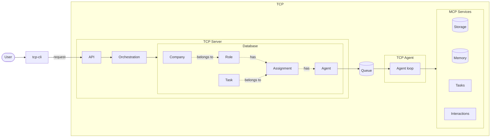
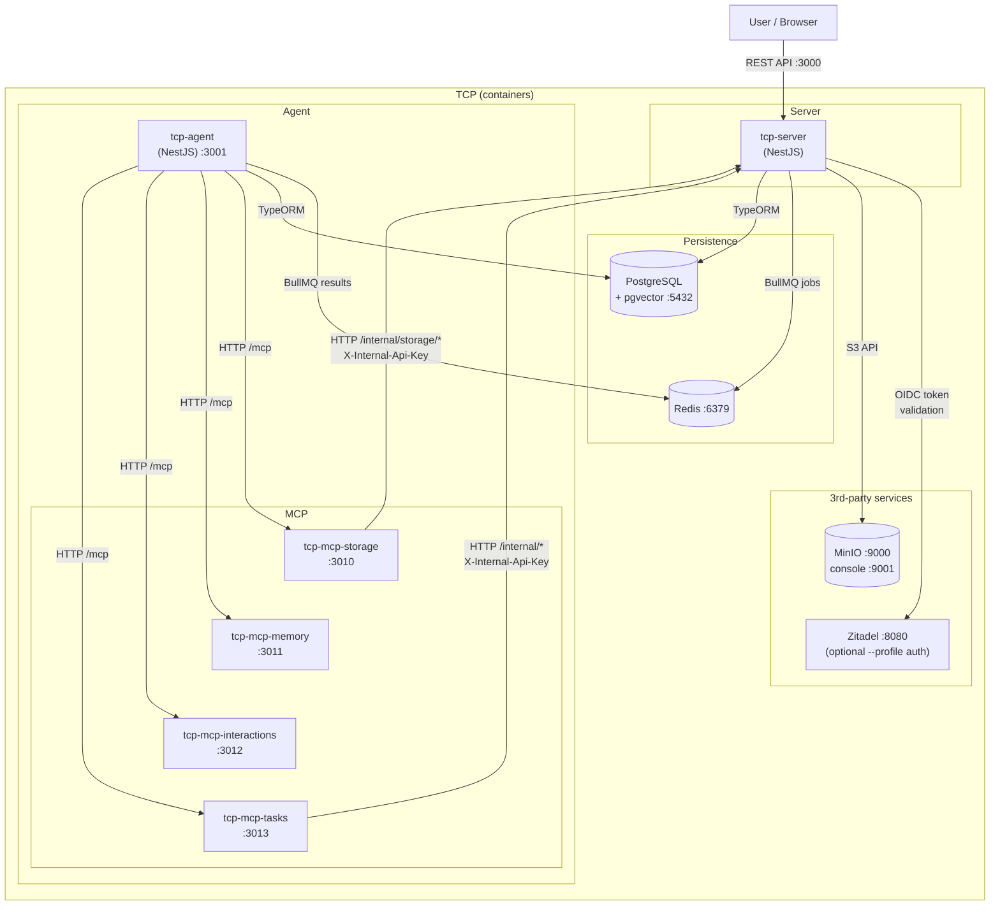
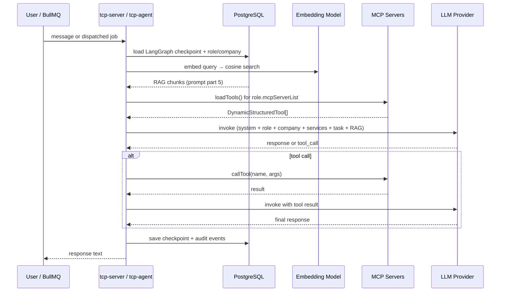
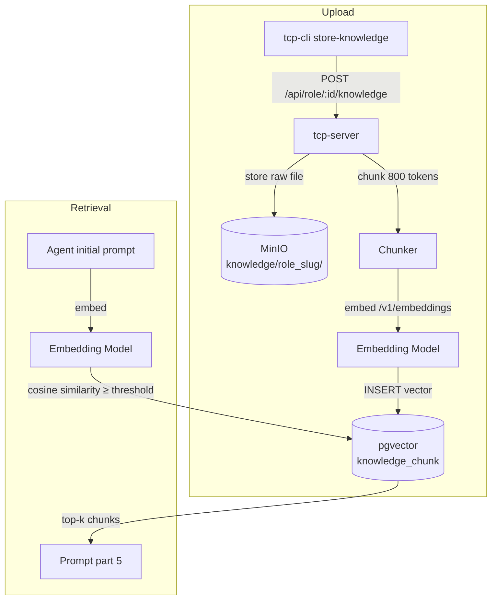

# Development

The tech stack, source layout, everyday commands, and project conventions. Read this when starting work on the codebase.

> [!TIP]
> See **[Developer setup checklist](docs/setup-checklist.md)** for a step-by-step first-time setup guide.

## Project overview

NestJS monorepo for the TCP system: `tcp-server` (REST API + orchestration state), `tcp-agent` (agent loop runner), `tcp-cli` (CLI client), and four MCP servers agents call for tools — `tcp-mcp-storage`, `tcp-mcp-memory`, `tcp-mcp-interactions`, `tcp-mcp-tasks`. Shared entities, prompt assembly, and cross-app utilities live in `libs/tcp-shared` (imported as `@tcp/shared`). Data is persisted in PostgreSQL + pgvector in production; better-sqlite3 in-memory for unit tests.

## Tech stack

| Concern               | Choice                                                                                               |
| --------------------- | ---------------------------------------------------------------------------------------------------- |
| Runtime               | Node.js / TypeScript (strict mode)                                                                   |
| Framework             | NestJS 11 (monorepo mode, 6 apps + `tcp-cli`)                                                        |
| ORM                   | TypeORM                                                                                              |
| Database (production) | PostgreSQL 16 + pgvector                                                                             |
| Database (unit tests) | better-sqlite3 (in-memory)                                                                           |
| Auth                  | OAuth2/OIDC — Zitadel (default), any OIDC IdP supported                                              |
| Object storage        | MinIO (Docker Compose)                                                                               |
| Task queue            | Redis + BullMQ — `agent-jobs` (tcp-server → tcp-agent) and `knowledge-reindex` (tcp-server-internal) |
| API docs              | `@nestjs/swagger` — `GET /swagger` + `GET /swagger-json` on all six server apps                      |
| Testing               | Jest + `@nestjs/testing`; testcontainers for integration/e2e                                         |
| Linting               | ESLint + typescript-eslint                                                                           |
| Formatting            | Prettier                                                                                             |
| Schema export         | ts-json-schema-generator → `schemas/schema.json`                                                     |

## Architecture

Architectural decisions are documented as ADRs in `ADRs/`. See [index.md](index.md) for the full list with implementation status.

| Concern               | Technology                                                                 |
| --------------------- | -------------------------------------------------------------------------- |
| Framework             | NestJS 11                                                                  |
| ORM                   | TypeORM                                                                    |
| Database (production) | PostgreSQL 16 + pgvector                                                   |
| Database (unit tests) | better-sqlite3 (in-memory)                                                 |
| Auth                  | OAuth2/OIDC (Zitadel default)                                              |
| Object storage        | MinIO (via [Silo](https://github.com/pgsty/silo), a MinIO-compatible fork) |
| Task queue            | Redis (BullMQ)                                                             |
| Schema export         | ts-json-schema-generator                                                   |

### Simplified architecture



> ### Simplified summary
>
> - A user talks to TCP using **TCP CLI**, which calls **TCP Server**'s API.
> - Companies, Roles, Agents, Tasks, and Assignments are persisted in the database.
> - An agent is a running instance combining a role and assignment, executing in **TCP Agent**.
> - Agents have access to **MCP Services** administering shared storage, individual knowledge, tasks and assignments.

### Main service

The main service topology.



> #### Service overview
>
> - **tcp-server** is the REST API and orchestration layer
> - **tcp-server** communicates directly with the authorisation service, and storage service
> - **tcp-server** and **tcp-agent** use Postgres to store and manage state, and Redis with BullMQ queues to communicate
> - **tcp-agent** consumes BullMQ jobs and runs the LangGraph agent loop.
> - Four MCP servers provide tool access to agents:
>   - **tcp-mcp-storage** proxies file operations to tcp-server's internal storage endpoints
>   - **tcp-mcp-memory** manages RAG access to embeddings from role-knowledge and company-knowledge, and memories
>   - **tcp-mcp-interactions** lets agents ask users questions and consult other agent roles
>   - **tcp-mcp-tasks** lets agents complete their assignment — plan a task, submit finished work, or assure another agent's work (mode-gated)
> - **PostgreSQL** (with pgvector) stores entities, agent checkpoints, and knowledge embeddings
> - **MinIO** stores knowledge documents, task files, and context-overflow data
> - **Zitadel** is an optional auth service, which starts if the `auth` profile is specified (ie. with `--profile auth`)

### Agent loop

How a single agent turn flows through the system.



> #### Agent turn flow
>
> The agent receives a message or is dispatched as a background job. The system loads the LangGraph checkpoint (conversation history) from PostgreSQL, retrieves relevant RAG chunks via pgvector, and loads MCP tools for the role. The LLM is invoked with the assembled prompt. If the model requests a tool call, the tool is executed via the appropriate MCP server and the result is fed back. The final response and checkpoint are persisted.

### RAG subsystem

How knowledge documents flow from upload to retrieval.



> RAG subsystem: knowledge documents are uploaded via the CLI, chunked into ~800-token segments, embedded using the company's embedding model, and stored as vectors in PostgreSQL (pgvector). When an agent runs, the initial prompt is embedded and the most similar chunks above the role's cosine threshold (`runConfig.ragThreshold`, default `0.35`) are retrieved and injected into the prompt. The right threshold depends on the embedding model — see [Tuning RAG retrieval](docs/development.md#tuning-rag-retrieval). The embedding model is configured separately from the chat LLM via `company.embeddingConfig`.

### Applications

| Application          | Purpose                                                                                           |
| -------------------- | ------------------------------------------------------------------------------------------------- |
| tcp-cli              | User-facing CLI interface to simplify interactions with tcp-server.                               |
| tcp-server           | API and orchestration service for the system.                                                     |
| tcp-agent            | Manages agents and the agent loop. Interacts with tcp-server to receive and complete assignments. |
| tcp-mcp-interactions | MCP tools allowing agents to ask users questions and consult other agent roles.                   |
| tcp-mcp-tasks        | MCP tools allowing agents to complete their assignment — plan, submit work, or assure QA.         |
| tcp-mcp-memory       | MCP tools allowing agents to retrieve memory from their stored expertise.                         |
| tcp-mcp-storage      | MCP tools allowing agents interact with shared storage.                                           |

## Workspaces

The repository is an [npm workspace](https://docs.npmjs.com/cli/using-npm/workspaces) with three members ([ADR-022](ADRs/ADR-022-monorepo-workspace-structure.md)):

| Workspace                    | Holds                                                   |
| ---------------------------- | ------------------------------------------------------- |
| `apps/backend`               | The six NestJS services, `tcp-cli`, and every test tier |
| `apps/frontend/tcp-frontend` | The web client                                          |
| `libs/tcp-shared`            | Code shared between them, published as `@tcp/shared`    |

One `npm ci` at the root installs all three; dependencies hoist to the root `node_modules`. The root `package.json` keeps only cross-cutting scripts (`schema:generate`, `licenses:generate`, `api:generate`, `migration:*`, `hooks:install`, lint/format) and delegates the rest with `--workspace`, so `npm run build`, `npm test` and friends still work from the root exactly as before.

`apps/tcp-stub-llm` is deliberately **not** a workspace — it has its own TypeScript major and eslint config. See [ADR-022](ADRs/ADR-022-monorepo-workspace-structure.md#consequences). It's still covered by the root `lint`, `lint:check`, `typecheck`, `format` and `format:check` scripts, each of which chains a separate `npm --prefix apps/tcp-stub-llm run <script>` call; a root `postinstall` runs `npm ci --prefix apps/tcp-stub-llm` so its own dependency tree stays installed. Its unit tests (`node --test`, not Jest) run as a distinct step in `scripts/run-unit-tests.sh` rather than through `npm test --workspaces`.

### `@tcp/shared` has two entry points

```jsonc
"exports": {
  ".": "./src/index.ts",        // full server-side surface
  "./client": "./src/client.ts" // browser-safe: DTO types + WireEvent
}
```

The default export re-exports TypeORM entities, NestJS modules, BullMQ, ioredis and MinIO helpers — none of which run in a browser. The web client may import **only** `@tcp/shared/client`, enforced by a `no-restricted-imports` rule in `apps/frontend/tcp-frontend/eslint.config.mjs` and by a resolver plugin in its `vite.config.ts`. `apps/frontend/tcp-frontend/test/fixtures/server-import-must-fail.ts` is a committed fixture that must fail lint; `npm run test:import-boundary` asserts it does. See [Web Client](web-client.md#the-tcpshared-boundary) — Vite does _not_ reject the bare specifier on its own, which is why the plugin exists.

Everything in `client.ts` must survive type erasure with no runtime import — see the rule documented at the top of that file before adding to it.

## Source layout

```text
package.json                # workspaces + cross-cutting scripts
tsconfig.base.json          # compilerOptions shared by the Node-side workspaces
eslint.config.mjs           # one lint entry point for every workspace
Dockerfile                  # one multi-stage build for all six services
apps/
 backend/                   # ── workspace: the NestJS services + tcp-cli
  package.json              # every backend dependency, and the unit-tier Jest config
  nest-cli.json             # the 7 Nest projects (resolved relative to this directory)
  tsconfig.json             # extends ../../tsconfig.base.json; adds the @tcp/shared paths
  webpack.config.js         # points webpack-node-externals at the hoisted root node_modules
  apps/
   tcp-server/            # REST API + orchestration state (port 3000)
     src/
       api/                # HTTP layer — controllers + services (company, role, agent, task,
                            # assignment/task-orchestration, conversation, storage proxy,
                            # system shutdown/drain, ...)
       audit/               # AuditService — internal audit-event endpoint
       auth/                # OIDC JWT strategy + guard
       config/              # Joi validation schema for env vars
       context/             # Context-budget/compaction wiring specific to tcp-server
       db/                  # DbService — TypeORM repository wrapper
       events/              # AuditEventPublisher + three KeyedEventBus<WireEvent> (agent/task/company SSE)
       health/              # GET /health endpoint (@nestjs/terminus)
       mcp/                 # Internal MCP-facing endpoints (storage-scope, etc.)
       migrations/          # TypeORM migrations (run on startup vs postgres)
       model-check/         # LLM/embedding model compatibility check
       rag/                 # RAG retrieval + KnowledgeReindexService (write hook + poller)
       storage/             # StorageService abstraction, MinioStorageAdapter, storage-keys
       templates/           # Input shapes for create operations
       utils/               # Shared utilities (ObjectUtils)
       data-source.ts       # TypeORM CLI datasource (migration:generate etc.)
   tcp-agent/              # Agent loop runner (port 3001)
     src/
       agent/               # AgentLoopService — LangGraph agent loop, initial-state assembly
       config/              # Joi validation schema for env vars
       health/              # GET /health endpoint
       mcp/                 # McpClientService wiring for the agent loop
       rag/                 # AgentRagService — the worker's "is anything indexed?" check
                            # (retrieval itself is @tcp/shared's KnowledgeRetrievalService)
       registry/            # Role/company/agent lookups the worker needs
       storage-tracking/    # Tracks storage-scope resolution for a running agent
       worker/               # AgentWorkerService — BullMQ `agent-jobs` consumer
   tcp-mcp-storage/        # Storage MCP server (port 3010)
   tcp-mcp-memory/         # Memory MCP server — recall/remember/search_knowledge (port 3011)
   tcp-mcp-interactions/   # Interactions MCP server — user input, agent consultation (port 3012)
   tcp-mcp-tasks/          # Tasks MCP server — create_plan/complete_assignment/assure_assignment (port 3013)
                            # Each MCP app follows the same shape: src/mcp/, a tools.jsonc +
                            # prompts.jsonc pair, and a thin HTTP-proxy *-tools.service.ts
                            # calling tcp-server's /internal/* endpoints via InternalApiClient.
                            # Bootstrap, health and config come from @tcp/shared
                            # (bootstrapMcpApp, StaticHealthModule, mcpConfigModule); only
                            # tcp-mcp-memory keeps its own health module, for its DB ping.
   tcp-cli/
     src/
       main.ts               # commander entry point; global options
       commands/             # thin per-command registration (flags → lib/<domain> action)
       lib/
         core/                # api.ts, cli-options.ts, run-command.ts, render.ts, ... (SSE parsing/reading
                              # moved to libs/tcp-shared/src/events/, shared with the web client)
         render/              # shared render library: EventLogBuffer, StreamPresenter, renderers, style backends
         auth/                # token.ts (resolution/renewal) + get-token action
         chat/                # chat command: flags, context, session, wiring, action
         tui/                 # full-screen TUI (terminal-kit widgets)
         system/              # fleet-level actions: shutdown drain (see docs/tcp-cli.md#shutdown)
         crud/, docs/, queries/, links/  # remaining commands' actions, grouped by purpose
     tsconfig.app.json        # extends ../../tsconfig.json; adds @tcp/shared paths
     tsconfig.json            # extends tsconfig.app.json; includes spec files (for ESLint)
  test/                       # every tier lives with the apps it exercises, so the specs'
                              # relative imports into app source are unchanged by the move
    api/                      # API contract tests — authenticated HTTP round-trips (need docker compose up --profile auth)
    e2e/
      tcp-server/             # tcp-server E2E specs (company-role, agent, task-orchestration, users, audit, etc.)
      tcp-agent/              # tcp-agent health E2E spec
      tcp-mcp-interactions/   # tcp-mcp-interactions health + MCP protocol E2E specs
      tcp-mcp-memory/         # tcp-mcp-memory health + MCP protocol E2E specs (skipped without Postgres)
      tcp-mcp-storage/        # tcp-mcp-storage health + MCP protocol E2E specs
      helpers/                # Shared E2E utilities (test-jwt helper)
    integration/
      tcp-server/             # tcp-server service connectivity tests (need Docker)
      tcp-agent/              # tcp-agent service connectivity tests (need Docker)
      tcp-shared/             # makeTypeOrmConfig integration test (need Docker for Postgres path)
    smoke/                    # Full-stack health checks, all six server apps (need docker compose up --profile auth)
    support/                  # testcontainers-env, env-file parser, migrate-database — anchored on
                              # __dirname, since Jest runs from apps/backend but compose lives at the root
    jest-{api,e2e,integration,smoke}.json
    tsconfig.json
  dist/apps/<app>/            # build output (gitignored)
 frontend/
  tcp-frontend/              # ── workspace: the web client. See docs/web-client.md
   index.html                 # entry document; carries the pre-paint theme script
   vite.config.ts             # dev port from EXPOSE_PORT_WEB_DEV; @tcp/shared boundary plugin; vitest
   eslint.config.mjs          # browser/ESM rules + jsx-a11y as errors (the root config is Node)
   playwright.config.ts       # browser tier: chromium, axe, JUnit into test-results/
   tsconfig.json              # the root-level tooling configs — the Node-side ones
   src/
     tsconfig.json            # browser target; NO bare @tcp/shared path alias, "types": []
     strings.ts               # the single lookup every user-facing string resolves through
     auth/                    # the OIDC client, the session, and the validated return address
     components/<Name>/       # shared components owned by no single page
     pages/<PageName>/        # one folder per route-level page: component, stylesheet, test
     shell/                   # the application frame: layout, header, and the route-change behaviour
     theme/                   # storage contract, ThemeProvider, useTheme, ThemeControl
     styles/                  # base.css + themes/{default,high-contrast}.css — tokens only
     *.test.tsx               # Vitest + Testing Library, colocated
   test/fixtures/             # server-import-must-fail.ts — the boundary's negative control
 tcp-stub-llm/               # NOT a workspace: own package.json/tsconfig/lint config, no
                             # NestJS, no @tcp/shared. See docs/stub-llm.md (port 3002).
libs/
  tcp-shared/
    src/
      models/                # TypeORM entities (shared across all apps) — doubles as JSON Schema source
      audit/                 # AuditClientService (used by all apps)
      bootstrap/             # bootstrapMcpApp — shared MCP server startup
      health/                # StaticHealthModule — /health for services with no dependency to probe
      http/                  # InternalApiClient — authenticated calls to tcp-server /internal/*
      auth/                  # InternalApiKeyGuard
      config/                # defaults, run-config/llm-config/system-prompt-template resolution
      context/                # Context budget, compaction, and incoming-data-guard services
      db/                     # makeTypeOrmConfig factory + optimistic-retry helper
      events/                 # WireEvent (unified SSE/Redis shape) + channel/summary helpers;
                               # wire-stream.ts (parseWireEvents, readWireStream) and wire-parse.ts —
                               # the SSE parser/reader shared by tcp-cli and the web client (ADR-025)
      llm/                    # buildChatModel factory, agent-graph builder, reasoning-content recovery
      mcp/                    # BaseMcpController, McpClientService, MCP_REGISTRY, resolve-mcp-server-list,
                              # tool-result kit (ToolResult, ok/err, relay4xxOrError)
      prompts/                # mode-prompts, mode-tools, prompt-assembly, qa-prompts — the single
                               # home for every prompt-part builder shared by tcp-server and tcp-agent
      rag/                    # EmbeddingService, KnowledgeRetrievalService
      redis/                  # assertRedisReachable
      storage/                # artifact-keys (resolveArtifactKey), write validation, stream-to-buffer
      validation/              # enum validation, control-char sanitisation
      uuid.ts                  # UUID type — deliberately NOT crypto's, so the browser-safe
                               # surface carries no dependency on @types/node
      index.ts                 # server-side entry point: re-exports all shared code
      client.ts                # browser-safe entry point: DTO types + WireEvent only
    package.json               # the @tcp/shared name and its two-entry exports map
    tsconfig.lib.json
scripts/                       # Test runner scripts (mirror CI steps) + git hooks (npm run hooks:install)
docs/
  ADRs/                        # Architectural Decision Records
  zitadel-setup.md             # Zitadel setup guide
  licenses.md                  # Auto-generated — do not edit by hand
dev-qual/                       # Git submodule — agent guidance, skills, and quality-gate scripts
schemas/                        # Auto-generated JSON Schema — do not edit by hand
```

`tcp-mcp-tasks` is the odd one out among the MCP apps: alongside the HTTP-proxy pattern it also holds `AuditClientService` (from `@tcp/shared`) to record its own tool-call audit events, since its completion tools (`create_plan`/`complete_assignment`/`assure_assignment`) are higher-stakes than the other services' reads and writes.

## Common commands

```bash
# Development
npm run start:dev             # Start tcp-server with hot reload (SQLite fallback)
./tcp-cli.sh                  # Run tcp-cli (builds automatically if needed)
./tcp-cli.sh --rebuild        # Force rebuild before running
npm run build                 # Build all apps + generate schema + license report
npm run build tcp-server      # Build tcp-server only
npm run build tcp-agent       # Build tcp-agent only
npm run build:tcp-cli         # Build tcp-cli standalone binary
npm run lint                  # ESLint with auto-fix (delegates to each workspace's own config)
npm run format                # Prettier over apps/, libs/, docs/

# Web client (see docs/web-client.md)
npm run dev --workspace apps/frontend/tcp-frontend     # Vite dev server on EXPOSE_PORT_WEB_DEV
                                                       # (put nginx in front: start-deployment.sh --dev-web)
npm run build --workspace apps/frontend/tcp-frontend   # static bundle into dist/
npm test --workspace apps/frontend/tcp-frontend        # Vitest + the import-boundary check

# Quality gate (also run by the git hooks)
./dev-qual/scripts/check.sh          # Full: lint, typecheck, build, unit tests, aislop
./dev-qual/scripts/check.sh --fast   # Fast: lint, typecheck, shellcheck only

# Testing
npm test                      # Unit tests (no external services, SQLite in-memory)
npm run test:e2e              # E2E tests (testcontainers starts postgres/redis/minio)
npm run test:integration      # Integration tests (testcontainers starts postgres/redis/minio/stub-llm)
npm run test:api              # API contract tests (requires docker compose up --profile auth)
npm run test:smoke            # Smoke tests (requires a running deployment)
npm run test:cov              # Coverage report

# Test scripts (mirrors CI, starts Docker services as needed)
./scripts/run-unit-tests.sh
./scripts/run-e2e-tests.sh
./scripts/run-integration-tests.sh
./scripts/run-api-tests.sh
./scripts/run-smoke-tests.sh
./scripts/run-browser-tests.sh
./scripts/run-all-tests.sh    # All six tiers

# Docker
docker compose up             # Start all services
docker compose --profile auth up  # Also start Zitadel
docker compose down           # Stop services (keep volumes)
docker compose down -v        # Stop and remove volumes

# Migrations
npm run migration:generate -- apps/backend/apps/tcp-server/src/migrations/Name  # Generate from entity diff
npm run migration:run         # Run pending migrations
npm run migration:revert      # Revert last migration
```

## Key environment variables

Beyond the database/Redis/MinIO/OIDC connection strings (see `.env.example`), a few app-specific ones are easy to miss:

| Variable                     | App(s)                | Purpose                                                                                                                                                                                                                                                                         |
| ---------------------------- | --------------------- | ------------------------------------------------------------------------------------------------------------------------------------------------------------------------------------------------------------------------------------------------------------------------------- |
| `MCP_STORAGE_URL`            | tcp-server, tcp-agent | `tcp-mcp-storage` base URL; omit to disable that server                                                                                                                                                                                                                         |
| `MCP_MEMORY_URL`             | tcp-server, tcp-agent | `tcp-mcp-memory` base URL; omit to disable that server                                                                                                                                                                                                                          |
| `MCP_INTERACTIONS_URL`       | tcp-server, tcp-agent | `tcp-mcp-interactions` base URL; omit to disable that server                                                                                                                                                                                                                    |
| `TCP_AGENT_URL`              | tcp-server            | tcp-agent's internal URL, used only by the combined health report (`GET /api/system/health`)                                                                                                                                                                                    |
| `TCP_RESTART_SUPPORTED`      | tcp-server, tcp-agent | `true` where a supervisor (Docker's restart policy) starts the service again after it exits; restart is refused otherwise (default `false`; compose sets `true`)                                                                                                                |
| `MCP_TASKS_URL`              | tcp-server, tcp-agent | `tcp-mcp-tasks` base URL; omit to disable that server                                                                                                                                                                                                                           |
| `INTERNAL_API_KEY`           | all apps              | Shared secret for internal service-to-service calls (`X-Internal-Api-Key`)                                                                                                                                                                                                      |
| `KNOWLEDGE_POLL_INTERVAL_MS` | tcp-server            | Reconciliation-poll interval for the `knowledge-reindex` sync (default `60000`)                                                                                                                                                                                                 |
| `TASK_MAX_QA_ATTEMPTS`       | tcp-server            | Env-level fallback for `runConfig.maxQaAttempts` (role/company override it first)                                                                                                                                                                                               |
| `RAG_THRESHOLD`              | tcp-server, tcp-agent | Env-level fallback for `runConfig.ragThreshold` (role/company override it first)                                                                                                                                                                                                |
| `TCP_MASK_API_KEYS`          | tcp-server            | Masks `LlmConfig.apiKey` in API responses (default `true`)                                                                                                                                                                                                                      |
| `LLM_ALLOWED_HOSTS`          | tcp-server            | Hosts a local or custom provider's `baseUrl` may use, besides those of `LLM_BASE_URL`/`EMBEDDING_BASE_URL` (default none). Remote providers must use their catalogue URL. Blocks SSRF via `llmConfig`                                                                           |
| `MODEL_CONCURRENCY`          | tcp-agent             | Two global pools (`local`, `remote`; defaults 1 and 4) plus optional per-endpoint overrides, limiting how many agent runs use a model at once. Replaces `AGENT_WORKER_CONCURRENCY`, which is now ignored with a boot warning. See [model-concurrency.md](model-concurrency.md). |

### Tuning RAG retrieval

Knowledge chunks are returned only when their cosine similarity to the query
meets `runConfig.ragThreshold` (role → company → `RAG_THRESHOLD` →
`DEFAULT_RAG_THRESHOLD`, currently `0.35`).

Every path retrieves through the same `KnowledgeRetrievalService` in
`@tcp/shared` — tcp-server's chat and knowledge queries, tcp-agent's prompt
assembly, and tcp-mcp-memory's `search_knowledge` tool — so one threshold
governs them all. `recall` is the exception: it runs its own hybrid query
across episodic memory as well as knowledge, and keeps its own cut-off.

**Cosine scores are not comparable across embedding models** — each has its own
score distribution, so this is a per-model calibration rather than a universal
"relevance" figure. Set it too high and retrieval silently returns nothing at
all, with no error to explain the empty prompt.

To calibrate after changing embedding model, query with `--threshold 0` to see
raw scores, using queries you know should and shouldn't match:

```bash
./tcp-cli.sh query-knowledge -c <company> -r <role> -q "a question the docs answer" --threshold 0
./tcp-cli.sh query-knowledge -c <company> -r <role> -q "something wholly unrelated" --threshold 0
```

Pick a value in the gap between the two. With no `--threshold`, the command
reports exactly what that role would retrieve in a real prompt.

## Key conventions

- **`libs/tcp-shared`** is the shared library imported as `@tcp/shared` from any app. See the source-layout tree above for what lives where; `models/`, `prompts/`, and `mcp/` are the ones every app touches.
- **Entities in `libs/tcp-shared/src/models/`** double as TypeORM entities and JSON Schema sources. Annotate with TSDoc validation tags (`@format`, `@minLength`, etc.) so the generated schema is accurate.
- **Prompt content lives in `libs/tcp-shared/src/prompts/`** — `mode-prompts.ts` (per-mode preambles), `mode-tools.ts` (per-mode server/tool gating), `prompt-assembly.ts` (the shared initial-prompt-part builders used by both `ChatService` and `AgentLoopService`), and `qa-prompts.ts` (QA presentation/rejection text used by `TaskOrchestrationService`). Add new prompt-part logic here, not locally in an app, so tcp-server and tcp-agent can't drift.
- **`schemas/schema.json`** and **`docs/licenses.md`** are generated artefacts — never edit them directly; regenerate via `npm run build`.
- **`apps/frontend/tcp-frontend/src/api/schema.d.ts`** is also a generated artefact, never edited by hand — the web client's API types, generated from `GET /swagger-json` ([ADR-014](ADRs/ADR-014-swagger-endpoints.md)). Regenerate with `npm run api:generate`, which needs a running tcp-server: it takes `--base-url` or `API_BASE_URL` (default `http://localhost:3000`; `.env.testing` uses `3001`). CI's `api-test` job regenerates it against the deployment it has already booted and fails the build if the committed copy is stale.
- **No user-facing string is inlined in JSX.** Every one resolves through `t('key')` from `apps/frontend/tcp-frontend/src/strings.ts`, so the phase 03 translation work replaces one module instead of every component ([ADR-021](ADRs/ADR-021-web-ui-framework-and-architecture.md#strings-and-theme-tokens)).
- **No literal colour, spacing or border value in a component stylesheet.** They resolve through `--tcp-*` custom properties, and component stylesheets ship with meaningful class names and empty rule bodies to be filled per theme ([ADR-026](ADRs/ADR-026-web-ui-accessibility-and-component-library.md#how-themes-work)). This one is invisible to linting — it only holds if review enforces it. `src/styles/base.css` is the single exception, and only for React Aria's own defaults: the library ships no styling, so a `RadioButton` with no rules is bare text with no focus ring (WCAG 2.4.7) and nothing marking the chosen option (WCAG 1.4.1). Those rules live there, in tokens, and are selected by React Aria's default class names (`.react-aria-RadioButton`, `.react-aria-Button`).
- **Route-level pages live in `src/pages/<PageName>/`**, holding the component, its stylesheet and its test together. Shared controls that more than one page uses live beside what they own — `ThemeControl` sits in `src/theme/` with the provider it drives.
- **Route-change focus and announcement.** On every route change focus moves to the page's `h1` and the page title is announced politely. Focus is managed at exactly four points across the whole application ([ADR-027](ADRs/ADR-027-screen-reader-strategy.md)); route change is one of them, and no component should add a fifth.
- **Each page sets its own document title** with `useDocumentTitle`, rather than the title living in the route table — the company view is titled by the company's name, which is loaded data. The route announcement reads `document.title` back, so a page that omits the call announces the name of the page before it.
- **A development-only capability is compiled out of a production build, not disabled in one.** `import.meta.env.DEV` is replaced with a literal at build time, so the branch becomes unreachable code the minifier drops; a runtime check would ship the capability and leave only a condition in front of it. `src/dev/dev-session.ts` is the first instance, and its absence is asserted against the built artefact in the browser tier. Phase 06's prompt 001.05 generalises the rule.
- **The session is a React context with a `session` prop as its test seam** (`src/auth/session.tsx`). Component tests render a signed-in user by passing a literal object; there is no auth library and no fake token in the test tier. `src/test-support/render-app.tsx`'s `renderAppAt(path, session)` is the helper every later component test uses.
- **Unit tests** (`.spec.ts`) use `better-sqlite3` in-memory; wire TypeORM directly in `Test.createTestingModule`, never through `AppModule`.
- **Integration and e2e tests** boot against real PostgreSQL, Redis, and MinIO started by [testcontainers](https://node.testcontainers.org/) from Jest's global setup (`test/{integration,e2e}/global-setup.ts`), on random host ports. Connection env vars are provisioned there, so `require-env.ts` (not a silent skip) guards each spec. See [docs/testing.md](testing.md#test-infrastructure).
- **Event architecture (audit-as-source-of-truth)**: audit events are the single source of truth for both history and live streaming (see [ADR-008](ADRs/ADR-008-audit-logging.md)). `AuditService.write` persists a row then hands it to `AuditEventPublisher`, which emits it as a `WireEvent` (`{ type: 'audit'; event }` or a live-only `{ type: 'stream'; … }` token delta — the sole non-audit wire shape) on the relevant agent/task/company SSE channel. All three CLI surfaces (`tui`, `chat`, `eavesdrop`) render through one shared library — `apps/backend/apps/tcp-cli/src/lib/render/` (`EventLogBuffer` accumulates events; `StreamPresenter` writes stdout/stderr incrementally; the renderer registry maps each audit event to display lines) — so history replay and the live stream produce identical output. Add new event kinds by extending the renderer registry, not by adding a parallel event family.
- **Redis fail-fast**: services that depend on Redis (agent orchestration, the agent worker, the knowledge-reindex queue) probe reachability at startup via `assertRedisReachable` (`@tcp/shared`) and refuse to start with a clear error if it's unreachable, rather than letting BullMQ block forever. tcp-server and tcp-agent both call `app.enableShutdownHooks()` so their queue/worker/Redis connections close cleanly on `SIGTERM`.
- **Testing intentional error paths**: when a test deliberately triggers a service-level `Logger.warn`/`.error` call (e.g. `POST /internal/agent/:id/fail`), use `captureNestLogs()`/`expectLoggedError()` from `apps/backend/test/e2e/helpers/log-capture.ts` to silence and assert on it, instead of letting it print during a normal test run. HTTP-level errors (404/400/401/409 via `HttpException`) aren't logged by Nest's default filter, so most error-path tests don't need this — it's only for paths that call a `Logger` directly.
- **Migrations**: use `synchronize: false` in production. Always create a migration when changing entity schema. Never use `synchronize: true` with PostgreSQL. New migration files must also be registered by hand in each app's `app.module.ts` migrations array.
- **No secrets in code.** Use environment variables for all credentials. Required vars are validated by Joi on startup — the app will not start if any are missing.
- **Zitadel** is optional for local dev. Run without it by setting stub OIDC env vars (see `.env.example`). `JwtAuthGuard` is applied to every user-facing controller across the API.
- **Soft data-quality warnings** (e.g. a role with no `knowledgeDomains`, a blank `companyContext`/`rolePrompt`) never fail the request — they're reported via the `X-Tcp-Warnings` response header (JSON array of strings) on `POST`/`PUT` company and role routes. See `apps/backend/apps/tcp-server/src/api/validation-warnings.ts`; `tcp-cli` prints these to stderr (see `docs/tcp-cli.md`).
