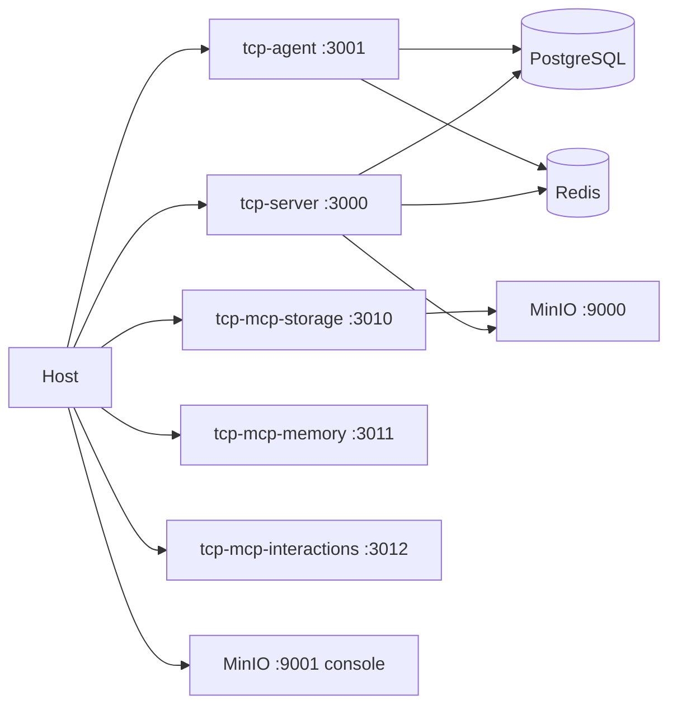

# Section 1 — Infrastructure

[← Back to start](./start.md#sections)

You are testing that all Docker Compose services start correctly, pass their health checks, and are reachable from the host. This is the foundation: if anything here fails, nothing else will work.



---

## 1.1 — Start the stack

```bash
docker compose up -d
```

Wait for all services to report `healthy`. You can monitor startup with:

```bash
docker compose ps
```

Expected: all services show `healthy` in the Status column.

| Service              | Expected status |
| -------------------- | --------------- |
| postgres             | healthy         |
| redis                | healthy         |
| minio                | healthy         |
| tcp-server           | healthy         |
| tcp-agent            | healthy         |
| tcp-mcp-storage      | healthy         |
| tcp-mcp-memory       | healthy         |
| tcp-mcp-interactions | healthy         |

If a service is `starting` after 60 seconds, check its logs:

```bash
docker compose logs <service-name> --tail 30
```

---

## 1.2 — TCP service health checks

Each TCP service exposes a `GET /health` endpoint. Check them all:

```bash
curl -s http://localhost:3000/health | jq
curl -s http://localhost:3001/health | jq
curl -s http://localhost:3010/health | jq
curl -s http://localhost:3011/health | jq
curl -s http://localhost:3012/health | jq
```

Expected response for each (status 200):

| Field    | Expected value |
| -------- | -------------- |
| `status` | `"ok"`         |

Example output for `tcp-server` (includes dependency checks):

```json
{
  "status": "ok",
  "info": {
    "postgres": { "status": "up" },
    "minio": { "status": "up" },
    "oidc": { "status": "up" }
  }
}
```

---

## 1.3 — MinIO web console

MinIO stores all company knowledge documents and context-overflow files. Open the console to verify it is running:

1. Navigate to [http://localhost:9001](http://localhost:9001) in your browser.
2. Log in with the credentials from your `.env` file (`MINIO_ACCESS_KEY` / `MINIO_SECRET_KEY`; defaults: `minioadmin` / `minioadmin`).
3. You should see the MinIO dashboard. The `tcp` bucket should already exist (created on tcp-server startup).

| Check               | Expected                     |
| ------------------- | ---------------------------- |
| Login succeeds      | MinIO dashboard visible      |
| `tcp` bucket exists | Listed in the Object Browser |

If the bucket is missing, check `docker compose logs tcp-server` for the line `Created MinIO bucket: tcp`.

---

## 1.4 — Authenticate with the CLI

The CLI uses OIDC to obtain a bearer token. In development, Zitadel runs under the `auth` profile:

**With Zitadel (auth profile):**

```bash
docker compose --profile auth up -d
./tcp-cli.sh get-token
```

`get-token` uses a device-flow login — it prints a `verification_uri`/code for you to
complete sign-in (`test`/`test`) in a browser, then prints the token.

**Without Zitadel (stub OIDC, no auth required):**

```bash
./tcp-cli.sh list-companies
```

> Auth guards are wired but not yet applied to endpoints — unauthenticated requests are accepted in the current build. When Zitadel is running you still need a token for the `chat` command.

Expected output from `get-token`: a JWT string beginning with `eyJ`.

---

[Continue to Section 2 → Companies & Roles](./02-companies-and-roles.md)
