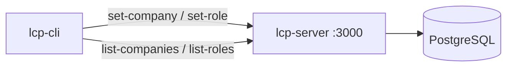

# Section 2 — Companies & Roles

[← Back to start](./start.md#sections)

> **Requires:** Section 1 complete — all services healthy.

You are testing the core data model. Every agent belongs to a company and has a role. Roles define the agent's persona (`rolePrompt`), LLM configuration, and which knowledge domains and MCP services it can access. Companies provide shared environment context (`companyContext`) and a default LLM config.



---

## 2.1 — Create a company

A sample company definition is provided in `scripts/test-data/simple-company.json`. Review it first:

```bash
cat scripts/test-data/simple-company.json
```

The key fields are:

| Field                 | Purpose                                               |
| --------------------- | ----------------------------------------------------- |
| `name`                | Human-readable company name                           |
| `slug`                | URL-safe ID used in MinIO paths (e.g. `acme`)         |
| `llmDefault.provider` | LLM provider: `lm-studio` or `openai`                 |
| `llmDefault.baseUrl`  | URL of the LLM API                                    |
| `llmDefault.model`    | Model identifier                                      |
| `companyContext`      | Company-wide context injected into every agent prompt |

Update the `baseUrl` and `model` to match your LLM provider, then create the company:

```bash
cat scripts/test-data/simple-company.json \
  | ./scripts/dev/lcp-cli.sh set-company
```

Expected response (status 200 or 201):

| Field  | Expected                         |
| ------ | -------------------------------- |
| `id`   | A UUID string                    |
| `name` | Matches what you set in the JSON |
| `slug` | Matches what you set in the JSON |

Note the company `id` — you will need it for subsequent steps. Export it:

```bash
export COMPANY_ID=<id from above>
```

---

## 2.2 — List companies

Confirm the company was saved:

```bash
./scripts/dev/lcp-cli.sh list-companies
```

Expected: a table or JSON list containing your new company. Each row shows `id`, `name`, and `slug`.

---

## 2.3 — Create a role

A sample role definition is provided in `scripts/test-data/simple-role.json`. Review it:

```bash
cat scripts/test-data/simple-role.json
```

Key fields:

| Field                  | Purpose                                                                           |
| ---------------------- | --------------------------------------------------------------------------------- |
| `name`                 | Role name used in MinIO paths and audit logs                                      |
| `description`          | Short description embedded in the system prompt                                   |
| `rolePrompt`           | Persona, domain knowledge, and behavioural guidelines for this role               |
| `systemPromptTemplate` | Handlebars-style template; `{{name}}`, `{{description}}`, `{{date}}` are replaced |
| `llmConfig`            | Optional role-specific LLM config; falls back to company `llmDefault`             |
| `mcpServerList`        | List of MCP server names available to this role (e.g. `["storage", "memory"]`)    |

Create the role, setting the `companyId` to the value from 2.1:

```bash
./scripts/dev/lcp-cli.sh set-role \
  --company-id "$COMPANY_ID" \
  --file scripts/test-data/simple-role.json
```

Expected response:

| Field       | Expected              |
| ----------- | --------------------- |
| `id`        | A UUID string         |
| `name`      | Matches the JSON      |
| `companyId` | Matches `$COMPANY_ID` |

Export the role ID:

```bash
export ROLE_ID=<id from above>
```

---

## 2.4 — List roles

```bash
./scripts/dev/lcp-cli.sh list-roles --company-id "$COMPANY_ID"
```

Expected: a table or JSON list containing your new role.

---

## 2.5 — Inspect the prompts (optional)

To verify that `companyContext` and `rolePrompt` are stored correctly, fetch the role directly from the API:

```bash
curl -s "http://localhost:3000/api/roles/$ROLE_ID" | jq '{name, rolePrompt, systemPromptTemplate}'
```

| Field                  | Expected                 |
| ---------------------- | ------------------------ |
| `name`                 | Role name from the JSON  |
| `rolePrompt`           | The persona text you set |
| `systemPromptTemplate` | The template string      |

---

[Continue to Section 3 → Chat Agents](./03-chat-agents.md)
