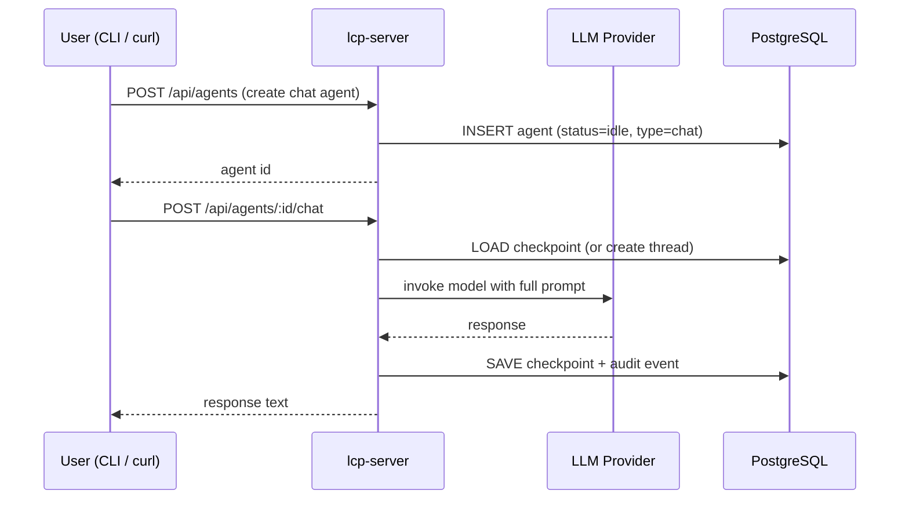

# Section 3 — Chat Agents

[← Back to start](./start.md#sections)

> **Requires:** Section 2 complete — `$COMPANY_ID` and `$ROLE_ID` set.

You are testing the interactive chat flow. A chat agent is a persistent conversation thread backed by LangGraph: each message is appended to the checkpoint and the model sees the full history. The lcp-server handles the LLM call directly (not via lcp-agent).



---

## 3.1 — Create a chat agent

A chat agent is created by POSTing to the agents endpoint with `type: "chat"`.

```bash
AGENT_ID=$(curl -s -X POST http://localhost:3000/api/agents \
  -H "Content-Type: application/json" \
  -d "{
    \"companyId\": \"$COMPANY_ID\",
    \"roleId\": \"$ROLE_ID\",
    \"type\": \"chat\",
    \"initialPrompt\": \"Hello! Who are you?\"
  }" | jq -r '.id')

echo "Agent ID: $AGENT_ID"
```

Expected response:

| Field      | Expected                 |
| ---------- | ------------------------ |
| `id`       | A UUID string            |
| `status`   | `"idle"`                 |
| `type`     | `"chat"`                 |
| `threadId` | `null` (not started yet) |

---

## 3.2 — Send the first message

The first message triggers prompt assembly (parts 0–8: system prompt, role persona, company context, services list, task, RAG results, final instruction) and stores the full conversation in a LangGraph checkpoint.

```bash
curl -s -X POST "http://localhost:3000/api/agents/$AGENT_ID/chat" \
  -H "Content-Type: application/json" \
  -d '{"message": "Hello! Who are you and what can you help me with?"}' \
  | jq '{response, compactionReport}'
```

Expected output:

| Field              | Expected                                       |
| ------------------ | ---------------------------------------------- |
| `response`         | A non-empty string — the agent's reply         |
| `compactionReport` | `null` (context is small on the first message) |

The response content will depend on your `rolePrompt`. If you used the sample data, expect the agent to describe itself using the persona defined there.

**What to check:**

- The response is coherent and reflects the role's persona.
- Status 200.

---

## 3.3 — Send a follow-up message

Send a second message. The model now has the full conversation history from the LangGraph checkpoint and should refer back to what was said.

```bash
curl -s -X POST "http://localhost:3000/api/agents/$AGENT_ID/chat" \
  -H "Content-Type: application/json" \
  -d '{"message": "What did I just ask you?"}' \
  | jq '.response'
```

Expected: the model correctly recalls the previous message ("You asked who I am and what I can help you with" or similar).

---

## 3.4 — Check the agent status

```bash
curl -s "http://localhost:3000/api/agents/$AGENT_ID" \
  | jq '{status, threadId}'
```

| Field      | Expected                                             |
| ---------- | ---------------------------------------------------- |
| `status`   | `"idle"` (returned to idle after each response)      |
| `threadId` | A non-null UUID (the LangGraph checkpoint thread ID) |

---

## 3.5 — Check audit events

Each LLM request and response is written to the audit log:

```bash
curl -s "http://localhost:3000/api/agents/$AGENT_ID/audit" \
  | jq '[.[] | {eventType, role}]'
```

Expected: a list of audit events including `llm_request` and `llm_response` entries, one pair per message sent.

---

## 3.6 — Cancel an in-flight request (optional)

This tests the abort signal pathway. Start a long request and immediately cancel it:

```bash
# In one terminal:
curl -s -X POST "http://localhost:3000/api/agents/$AGENT_ID/chat" \
  -H "Content-Type: application/json" \
  -d '{"message": "Write a very long story."}' &

# In another terminal (within ~1 second):
kill %1
```

After cancellation, the agent status should return to `"idle"` (not `"failed"`).

---

[Continue to Section 4 → Autonomous Agents](./04-autonomous-agents.md)
