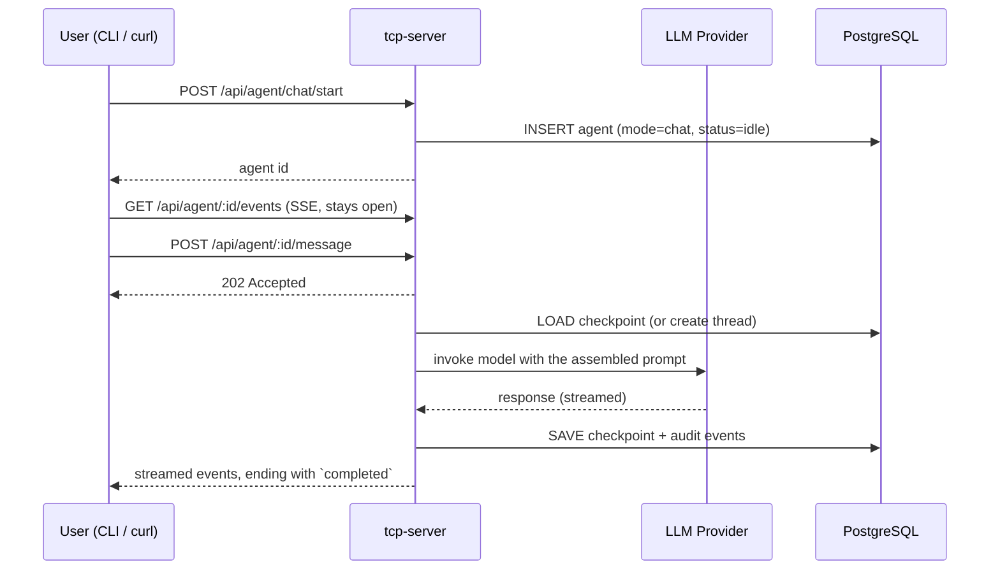

# Section 3 — Chat Agents

[← Back to start](./start.md#sections)

> **Requires:** Section 2 complete — `$COMPANY_ID` and `$ROLE_ID` set.

You are testing the interactive chat flow. A chat agent is a persistent conversation thread backed by LangGraph: each message is appended to the checkpoint and the model sees the full history. tcp-server runs the turn inline (not via tcp-agent), returns `202` immediately, and streams everything the turn does over SSE.

Every route below is JWT-guarded — `$TCP_TOKEN` from [start.md](./start.md#useful-aliases) must be set.



---

## 3.1 — Create a chat agent

```bash
AGENT_ID=$(curl -s -X POST http://localhost:3000/api/agent/chat/start \
  -H "Authorization: Bearer $TCP_TOKEN" \
  -H "Content-Type: application/json" \
  -d "{
    \"companyId\": \"$COMPANY_ID\",
    \"roleId\": \"$ROLE_ID\"
  }" | jq -r '.id')

echo "Agent ID: $AGENT_ID"
```

Expected response:

| Field          | Expected                                   |
| -------------- | ------------------------------------------ |
| `id`           | A UUID string                              |
| `status`       | `"idle"`                                   |
| `threadId`     | `null` (nothing checkpointed yet)          |
| `assignmentId` | A UUID — every agent carries an assignment |

The agent's `chat` **mode** lives on that assignment, not on the agent (see
[tasks.md → Agent modes](../tasks.md#agent-modes)). There is no `type` field.

---

## 3.2 — Send the first message

The message triggers prompt assembly (parts 0–8: system prompt, role persona, company context, services list, the assignment presentation, RAG results, final instruction) and stores the conversation in a LangGraph checkpoint. The POST returns immediately; the turn itself runs detached.

```bash
curl -s -o /dev/null -w '%{http_code}\n' \
  -X POST "http://localhost:3000/api/agent/$AGENT_ID/message" \
  -H "Authorization: Bearer $TCP_TOKEN" \
  -H "Content-Type: application/json" \
  -d '{"message": "Hello! Who are you and what can you help me with?"}'
```

**What to check:**

- The status code is **202**, and the body is `{"accepted":true}`.
- Nothing else comes back on this request — the reply arrives on the SSE stream (section 3.6) or through the CLI (section 3.7). There is no `response` or `compactionReport` field on any HTTP response; the compaction summary rides on the terminal `completed` event.

---

## 3.3 — Send a follow-up message

Send a second message. The model now has the full conversation history from the LangGraph checkpoint and should refer back to what was said.

```bash
curl -s -X POST "http://localhost:3000/api/agent/$AGENT_ID/message" \
  -H "Authorization: Bearer $TCP_TOKEN" \
  -H "Content-Type: application/json" \
  -d '{"message": "What did I just ask you?"}'
```

Expected: on the stream (or in the CLI), the model correctly recalls the previous message ("You asked who I am and what I can help you with" or similar).

---

## 3.4 — Check the agent status

```bash
curl -s "http://localhost:3000/api/agent/$AGENT_ID" \
  -H "Authorization: Bearer $TCP_TOKEN" \
  | jq '{status, threadId}'
```

| Field      | Expected                                             |
| ---------- | ---------------------------------------------------- |
| `status`   | `"idle"` (returns to idle after each turn)           |
| `threadId` | A non-null UUID (the LangGraph checkpoint thread ID) |

---

## 3.5 — Check audit events

Every LLM request and response is written to the audit log, which is also what the CLI replays as history:

```bash
curl -s "http://localhost:3000/api/agent/$AGENT_ID/history" \
  -H "Authorization: Bearer $TCP_TOKEN" \
  | jq '[.[] | {eventType, role}]'
```

Expected: events in chronological order including `input` (your message), `llm_request`, `llm_response`, and `state_change` entries — one set per message sent.

## 3.6 — Watch the raw event stream (optional)

Subscribe to the SSE stream directly to see what the CLI renders. In one
terminal, open the stream; in another, send a message.

```bash
# Terminal 1 — watch the stream (stays open):
curl -sN "http://localhost:3000/api/agent/$AGENT_ID/events" \
  -H "Authorization: Bearer $TCP_TOKEN"

# Terminal 2 — send a message (returns 202 immediately):
curl -s -X POST "http://localhost:3000/api/agent/$AGENT_ID/message" \
  -H "Authorization: Bearer $TCP_TOKEN" \
  -H "Content-Type: application/json" \
  -d '{"message": "Tell me a short story."}'
```

Expected on the stream: a sequence of `data:` events. Most are audit rows
(`{"type":"audit","event":{…}}` — `input`, `state_change`, `llm_request`,
`llm_response`), interleaved with live-only `reasoning`/`response` token deltas
where the provider streams them, ending with a terminal `state_change`.
Reconnecting after the turn has finished still delivers a synthesized terminal
event, replayed from the stored output.

---

## 3.7 — Streamed rendering via the CLI

Run an interactive session in a real terminal (not piped) to exercise the
full-screen TUI, the default rendering mode since 008.6.

```bash
./tcp-cli.sh chat --role-id "$ROLE_ID"
```

**What to check (TUI mode — default on a real terminal):**

- The screen switches to a full-screen view with a tab bar at the top and an
  input line at the bottom. Unlike the old linear transcript, you can no longer
  eyeball "one scrolling stream" — instead, confirm correctness **per tab**:
  - The root tab (your own conversation) shows only its own events: no
    interleaving with any consulted agent's output.
  - Discrete events render as `hh:mm:ss | event_type | text` (e.g.
    `14:32:01 | agent_status | running`), blank-line separated.
  - Reasoning renders specially: no time/type columns, indented two spaces,
    grey, word-wrapped — with a blank line separating it from the events
    before and after it. Confirm it's an actual colour, not literal `^K`/`^:`
    text leaking into the pane.
  - The active tab is shown in bold/bright colour in the tab bar; switch tabs
    and confirm the highlight moves with focus, not just the `[ ]` brackets.
  - If the model ever emits a literal `^` (e.g. in code or math), confirm it
    displays as a single `^` and doesn't corrupt the colour of anything after it.
  - No raw/unformatted event JSON leaks into any pane.
  - `--hide-reasoning` suppresses the reasoning block; the response still renders.
- **Company roster (pane 0):** the first tab is always the company, listing
  its roles. **Up/Down** moves the highlight, **Enter** starts a new chat
  with the highlighted role (a new talkable tab opens and becomes active),
  **r** re-fetches the list. This tab has no input box — confirm arrow keys
  and Enter never fall through to the input from an adjacent talkable tab.
- **Consultation tab:** trigger a consultation and confirm a **new tab**
  appears for the consulted agent (labelled with its role name), switchable via
  **Tab**/**Shift+Tab**. That tab has no input box (spectate-only) and
  its own independent scrollback — switching back to the root tab and back
  again should not lose or reorder anything in either tab.
- **Multiple talkable tabs:** start a second chat from the roster while the
  root agent's turn is still running. Confirm the new tab's input works
  immediately (busy state is per-tab, not global), a draft typed on one
  talkable tab survives switching away and back, and submitting on each tab
  reaches the right agent (not whichever tab was active first).
- **Closing a tab (Ctrl+W):** on a talkable tab with a turn in flight, confirm
  Ctrl+W removes the tab immediately, the turn stops (no further output for
  that agent), and the agent is deleted server-side (check `Agent ... removed`
  on stderr). On a consultation-follower tab, confirm Ctrl+W just removes the
  tab without a deletion message (that agent isn't ours to delete). On the
  roster tab, confirm Ctrl+W does nothing — it's never closable. After closing
  the last agent tab, confirm you're left on the roster, same as starting with
  `--company-id` alone.
- **Ctrl+C mid-turn** stops watching (prints nothing destructive to either
  pane; the agent keeps running server-side) and returns you to the input box.
  **Ctrl+C at the idle prompt** tears down the TUI, cleans up the agent, and
  exits back to a normal terminal — confirm the terminal is left in a sane
  state (cursor visible, no leftover escape sequences).
- Typing `exit` or `quit` in the input box ends the session the same way.

**What to check (plain renderer — pipe the command, or pass `--no-tui`):**

```bash
./tcp-cli.sh chat --role-id "$ROLE_ID" --no-tui
```

- Colour-coded, blank-line-separated blocks appear: **Agent state** (cyan),
  **LLM state** (magenta), **Reasoning** (grey, indented), **Response** (white).
- No raw/unformatted event JSON leaks into the output.
- **Stray-`>` check:** after each turn completes, exactly **one** `> ` prompt is
  shown — never a duplicate or an orphaned prompt while the model is still
  working. Run several turns, including one that triggers a consultation, and one
  where you press **Ctrl+C mid-turn** (which should stop watching, print that the
  agent continues server-side, and re-show a single prompt).
- **Consultation follow:** when the agent consults another role, its activity is
  rendered inline prefixed with the consulted role name (e.g.
  `[Cat assistant] Response: …`).

**What to check (`tui`, no role given):**

```bash
./tcp-cli.sh tui --company-id "$COMPANY_ID"
```

- Opens straight onto the company roster — no agent tab exists yet, no agent
  is created until a role is picked. (`chat` always requires a role; browsing a
  company without one is `tui`'s job.)
- Enter on a role starts a chat and switches to its new talkable tab; Ctrl+C
  at the idle prompt still cleans up every agent created this way, not just
  one.
- `tui` piped, or with `--no-tui`, is rejected with a clear error — there's no
  roster to browse without a TTY.

`scripts/manual-verify.sh` automates the consultation scenario (`-r 4` runs just
the consultation prompt) and asks these as yes/no checks, covering both modes.

---

[Continue to Section 4 → Autonomous Agents](./04-autonomous-agents.md)
