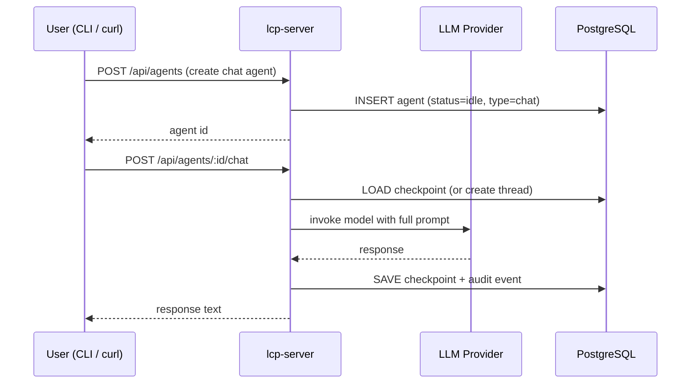

# Section 3 — Chat Agents

[← Back to start](./start.md#sections)

> **Requires:** Section 2 complete — `$COMPANY_ID` and `$ROLE_ID` set.

You are testing the interactive chat flow. A chat agent is a persistent conversation thread backed by LangGraph: each message is appended to the checkpoint and the model sees the full history. The lcp-server handles the LLM call directly (not via lcp-agent).



---

## 3.1 — Create a chat agent

A chat agent is created by POSTing to the agents endpoint with `type: "chat"`.

```bash
AGENT_ID=$(curl -s -X POST http://localhost:3000/api/agents \
  -H "Content-Type: application/json" \
  -d "{
    \"companyId\": \"$COMPANY_ID\",
    \"roleId\": \"$ROLE_ID\",
    \"type\": \"chat\",
    \"initialPrompt\": \"Hello! Who are you?\"
  }" | jq -r '.id')

echo "Agent ID: $AGENT_ID"
```

Expected response:

| Field      | Expected                 |
| ---------- | ------------------------ |
| `id`       | A UUID string            |
| `status`   | `"idle"`                 |
| `type`     | `"chat"`                 |
| `threadId` | `null` (not started yet) |

---

## 3.2 — Send the first message

The first message triggers prompt assembly (parts 0–8: system prompt, role persona, company context, services list, task, RAG results, final instruction) and stores the full conversation in a LangGraph checkpoint.

```bash
curl -s -X POST "http://localhost:3000/api/agents/$AGENT_ID/chat" \
  -H "Content-Type: application/json" \
  -d '{"message": "Hello! Who are you and what can you help me with?"}' \
  | jq '{response, compactionReport}'
```

Expected output:

| Field              | Expected                                       |
| ------------------ | ---------------------------------------------- |
| `response`         | A non-empty string — the agent's reply         |
| `compactionReport` | `null` (context is small on the first message) |

The response content will depend on your `rolePrompt`. If you used the sample data, expect the agent to describe itself using the persona defined there.

> **Via the CLI (recommended):** `lcp-cli chat` no longer blocks on this call.
> `POST /api/agent/:id/message` returns `202 Accepted` immediately and the turn
> streams over `GET /api/agent/:id/events` (SSE). The curl above is a low-level
> illustration; for the streamed experience use section 3.7.

**What to check:**

- The response is coherent and reflects the role's persona.
- Status 202 (accepted); the turn's output arrives on the SSE stream.

---

## 3.3 — Send a follow-up message

Send a second message. The model now has the full conversation history from the LangGraph checkpoint and should refer back to what was said.

```bash
curl -s -X POST "http://localhost:3000/api/agents/$AGENT_ID/chat" \
  -H "Content-Type: application/json" \
  -d '{"message": "What did I just ask you?"}' \
  | jq '.response'
```

Expected: the model correctly recalls the previous message ("You asked who I am and what I can help you with" or similar).

---

## 3.4 — Check the agent status

```bash
curl -s "http://localhost:3000/api/agents/$AGENT_ID" \
  | jq '{status, threadId}'
```

| Field      | Expected                                             |
| ---------- | ---------------------------------------------------- |
| `status`   | `"idle"` (returned to idle after each response)      |
| `threadId` | A non-null UUID (the LangGraph checkpoint thread ID) |

---

## 3.5 — Check audit events

Each LLM request and response is written to the audit log:

```bash
curl -s "http://localhost:3000/api/agents/$AGENT_ID/audit" \
  | jq '[.[] | {eventType, role}]'
```

Expected: a list of audit events including `llm_request` and `llm_response` entries, one pair per message sent.

---

## 3.6 — Watch the raw event stream (optional)

Subscribe to the SSE stream directly to see what the CLI renders. In one
terminal, open the stream; in another, send a message.

```bash
# Terminal 1 — watch the stream (stays open):
curl -sN "http://localhost:3000/api/agent/$AGENT_ID/events"

# Terminal 2 — send a message (returns 202 immediately):
curl -s -X POST "http://localhost:3000/api/agent/$AGENT_ID/message" \
  -H "Content-Type: application/json" \
  -d '{"message": "Tell me a short story."}'
```

Expected on the stream: a sequence of `data:` events — `agent_status` (running),
`llm` activity, `reasoning`/`response` deltas (if the provider streams them), and
a final `completed` event carrying the response. Reconnecting after the turn has
finished still delivers a synthesized `completed` event (replay from the stored
output).

---

## 3.7 — Streamed rendering via the CLI

Run an interactive session in a real terminal (not piped) to exercise the
full-screen TUI, the default rendering mode since 008.6.

```bash
./lcp-cli.sh --username test --password test chat --role-id "$ROLE_ID"
```

**What to check (TUI mode — default on a real terminal):**

- The screen switches to a full-screen view with a tab bar at the top and an
  input line at the bottom. Unlike the old linear transcript, you can no longer
  eyeball "one scrolling stream" — instead, confirm correctness **per tab**:
  - The root tab (your own conversation) shows only its own events: no
    interleaving with any consulted agent's output.
  - Discrete events render as `hh:mm:ss | event_type | text` (e.g.
    `14:32:01 | agent_status | running`), blank-line separated.
  - Reasoning renders specially: no time/type columns, indented two spaces,
    grey, word-wrapped — with a blank line separating it from the events
    before and after it.
  - No raw/unformatted event JSON leaks into any pane.
  - `--hide-reasoning` suppresses the reasoning block; the response still renders.
- **Consultation tab:** trigger a consultation and confirm a **new tab**
  appears for the consulted agent (labelled with its role name), switchable via
  **Ctrl+Right**/**Ctrl+Left**. That tab has no input box (spectate-only) and
  its own independent scrollback — switching back to the root tab and back
  again should not lose or reorder anything in either tab.
- **Ctrl+C mid-turn** stops watching (prints nothing destructive to either
  pane; the agent keeps running server-side) and returns you to the input box.
  **Ctrl+C at the idle prompt** tears down the TUI, cleans up the agent, and
  exits back to a normal terminal — confirm the terminal is left in a sane
  state (cursor visible, no leftover escape sequences).
- Typing `exit` or `quit` in the input box ends the session the same way.

**What to check (plain renderer — pipe the command, or pass `--no-tui`):**

```bash
./lcp-cli.sh --username test --password test chat --role-id "$ROLE_ID" --no-tui
```

- Colour-coded, blank-line-separated blocks appear: **Agent state** (cyan),
  **LLM state** (magenta), **Reasoning** (grey, indented), **Response** (white).
- No raw/unformatted event JSON leaks into the output.
- **Stray-`>` check:** after each turn completes, exactly **one** `> ` prompt is
  shown — never a duplicate or an orphaned prompt while the model is still
  working. Run several turns, including one that triggers a consultation, and one
  where you press **Ctrl+C mid-turn** (which should stop watching, print that the
  agent continues server-side, and re-show a single prompt).
- **Consultation follow:** when the agent consults another role, its activity is
  rendered inline prefixed with the consulted role name (e.g.
  `[Cat assistant] Response: …`).

`scripts/manual-verify.sh` automates the consultation scenario (`-r 4` runs just
the consultation prompt) and asks these as yes/no checks, covering both modes.

---

[Continue to Section 4 → Autonomous Agents](./04-autonomous-agents.md)
