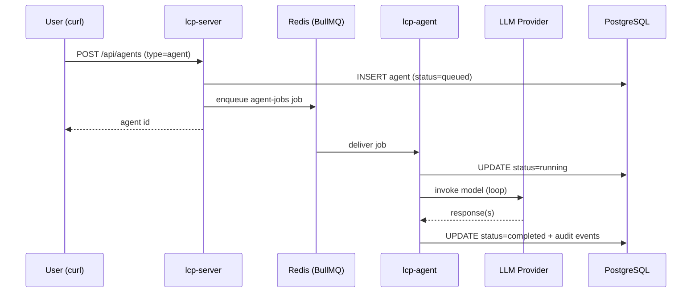

# Section 4 — Autonomous Agents

[← Back to start](./start.md#sections)

> **Requires:** Section 2 complete — `$COMPANY_ID` and `$ROLE_ID` set.

You are testing the autonomous agent pipeline. Unlike chat agents, autonomous agents run as background jobs: lcp-server enqueues a task on Redis (BullMQ), and lcp-agent picks it up, runs the LangGraph loop, and persists the result. The agent works without user interaction after the initial prompt.



---

## 4.1 — Create an autonomous agent

```bash
AGENT_ID=$(curl -s -X POST http://localhost:3000/api/agents \
  -H "Content-Type: application/json" \
  -d "{
    \"companyId\": \"$COMPANY_ID\",
    \"roleId\": \"$ROLE_ID\",
    \"type\": \"agent\",
    \"initialPrompt\": \"Write a brief summary of what you can do for this company.\"
  }" | jq -r '.id')

echo "Agent ID: $AGENT_ID"
```

Expected response:

| Field    | Expected                                |
| -------- | --------------------------------------- |
| `id`     | A UUID                                  |
| `status` | `"queued"` — immediately after creation |
| `type`   | `"agent"`                               |

---

## 4.2 — Watch the agent run

Poll the status endpoint until the agent completes. The lifecycle is:
`queued → running → completed` (or `failed` if the LLM call errors).

```bash
# Poll every 2 seconds until status is no longer 'running' or 'queued'
until [[ $(curl -s "http://localhost:3000/api/agents/$AGENT_ID" | jq -r '.status') != 'queued' && \
        $(curl -s "http://localhost:3000/api/agents/$AGENT_ID" | jq -r '.status') != 'running' ]]; do
  echo -n "."
  sleep 2
done
echo
curl -s "http://localhost:3000/api/agents/$AGENT_ID" | jq '{status, threadId}'
```

Expected final status:

| Field      | Expected        |
| ---------- | --------------- |
| `status`   | `"completed"`   |
| `threadId` | A non-null UUID |

Typical completion time with a local LLM: 5–30 seconds.

---

## 4.3 — Read the agent's output

The agent's final response is captured as an audit event of type `llm_response`:

```bash
curl -s "http://localhost:3000/api/agents/$AGENT_ID/audit" \
  | jq '[.[] | select(.eventType == "llm_response") | .payload.response]'
```

Expected: a JSON array containing the agent's text response. If the role persona was set up in Section 2, the response should reflect it.

---

## 4.4 — Review the full audit trail

Autonomous agents write audit events for each step:

```bash
curl -s "http://localhost:3000/api/agents/$AGENT_ID/audit" \
  | jq '[.[] | {eventType, createdAt}]'
```

Expected sequence of event types:

| Event type     | When it appears                                      |
| -------------- | ---------------------------------------------------- |
| `llm_request`  | Before each LLM call                                 |
| `llm_response` | After each LLM response                              |
| `state_change` | On status transitions (queued → running → completed) |

---

## 4.5 — Verify lcp-agent processed the job

Check that lcp-agent received and ran the job:

```bash
docker compose logs lcp-agent --tail 20
```

Expected log lines (approximate):

| Log message             | Indicates                      |
| ----------------------- | ------------------------------ |
| `Agent <id> picked up`  | BullMQ job delivered to worker |
| `Agent <id>: running`   | Agent loop started             |
| `Agent <id>: completed` | Loop finished successfully     |

---

## 4.6 — Test MCP tool loading (if role has mcpServerList)

If your role's `mcpServerList` includes `"storage"`, `"memory"`, or `"interactions"`, lcp-agent will attempt to connect to those MCP servers and load their tools before running the agent loop.

To verify:

```bash
docker compose logs lcp-agent | grep -i "mcp\|tool"
```

Expected lines:

- `Loaded N tools from MCP server "storage"` — if the server is reachable.
- `Failed to load tools from MCP server "..."` (with a warning) — if a server is down. The agent still runs with whatever tools did load.

---

[Continue to Section 5 → RAG & Documents](./05-rag-documents.md)
