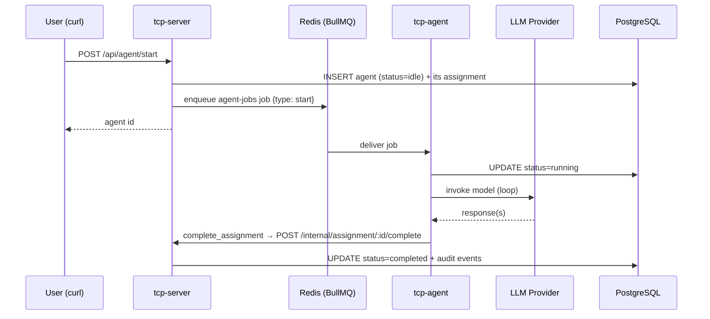

# Section 4 — Autonomous Agents

[← Back to start](./start.md#sections)

> **Requires:** Section 2 complete — `$COMPANY_ID` and `$ROLE_ID` set.

You are testing the autonomous agent pipeline. Unlike chat agents, autonomous agents run as background jobs: tcp-server enqueues a task on Redis (BullMQ), and tcp-agent picks it up, runs the LangGraph loop, and persists the result. The agent works without user interaction after the initial prompt.



Every route below is JWT-guarded — `$TCP_TOKEN` from
[start.md](./start.md#useful-aliases) must be set.

---

## 4.1 — Create an autonomous agent

```bash
AGENT_ID=$(curl -s -X POST http://localhost:3000/api/agent/start \
  -H "Authorization: Bearer $TCP_TOKEN" \
  -H "Content-Type: application/json" \
  -d "{
    \"companyId\": \"$COMPANY_ID\",
    \"roleId\": \"$ROLE_ID\",
    \"initialPrompt\": \"Write a brief summary of what you can do for this company.\"
  }" | jq -r '.id')

echo "Agent ID: $AGENT_ID"
```

Expected response:

| Field          | Expected                                                       |
| -------------- | -------------------------------------------------------------- |
| `id`           | A UUID                                                         |
| `status`       | `"idle"` — the job is queued, the worker hasn't claimed it yet |
| `assignmentId` | A UUID — an orphan `implement`-mode assignment                 |

There is no `type` field and no `queued` status: whether an agent is
"autonomous" is simply whether it was dispatched to the worker queue. Its mode
lives on its assignment (see [tasks.md → Agent modes](../tasks.md#agent-modes)).

Returns **503** if the system is draining for shutdown.

---

## 4.2 — Watch the agent run

Poll the status endpoint until the agent reaches a terminal state. The lifecycle
is `idle → running → completed` (or `failed`, or `paused` if it asks a question
or consults another role).

```bash
# Poll every 2 seconds until the status is terminal
until [[ ! $(curl -s "http://localhost:3000/api/agent/$AGENT_ID" \
              -H "Authorization: Bearer $TCP_TOKEN" | jq -r '.status') \
         =~ ^(idle|running)$ ]]; do
  echo -n "."
  sleep 2
done
echo
curl -s "http://localhost:3000/api/agent/$AGENT_ID" \
  -H "Authorization: Bearer $TCP_TOKEN" | jq '{status, threadId}'
```

Expected final status:

| Field      | Expected        |
| ---------- | --------------- |
| `status`   | `"completed"`   |
| `threadId` | A non-null UUID |

Typical completion time with a local LLM: 5–30 seconds.

Rather than polling, you can watch the run live — this is what `eavesdrop` is
for:

```bash
./tcp-cli.sh eavesdrop --agent-id "$AGENT_ID" --tail
```

---

## 4.3 — Read the agent's output

The agent's final answer is stored on the agent itself, as the `summary` it
passed to `complete_assignment`:

```bash
curl -s "http://localhost:3000/api/agent/$AGENT_ID" \
  -H "Authorization: Bearer $TCP_TOKEN" | jq -r '.output'
```

Expected: the agent's text response. If the role persona was set up in Section 2,
it should reflect it.

---

## 4.4 — Review the full audit trail

Autonomous agents write audit events for each step. This is the same data the
CLI replays with `eavesdrop --show-history`:

```bash
curl -s "http://localhost:3000/api/agent/$AGENT_ID/history" \
  -H "Authorization: Bearer $TCP_TOKEN" \
  | jq '[.[] | {eventType, timestamp}]'
```

Expected sequence of event types:

| Event type              | When it appears                                       |
| ----------------------- | ----------------------------------------------------- |
| `state_change`          | On status transitions (idle → running → completed)    |
| `llm_request`           | Before each LLM call                                  |
| `llm_response`          | After each LLM response                               |
| `tool_call`             | Each MCP tool the agent invokes                       |
| `tool_result`           | Each tool's result                                    |
| `agent_loop_completion` | Once at the end — the summary and the tracked actions |

---

## 4.5 — Verify tcp-agent processed the job

Check that tcp-agent received and ran the job:

```bash
docker compose logs tcp-agent --tail 20
```

Expected log lines (approximate):

| Log message             | Indicates                      |
| ----------------------- | ------------------------------ |
| `Agent <id> picked up`  | BullMQ job delivered to worker |
| `Agent <id>: running`   | Agent loop started             |
| `Agent <id>: completed` | Loop finished successfully     |

---

## 4.6 — Test MCP tool loading (if role has mcpServerList)

If your role's `mcpServerList` includes `"storage"`, `"memory"`, `"interactions"`, or `"tasks"`, tcp-agent will attempt to connect to those MCP servers and load their tools before running the agent loop. The agent's mode then narrows that set (`MODE_TOOLS`) — an `implement`-mode agent gets all four, a `plan`-mode one never gets `interactions`.

To verify:

```bash
docker compose logs tcp-agent | grep -i "mcp\|tool"
```

Expected lines:

- `Loaded N tools from MCP server "storage"` — if the server is reachable.
- `Failed to load tools from MCP server "..."` (with a warning) — if a server is down. The agent still runs with whatever tools did load.

---

[Continue to Section 5 → RAG & Documents](./05-rag-documents.md)
