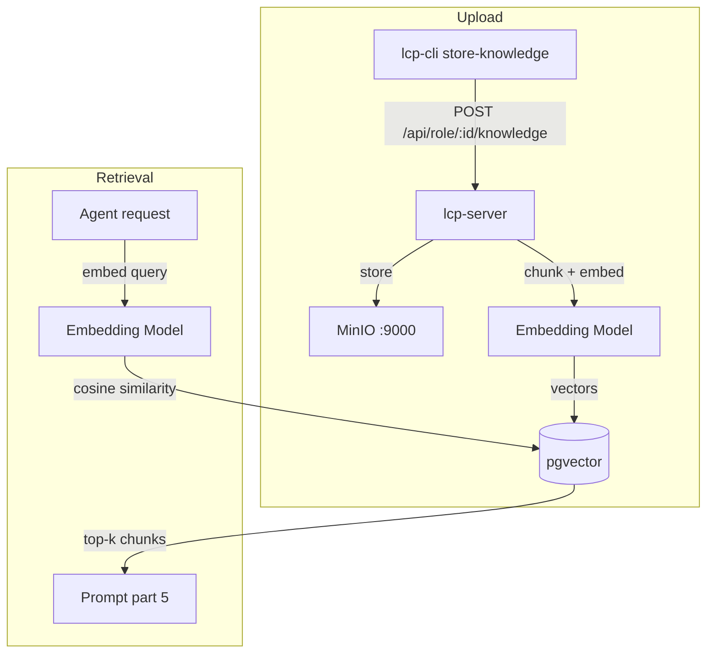

# Section 5 — RAG & Documents

[← Back to start](./start.md#sections)

> **Requires:** Section 2 complete — `$COMPANY_ID` and `$ROLE_ID` set.
>
> **Also requires:** An embedding model configured. The company's `embeddingConfig` must point to a model that supports `/v1/embeddings` (LM Studio with `nomic-embed-text` or similar). If your company has no `embeddingConfig`, RAG retrieval is skipped silently.

You are testing the RAG (Retrieval-Augmented Generation) pipeline. Knowledge documents are uploaded to MinIO, chunked, embedded via the embedding model, and stored in PostgreSQL (pgvector). When an agent runs, relevant chunks are retrieved by semantic similarity and injected into prompt part 5.



---

## 5.1 — Prepare a knowledge document

Knowledge documents must be Markdown files with valid YAML front-matter containing at least a `title` field. Create a sample document:

```bash
cat > /tmp/test-knowledge.md << 'EOF'
---
title: Company Policies Overview
author: Test
---

# Company Policies

## Code of Conduct

All employees are expected to treat colleagues with respect. Harassment of any kind is not tolerated.

## Remote Work

Employees may work remotely up to three days per week. Core hours are 10:00–15:00 local time.

## Data Handling

All customer data must be encrypted at rest and in transit. Do not store customer PII in personal devices.
EOF
```

---

## 5.2 — Upload the document

```bash
./lcp-cli.sh store-knowledge \
  --role "$ROLE_ID" \
  --source /tmp/test-knowledge.md
```

Expected output:

| Output          | Expected                                   |
| --------------- | ------------------------------------------ |
| Success message | `Uploaded: test-knowledge.md` (or similar) |
| No error        | Exit code 0                                |

If validation fails (e.g. missing `title`), the CLI reports the error and uploads nothing.

---

## 5.3 — List stored documents

```bash
./lcp-cli.sh list-knowledge --role "$ROLE_ID"
```

Expected: a table showing `test-knowledge.md` with its size and last-modified date.

You can also verify the file is in MinIO by checking the console at [http://localhost:9001](http://localhost:9001) under the path `{company-slug}/knowledge/{role-slug}/test-knowledge.md`.

---

## 5.4 — Query the RAG index directly (lighter-weight alternative)

Before spinning up a full agent turn (5.5 below), you can see the raw chunks
a role's next prompt would retrieve directly, with no LLM call involved:

```bash
./lcp-cli.sh query-knowledge --role "$ROLE_ID" --query "What is the company policy on remote work?"
```

Expected: a JSON array of `{ id, documentPath, chunkIndex, content, similarity }`,
including a chunk of `test-knowledge.md`'s "Remote Work" section, ranked by
similarity. An empty array means either nothing scored above the default
threshold (0.7) or the company has no `embeddingConfig` — not an error.

---

## 5.5 — Verify RAG retrieval in an agent

Create an agent with a prompt that should trigger retrieval of the document content:

```bash
AGENT_ID=$(curl -s -X POST http://localhost:3000/api/agents \
  -H "Content-Type: application/json" \
  -d "{
    \"companyId\": \"$COMPANY_ID\",
    \"roleId\": \"$ROLE_ID\",
    \"type\": \"agent\",
    \"initialPrompt\": \"What is the company policy on remote work?\"
  }" | jq -r '.id')

# Wait for completion
until [[ $(curl -s "http://localhost:3000/api/agents/$AGENT_ID" | jq -r '.status') == 'completed' ]]; do
  sleep 2
done

curl -s "http://localhost:3000/api/agents/$AGENT_ID/audit" \
  | jq '[.[] | select(.eventType == "llm_response") | .payload.response] | last'
```

Expected: the agent's response mentions the remote work policy (three days per week, core hours 10:00–15:00). This confirms that the relevant knowledge chunk was retrieved and injected.

---

## 5.6 — Check that injection shows in the audit log

The RAG injection is not directly audited but you can infer it from lcp-agent logs:

```bash
docker compose logs lcp-agent | grep -i "rag\|chunk\|retriev"
```

For lcp-server chat agents, check:

```bash
docker compose logs lcp-server | grep -i "rag\|chunk\|retriev"
```

---

## 5.7 — Remove a document

```bash
./lcp-cli.sh delete-knowledge \
  --role "$ROLE_ID" \
  --file "test-knowledge.md"
```

Expected: success message. The document is removed from MinIO and all associated `KnowledgeChunk` rows are deleted from PostgreSQL. Subsequent agents will not retrieve content from it.

---

## 5.8 — Open the document store (optional)

The `open-document-store` command prints and opens the MinIO console URL:

```bash
./lcp-cli.sh open-document-store
```

Expected: URL printed to stdout; browser opens to the MinIO console.

---

[Continue to Section 6 → MCP Servers](./06-mcp-servers.md)
