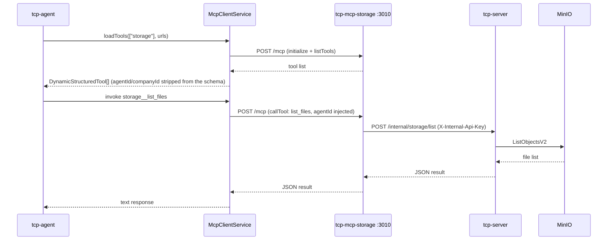

# Section 6 — MCP Servers

[← Back to start](./start.md#sections)

> **Requires:** Section 1 complete — Docker stack running. Section 5 recommended (storage operations are more interesting with files present).

You are testing the four MCP (Model Context Protocol) servers. Each exposes an HTTP endpoint that agents use to call tools at runtime. The servers use a stateless request-per-connection model: a fresh MCP session is created for every tool call.

The four servers are:

- **tcp-mcp-storage** (port 3010) — shared-storage exploration plus assignment-scoped working files and materials. Holds no S3 client: it proxies to tcp-server.
- **tcp-mcp-memory** (port 3011) — `recall`, `remember`, `search_knowledge`, over pgvector. The only one with its own database connection.
- **tcp-mcp-interactions** (port 3012) — `request_user_input`, `request_agent_consultation`, `list_available_contacts`. Proxies to tcp-server.
- **tcp-mcp-tasks** (port 3013) — `create_plan`, `complete_assignment`, `assure_assignment`, gated to the caller's mode. Proxies to tcp-server.

> The MCP servers are internal-only unless the stack was started with
> `./scripts/start-deployment.sh --dev-ports`. Start it that way before running
> this section's `curl`s against `localhost`.



---

## 6.1 — Health checks

Each MCP server exposes a `GET /health` endpoint.

```bash
curl -s http://localhost:3010/health
curl -s http://localhost:3011/health
curl -s http://localhost:3012/health
```

Expected response for each (status 200):

```json
{ "status": "ok" }
```

---

## 6.2 — List tools on the storage server

Send an MCP `initialize + tools/list` request to the storage server. This is what tcp-agent does when loading tools for a role that includes `"storage"` in its `mcpServerList`.

```bash
curl -s -X POST http://localhost:3010/mcp \
  -H "Content-Type: application/json" \
  -d '{
    "jsonrpc": "2.0",
    "id": 1,
    "method": "initialize",
    "params": {
      "protocolVersion": "2025-03-26",
      "capabilities": {},
      "clientInfo": { "name": "manual-test", "version": "0.0.1" }
    }
  }' | jq '.result.serverInfo'
```

Expected:

| Field     | Expected            |
| --------- | ------------------- |
| `name`    | `"tcp-mcp-storage"` |
| `version` | `"1.0.0"`           |

Then list tools:

```bash
curl -s -X POST http://localhost:3010/mcp \
  -H "Content-Type: application/json" \
  -d '{
    "jsonrpc": "2.0",
    "id": 2,
    "method": "tools/list",
    "params": {}
  }' | jq '[.result.tools[].name]'
```

Expected tool list:

| Tool                                                                                                                                                                                                                                 | Description                                                           |
| ------------------------------------------------------------------------------------------------------------------------------------------------------------------------------------------------------------------------------------ | --------------------------------------------------------------------- |
| `describe_server`                                                                                                                                                                                                                    | Returns an overview of the storage service                            |
| `describe_folder`                                                                                                                                                                                                                    | Explains the purpose of a folder by path prefix                       |
| `list_files` / `read_file` / `search_files`                                                                                                                                                                                          | Read-only exploration by full object key                              |
| `get_file_properties` / `get_file_summary`                                                                                                                                                                                           | File metadata / structural summary                                    |
| `list_working_files` / `read_working_file` / `create_working_file` / `append_working_file` / `replace_in_working_file` / `delete_working_file` / `restore_working_file` / `get_working_file_properties` / `get_working_file_summary` | Assignment-scoped working files (filename-only; require an `agentId`) |
| `list_material_files` / `read_material_file` / `get_material_file_properties`                                                                                                                                                        | Assignment-scoped materials (require an `agentId`)                    |

> The `*_working_file` and `*_material_file` tools take an `agentId` that in production is injected by `McpClientService` and resolved server-side to a working directory. A bare `curl` has no agent context, so the sections below exercise the read-only exploration tools; drive the scoped tools through a real agent run instead.

---

## 6.3 — Call `describe_server`

```bash
curl -s -X POST http://localhost:3010/mcp \
  -H "Content-Type: application/json" \
  -d '{
    "jsonrpc": "2.0",
    "id": 3,
    "method": "tools/call",
    "params": {
      "name": "describe_server",
      "arguments": {}
    }
  }' | jq -r '.result.content[0].text'
```

Expected: a markdown overview of the storage service listing all tools and path conventions.

This is the tool an agent calls when it first connects to a server to learn what is available and how to use it — analogous to reading a man page before running commands.

---

## 6.4 — Call `describe_folder`

```bash
curl -s -X POST http://localhost:3010/mcp \
  -H "Content-Type: application/json" \
  -d '{
    "jsonrpc": "2.0",
    "id": 4,
    "method": "tools/call",
    "params": {
      "name": "describe_folder",
      "arguments": { "path": "acme/tasks/123/output" }
    }
  }' | jq -r '.result.content[0].text'
```

Expected: a description of the `output` folder — something like "Task output — Files created during task execution. This is your working area..."

Try different path prefixes and observe the canned descriptions:

| Path                       | Expected description topic            |
| -------------------------- | ------------------------------------- |
| `acme/tasks/abc/materials` | Task materials — read-only inputs     |
| `acme/tasks/abc/output`    | Task output — agent working area      |
| `acme/knowledge/analyst`   | Knowledge base — RAG source documents |
| `acme/finished/reports`    | Finished reports — stable artefacts   |
| `acme/audit/abc`           | Audit log — append-only JSONL         |

---

## 6.5 — List files in MinIO via MCP

If you uploaded a document in Section 5, you can retrieve it through the storage MCP server:

```bash
# Replace 'acme' with your company slug
curl -s -X POST http://localhost:3010/mcp \
  -H "Content-Type: application/json" \
  -d '{
    "jsonrpc": "2.0",
    "id": 5,
    "method": "tools/call",
    "params": {
      "name": "list_files",
      "arguments": { "path": "acme/knowledge" }
    }
  }' | jq -r '.result.content[0].text'
```

Expected: a JSON array of file entries including `test-knowledge.md`.

| Field          | Expected                                                         |
| -------------- | ---------------------------------------------------------------- |
| `key`          | Full object key, e.g. `acme/knowledge/analyst/test-knowledge.md` |
| `size`         | File size in bytes (> 0)                                         |
| `lastModified` | ISO 8601 timestamp                                               |

---

## 6.6 — Read a file via MCP

Read back a document you uploaded in Section 5 through the read-only `read_file` tool (agent writes go through the assignment-scoped `append_working_file` tool, which needs a real agent context — see the note in 6.2):

```bash
# Read (replace the key with one from the 6.5 listing)
curl -s -X POST http://localhost:3010/mcp \
  -H "Content-Type: application/json" \
  -d '{
    "jsonrpc": "2.0",
    "id": 7,
    "method": "tools/call",
    "params": {
      "name": "read_file",
      "arguments": { "path": "acme/knowledge/analyst/test-knowledge.md" }
    }
  }' | jq -r '.result.content[0].text'
```

Expected: the file's text content, or `File not found: {path}` if the key does not exist.

---

## 6.7 — Verify the memory server searches for real

`recall` runs a live pgvector query, so this needs a company with an
`embeddingConfig` and some indexed knowledge (Section 5).

```bash
curl -s -X POST http://localhost:3011/mcp \
  -H "Content-Type: application/json" \
  -d "{\"jsonrpc\":\"2.0\",\"id\":1,\"method\":\"tools/call\",\"params\":{
        \"name\":\"recall\",
        \"arguments\":{\"roleId\":\"$ROLE_ID\",\"companyId\":\"$COMPANY_ID\",\"query\":\"remote work policy\"}}}" \
  | jq -r '.result.content[0].text'
```

Expected: matching chunks with their cosine similarity scores, or a "no results"
message if nothing clears the threshold. With no `embeddingConfig` on the
company, expect a message directing the agent to the RAG context in its prompt
instead — that is the one remaining "not implemented"-shaped response, and it
means "not configured", not "not built".

---

## Testing complete

You have verified the full stack end to end:

| Section                                                          | ✓   |
| ---------------------------------------------------------------- | --- |
| Infrastructure — all services healthy                            |     |
| Companies & roles — create and retrieve                          |     |
| Chat agents — multi-turn conversation                            |     |
| Autonomous agents — job dispatch and completion                  |     |
| RAG & documents — upload, retrieve, and verify in agent response |     |
| MCP servers — tool listing, describe, read, write                |     |

[← Back to start](./start.md)
