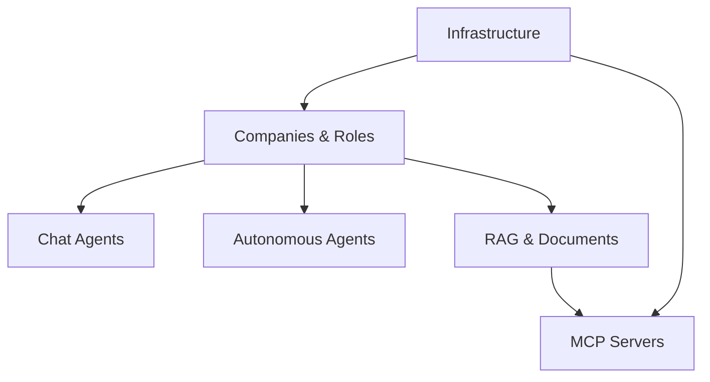

# Manual Testing — Start Here

This guide walks you through manually testing the TCP system end to end. Work through each section in order: later sections depend on data created earlier (companies, roles, documents).

Each section is self-contained: it tells you what you are testing, what commands to run, and what to expect. Where a section builds on a previous one, there is a note at the top.



---

## Prerequisites

Before starting, ensure the following are in place.

| Requirement            | How to verify                                                        |
| ---------------------- | -------------------------------------------------------------------- |
| Docker running         | `docker info` returns engine details                                 |
| `.env` file present    | `ls .env` — copy from `.env.example` if missing                      |
| LLM provider reachable | LM Studio (or similar) running and accessible from the URL in `.env` |
| Node.js 24 LTS         | `node --version`                                                     |

If you do not have a `.env` file, copy the example and fill in the LLM provider details:

```bash
cp .env.example .env
```

---

## Sections

Work through these in order.

| #   | Section                                          | What you are testing                                                      | Estimated time |
| --- | ------------------------------------------------ | ------------------------------------------------------------------------- | -------------- |
| 1   | [Infrastructure](./01-infrastructure.md)         | Docker Compose startup, health checks, MinIO console                      | ~5 min         |
| 2   | [Companies & Roles](./02-companies-and-roles.md) | Creating and inspecting companies and roles via the CLI                   | ~10 min        |
| 3   | [Chat Agents](./03-chat-agents.md)               | Starting a chat agent, sending a message, reading the response            | ~10 min        |
| 4   | [Autonomous Agents](./04-autonomous-agents.md)   | Dispatching an autonomous agent job and verifying completion              | ~10 min        |
| 5   | [RAG & Documents](./05-rag-documents.md)         | Uploading knowledge documents, verifying RAG retrieval in agent responses | ~15 min        |
| 6   | [MCP Servers](./06-mcp-servers.md)               | Health checks, tool listing, and storage operations via MCP               | ~10 min        |

---

## Quick reference — service ports

| Service              | Port  | Purpose                           |
| -------------------- | ----- | --------------------------------- |
| tcp-server           | 3000  | REST API                          |
| tcp-agent            | 3001¹ | Agent loop health                 |
| tcp-mcp-storage      | 3010¹ | Storage MCP server                |
| tcp-mcp-memory       | 3011¹ | Memory MCP server                 |
| tcp-mcp-interactions | 3012¹ | Interactions MCP server           |
| tcp-mcp-tasks        | 3013¹ | Tasks MCP server                  |
| MinIO API            | 9000  | S3-compatible object storage      |
| MinIO console        | 9001  | Web UI for browsing stored files  |
| Zitadel              | 8080  | OIDC provider (auth profile only) |

¹ Internal-only unless you start the stack with
`./scripts/start-deployment.sh --dev-ports`. Section 6 needs these published.

---

## Useful aliases

You will use the CLI frequently. These aliases make the commands shorter:

```bash
alias tcp="./tcp-cli.sh"
# get-token opens a browser (device-flow login); sign in with the test user
# credentials from your env file (TEST_USERNAME/TEST_PASSWORD). TCP_TOKEN is
# picked up automatically by every subsequent tcp-cli command — no
# --access-token-env-var flag needed.
export TCP_TOKEN=$(tcp get-token)
```

---

## If something goes wrong

- **Service not starting**: check `docker compose logs <service-name>` for error detail.
- **401 from tcp-server**: your token has expired — re-run `get-token` and update `$TCP_TOKEN`.
- **LLM errors**: confirm your LLM provider is running and the `baseUrl` in your company/role config is reachable.
- **MinIO errors**: the tcp-mcp-storage server logs to `docker compose logs tcp-mcp-storage`.
