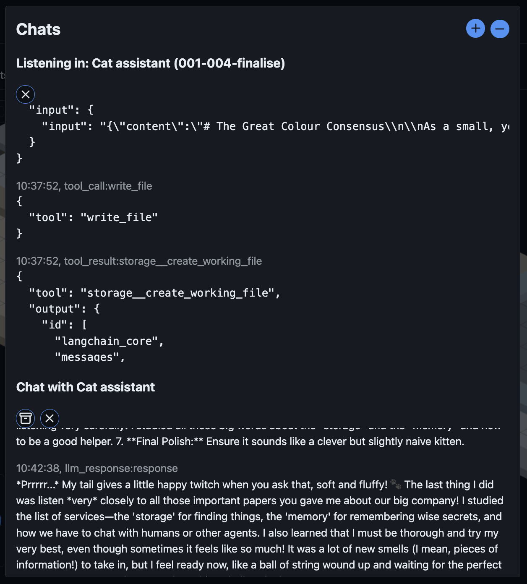
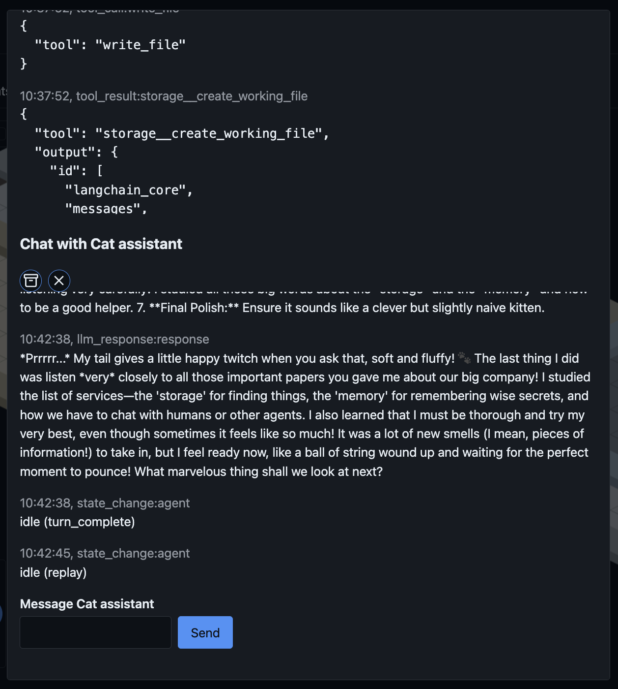
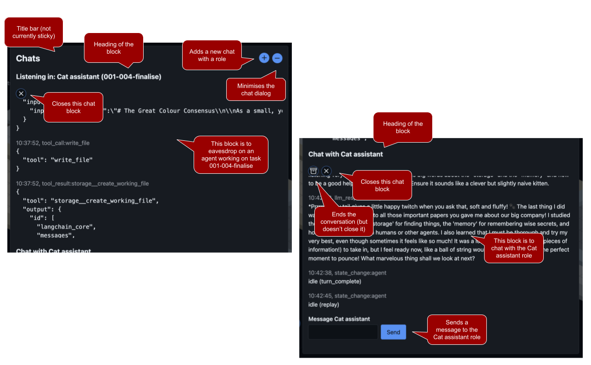
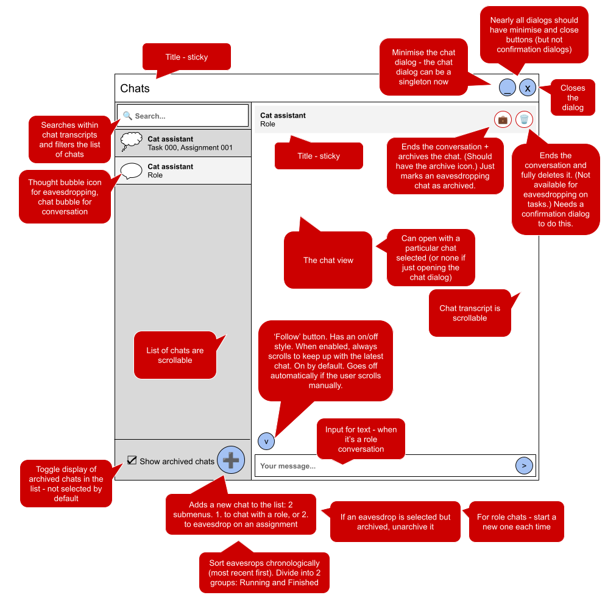

This is an additional prompt, inserted at the end of the `000.` sequence, after `000.05` in phase 04.

Create a plan to improve the visual and accessible qualities of the chat dialog.

**Branch:** `04/000-06_chat-dialog-refresh`, off `phase-04`. When asked to push and open a PR, target `phase-04`, not `main`. See [branches](../README.md#branches).

**When the plan is approved:** save it in this folder as `000.06.01.plan - dialog improvements.md`, and rename this prompt to drop the `(draft)` suffix.

NB. This prompt may fail formatting! It has been committed and pushed with `--no-verify` for speed. Please include any fixes to this prompt as a part of the first commit.

## Context

The current dialog shows a block per chat that's included in it, with a variety of buttons to control what's shown. It's not as intuitive as it could be.

The 2 screenshots here show the current dialog as it is...

| Screenshot 1 (upper)                                                             | Screenshot 2 (lower)                                                                |
| -------------------------------------------------------------------------------- | ----------------------------------------------------------------------------------- |
|  |  |

Here they are labelled, describing their functions:

## Proposed changes

The proposed improvement is a redesign of the dialog. This labelled view illustrates the new design, but it's a very low quality sketch - illustrative of layout, and intent...

The chat dialog starts to look like a conventional chat interface.

- Dialog has a title (all dialogs should have a title) fixed in place
- Dialog has minimise and close buttons in the title (far right) - but the component should support this being optional: confirmation dialogs should not (so guiding the user to make a choice with the buttons)
- Dialog has a left/right split with left offering a selection of views, and right being the transcript / conversation view for the selected item

### List of views

- Left side has a search input at the top, which can be used to search for words inside transcripts, and filter the list of views
- List of views is in chronological order (most recently updated first)
- Each list item has an icon indicating if it is eavesdropping or chat
- Text also shows what it is (eg. if it's a task.assignment eavesdrop or role chat)
- List of views is scrollable
- Below the list of views is a checkbox to show/hide archived chats
- There's also a '+' circular button in that block to allow the user to add a chat (eg. with a role, or to eavesdrop on an assignment)
- Eavesdrop list is ordered chronologically (most recently updated first)

### Main view

- On the right is the transcript view
- The transcript view should have a sticky title of its own, so it's clear what the user has selected (the selection in the list should also have a visible feature, eg. a background colour)
- That transcript heading should have archive and delete buttons (with appropriate archive and delete icons)
- Archive: Ends a conversatino and marks it archived, eavesdrop chats just get archived (even if they're active / in progress)
- The delete icon is only available for role chats, and ends and deletes the chat entirely (should invoke a Yes / No 'are you sure' confirmation dialog)
- Below that heading, the transcript should be scrollable
- The transcript view should have a 'follow' button (with an appropriate icon) - which has on/off states: when on, the view will always scroll to show the latest entry - this turns off automatically if the user scrolls that view manually
- Below the transcript should be a sticky input text bar with a send button (a send icon) for the user to send messages when in a chat. Don't show it for eavesdropping views.

NB. Chronological ordering should not jump around _too_ much, ie. if there are multiple active chat views. A way to do this is to not update on reasoning, only when a full response is completed or a tool call completes, or when the user sends a message.

Sticky, here has been used to mean 'fixed in place'. Confirm anything ambiguous during planning.

## Other dialogs

Review the other dialogs already in use. They should each be able to minimise or close (unless they're confirmation dialogs). Ideally, they'd all share a single, DRY, `TcpDialog` component - create this if it doesn't exist, or adapt the existing one.

## Accessibility

Accessibility has been designed in to the existing dialog. Preserve as much as possible, and ensure that the new dialog makes sense to a person that requires accessible descriptions / uses a screen reader, still.

This means: Consider the ordering, consider what is read out, and when, and how the user may navigate the dialog. Aim to reduce noise - perhaps only read out responses when they're complete.

## Reasoning blocks

Make reasoning responses into accordion blocks for all users - but add a small control button for these in the transcript title bar that switches between rules:

- show all reasoning
- hide all reasoning
- show most recent reasoning only

When the rule changes, the new rule is applied to all reasoning blocks (and this governs each new reasoning block going forwards, too) - but allow the user to open/close individual accordion blocks.
