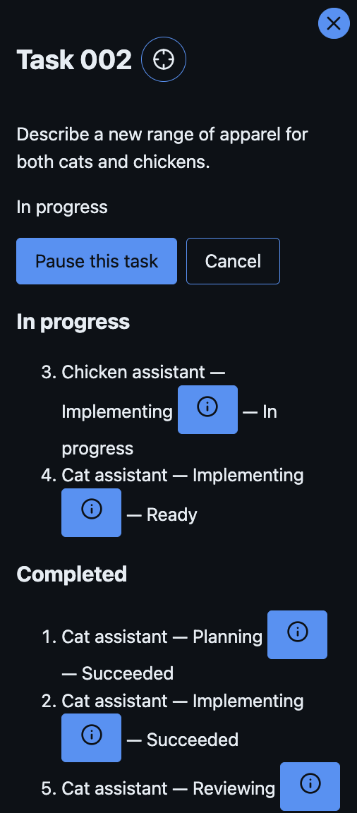
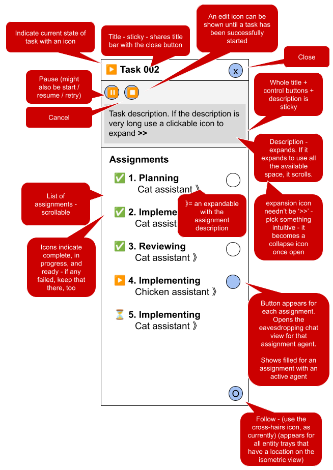

Create a new plan to address the feedback below for the UI.

Remain on branch `04/000-06_chat-dialog-refresh`, continue to create commits there.

When done, push and update the PR.

## Task room lighting

During a task, the lighting in a task room goes off when an agent completes an assignment and another must enter the room. It's better if the lighting for a task room stays on while a task is active - ie. ignore location of avatars, just use task status

## The task tray

The list of assignments for a task needs a bit of a refresh.

| Current                                     | Proposed                                     |
| ------------------------------------------- | -------------------------------------------- |
|  |  |

Emoji and symbols used in the design illustration are illustrative only. Prefer icons from the established icon library - and select for appropriateness to the usage.

Retain accessible qualities for the components.

### General tray layout

This is the general layout for trays. If possible, ensure we have a common component to render trays that ensures the general layout, which can have other components composited into it for the speifics.

- Title and close button should share a title bar (for all trays)
- Below that should be a sticky/fixed section containing:
  - Small icon buttons for actions the user can take with this entity
  - A description of the entity
    - Some kind of expansion control for long descriptions
    - If expanded and if it reaches all the space available, it becomes scrollable
    - The expand control is exchanged for a contract / restore icon of some sort, stuck to the bottom of the expanded section so it's always visible
- At the bottom right is a follow button that centres the isometric view on the entity (as now)

### Task specifics

- The small icon buttons for actions - each shown as appropriate
  - start / resume / retry
  - pause
  - cancel
  - edit
- The main section contains
  - Heading: Assignments
  - A list of assignments, arranged as a small table
    - Col 1: Status icon, top aligned
    - Col 2: Initially 2 rows:
      - Assignment type (eg. planning / implementing / reviewing / finalising / etc.)
      - Role, followed by an expansion control
        - ... for an expanded section containing the assignment description
        - When expanded the expand icon is exchanged for a contract control
  - Inspect icon button
    - Outline for completed assignments
    - Filled for assignments in progress
    - Not present for not started assignments
    - Opens the eavesdropping chat view for the assignment agent
