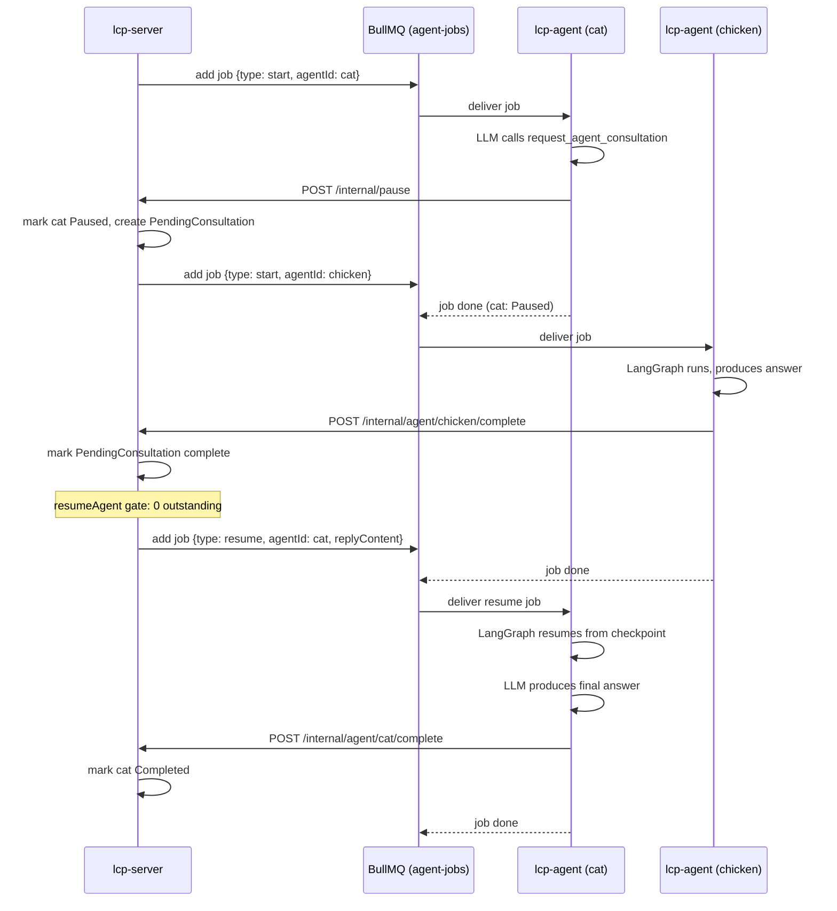
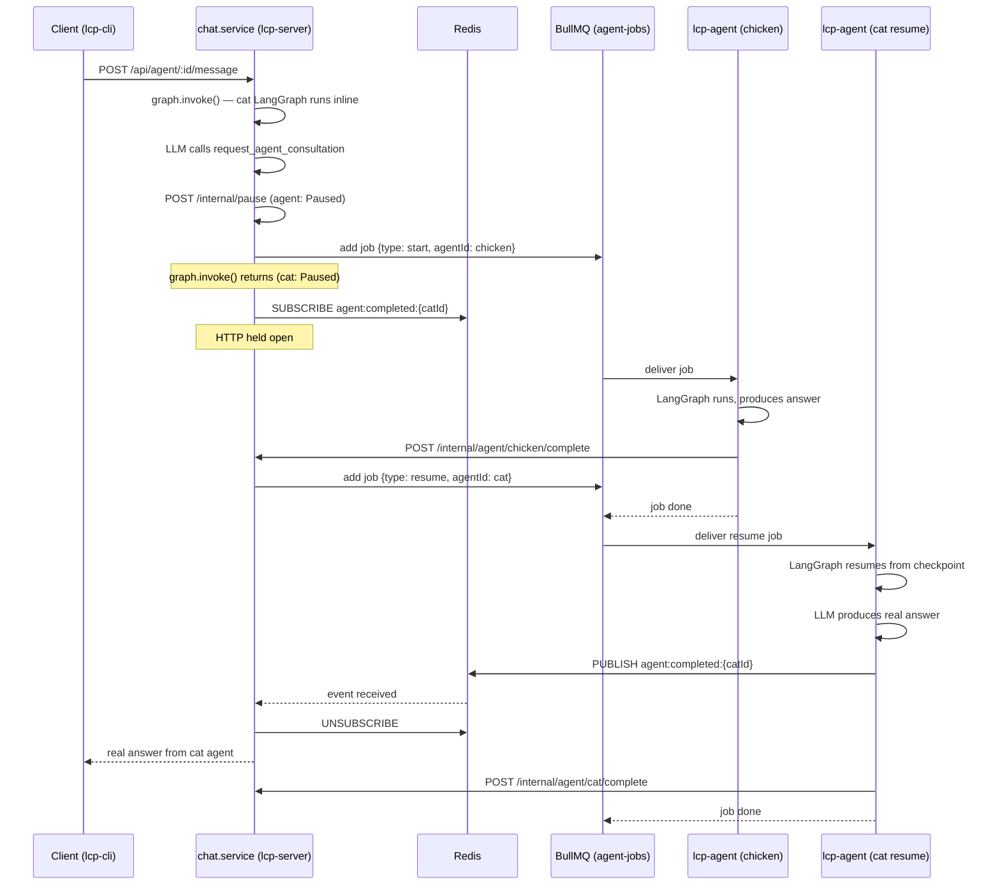

# BullMQ Queue

## Overview

LCP uses a single BullMQ queue named **`agent-jobs`** backed by Redis. All
agent execution is asynchronous: lcp-server enqueues jobs, lcp-agent workers
consume them.

| Role     | Service    | Component                   |
| -------- | ---------- | --------------------------- |
| Producer | lcp-server | `AgentOrchestrationService` |
| Consumer | lcp-agent  | `AgentWorkerService`        |

## Job types

| `type`   | When dispatched                                               | Payload                                      |
| -------- | ------------------------------------------------------------- | -------------------------------------------- |
| `start`  | New agent created (`AgentOrchestrationService.startAgent`)    | `{ agentId, type: 'start' }`                 |
| `resume` | All outstanding requests resolved (`resumeAgent` gate passes) | `{ agentId, type: 'resume', replyContent? }` |

`replyContent` on a `resume` job is the aggregated text of every consultation
result and user reply received since the agent paused (see
[ADR-012](ADRs/ADR-012-human-in-the-loop.md) for the aggregation logic).

## Use cases

### 1. Standard agent task

The common path: lcp-server enqueues a `start` job, lcp-agent runs the loop
to completion, and records the output.

```mermaid
sequenceDiagram
    participant S as lcp-server
    participant Q as BullMQ (agent-jobs)
    participant A as lcp-agent

    S->>Q: add job {type: start, agentId}
    Q->>A: deliver job
    A->>A: AgentLoopService.run()
    Note over A: LangGraph runs to completion
    A->>A: complete_task called (required; reminded if missed)
    A->>S: POST /internal/agent/:id/complete (or /fail)
    S->>S: store output, mark Completed (or Failed)
    A-->>Q: job done
```

---

### 2. Agent-to-agent consultation

The calling agent pauses while the called agent runs as a separate job. When
the called agent completes, lcp-server gates the resume on outstanding
requests before re-enqueuing the calling agent.



---

### 3. Chat session with consultation

A chat session (triggered by `POST /api/agent/:id/message`) runs LangGraph
**inline** in lcp-server — no BullMQ job for the calling agent's first turn.
The POST returns `202` immediately and the turn streams over SSE; when a
consultation tool is called, lcp-server dispatches a BullMQ job for the called
agent as normal. Once that job's chain completes, the calling agent's resumed
run finishes and lcp-server emits the terminal `completed` event to the client's
SSE stream.

> **Note:** the sequence diagram below predates [ADR-015](ADRs/ADR-015-agent-completion-sse.md)
> (amended) — the `SUBSCRIBE agent:completed` / "HTTP held open" long-poll it
> shows was replaced by the `202` + SSE flow. Steps are otherwise unchanged. See
> [ADR-012](ADRs/ADR-012-human-in-the-loop.md) for the pause/resume details.



---

### 4. User-input pause and resume

An agent can pause to ask a human a question. The human replies via the CLI
or API; lcp-server gates the resume on all outstanding requests (same path as
consultation).


## Resume gating

`AgentOrchestrationService.resumeAgent` is the single choke point for all
resume paths (consultation complete, user reply). Before dispatching a
`resume` job it counts outstanding `PendingConsultation` rows with
`status = 'pending'` and `Conversation` rows with `status = 'awaiting_user'`
for the agent. The job is only dispatched when both counts are zero, ensuring
the agent sees every answer it asked for in a single resumed run rather than
resuming prematurely on the first response to arrive.

## Redis pub/sub channel

In addition to job routing, Redis carries a lightweight completion signal:

| Channel                     | Published by                   | Consumed by                |
| --------------------------- | ------------------------------ | -------------------------- |
| `agent:completed:{agentId}` | `AgentLoopService` (lcp-agent) | `ChatService` (lcp-server) |

This channel is only relevant for **chat sessions** (use case 3). Standard
BullMQ agent runs (use cases 1, 2, 4) do not depend on it — if no one
subscribes, the message goes nowhere harmlessly.
