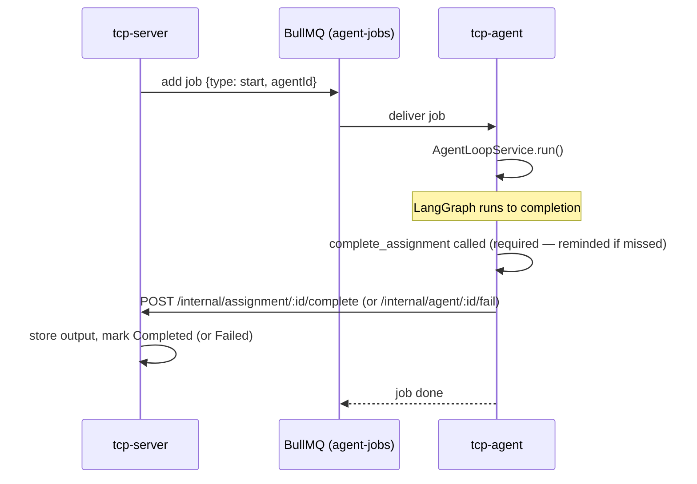
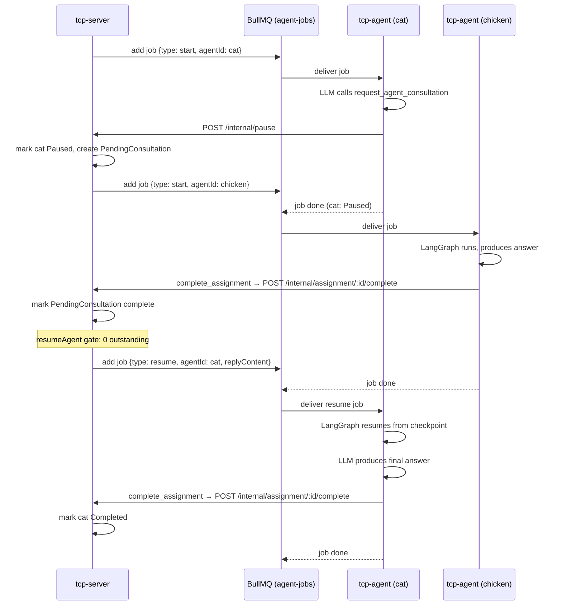
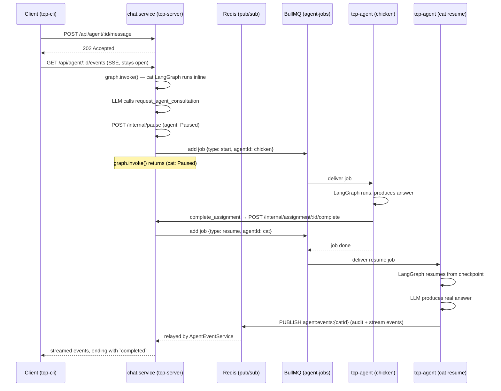
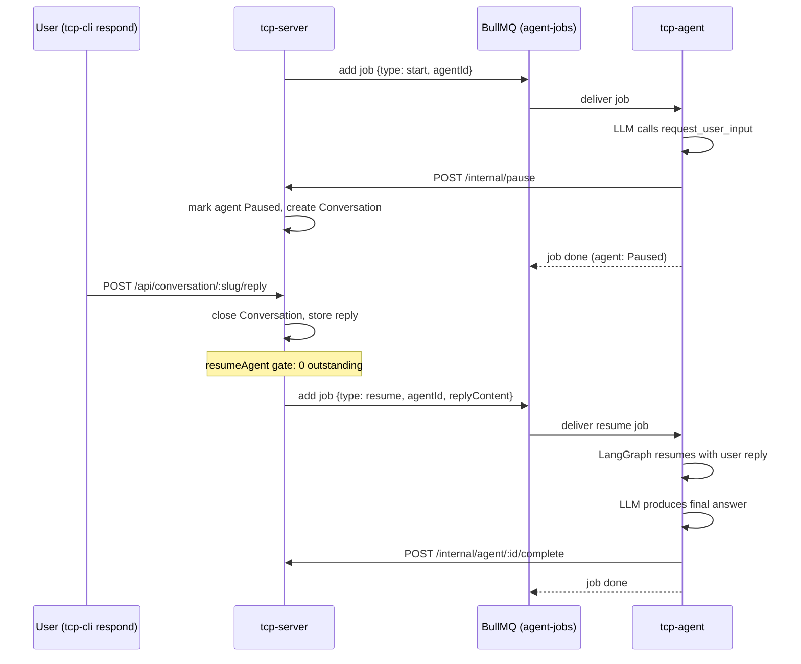

# BullMQ Queue

## Overview

Agent execution is asynchronous: tcp-server enqueues jobs on the **`agent-jobs`**
BullMQ queue, and tcp-agent workers consume them. This is the queue this
document is about.

| Role     | Service    | Component                   |
| -------- | ---------- | --------------------------- |
| Producer | tcp-server | `AgentOrchestrationService` |
| Consumer | tcp-agent  | `AgentWorkerService`        |

A second queue, **`knowledge-reindex`**, is internal to tcp-server — both its
producer and its worker live in `KnowledgeReindexService`, so it never crosses
a service boundary. See
[shared-storage.md → Automatic RAG sync](shared-storage.md#automatic-rag-sync-01022).

## Job types

| `type`   | When dispatched                                               | Payload                                      |
| -------- | ------------------------------------------------------------- | -------------------------------------------- |
| `start`  | New agent created (`AgentOrchestrationService.startAgent`)    | `{ agentId, type: 'start' }`                 |
| `resume` | All outstanding requests resolved (`resumeAgent` gate passes) | `{ agentId, type: 'resume', replyContent? }` |

`replyContent` on a `resume` job is the aggregated text of every consultation
result and user reply received since the agent paused (see
[ADR-012](ADRs/ADR-012-human-in-the-loop.md) for the aggregation logic).

## Use cases

### 1. Standard agent task

The common path: tcp-server enqueues a `start` job, tcp-agent runs the loop
to completion, and records the output.

---

### 2. Agent-to-agent consultation

The calling agent pauses while the called agent runs as a separate job. When
the called agent completes, tcp-server gates the resume on outstanding
requests before re-enqueuing the calling agent.

---

### 3. Chat session with consultation

A chat session (triggered by `POST /api/agent/:id/message`) runs LangGraph
**inline** in tcp-server — no BullMQ job for the calling agent's first turn.
The POST returns `202` immediately and the turn streams over the agent's SSE
event stream; when a consultation tool is called, tcp-server dispatches a BullMQ
job for the called agent as normal. Once that job's chain completes, the calling
agent's resumed run finishes and its terminal `completed` event reaches the
client over the same stream — nothing is held open waiting for it. See
[ADR-015](ADRs/ADR-015-agent-completion-sse.md) for the delivery design and
[ADR-012](ADRs/ADR-012-human-in-the-loop.md) for the pause/resume details.

---

### 4. User-input pause and resume

An agent can pause to ask a human a question. The human replies via the CLI
or API; tcp-server gates the resume on all outstanding requests (same path as
consultation).

## Resume gating

`AgentOrchestrationService.resumeAgent` is the single choke point for all
resume paths (consultation complete, user reply). Before dispatching a
`resume` job it counts outstanding `PendingConsultation` rows with
`status = 'pending'` and `Conversation` rows with `status = 'awaiting_user'`
for the agent. The job is only dispatched when both counts are zero, ensuring
the agent sees every answer it asked for in a single resumed run rather than
resuming prematurely on the first response to arrive.

## Redis pub/sub channels

Redis carries more than the queue. Two unrelated families of channel run
alongside `agent-jobs`, both defined in `@tcp/shared`
(`events/wire-events.ts`, `events/shutdown-channel.ts`):

| Channel                  | Direction              | Carries                                                                                                                |
| ------------------------ | ---------------------- | ---------------------------------------------------------------------------------------------------------------------- |
| `agent:events:{agentId}` | tcp-agent → tcp-server | `WireEvent`s for one agent — persisted audit rows plus live token deltas — relayed onto that agent's SSE stream        |
| `task:events:{taskId}`   | tcp-server → itself    | Task and assignment state changes, relayed onto the task's SSE stream                                                  |
| `company:events:{id}`    | tcp-server → itself    | Company/task state changes, backing the TUI roster's live task list                                                    |
| `tcp:shutdown:command`   | tcp-server → workers   | `drain` \| `force` \| `cancel` (see [ADR-019](ADRs/ADR-019-graceful-shutdown.md))                                      |
| `tcp:shutdown:status`    | workers → tcp-server   | `{ activeAgents }` — the worker's real in-memory count of running loops, which is what lets a drain confirm quiescence |

The earlier `agent:completed:{agentId}` completion signal no longer exists: it
was retired along with the chat long-poll (see
[ADR-015](ADRs/ADR-015-agent-completion-sse.md)), and audit events are now the
single source of truth for both history and live streaming (see
[ADR-008](ADRs/ADR-008-audit-logging.md)).
