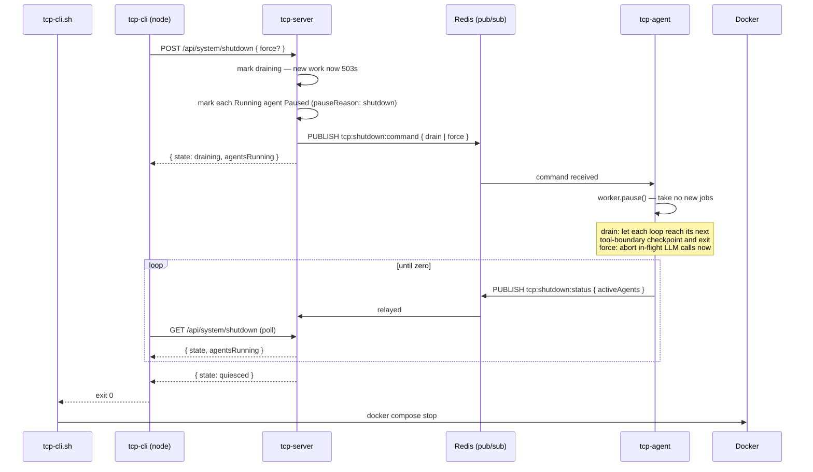

# Services

All services are defined in `docker-compose.yml`. Zitadel is optional and only
starts when the `auth` profile is active (`docker compose --profile auth up`).

## Summary

| Service              | Container name         | Exposed ports                        | Description                                              |
| -------------------- | ---------------------- | ------------------------------------ | -------------------------------------------------------- |
| tcp-server           | `tcp-server`           | 3000                                 | REST API and orchestration layer                         |
| tcp-agent            | `tcp-agent`            | 3001 in-container, 3003¹ on the host | Agent loop runner                                        |
| tcp-mcp-storage      | `tcp-mcp-storage`      | 3010¹                                | Storage MCP server                                       |
| tcp-mcp-memory       | `tcp-mcp-memory`       | 3011¹                                | Memory MCP server                                        |
| tcp-mcp-interactions | `tcp-mcp-interactions` | 3012¹                                | Interactions MCP server                                  |
| tcp-mcp-tasks        | `tcp-mcp-tasks`        | 3013¹                                | Tasks MCP server                                         |
| stub-llm             | `stub-llm`             | 3002¹                                | Configurable stub LLM for tests (profile: `integration`) |
| PostgreSQL           | `postgres`             | 5432                                 | Primary relational store (pgvector extension enabled)    |
| Redis                | `redis`                | 6379                                 | BullMQ broker and pub/sub transport for SSE and shutdown |
| MinIO                | `minio`                | 9000 (API), 9001 (console)           | S3-compatible object storage                             |
| Zitadel              | `zitadel`              | 8080                                 | OIDC identity provider (profile: auth)                   |

¹ Internal-only by default. `start-deployment.sh --dev-ports` publishes these
to the host (needed by the smoke tier and for direct `curl` access).

tcp-agent is the one service whose host port differs from its container port:
it listens on 3001 inside the network, and `--dev-ports` publishes it on
`EXPOSE_PORT_AGENT` (3003 by default, 3004 under `.env.testing`). Publishing it
as 3001 would collide with tcp-server, which `.env.testing` puts on the host's
3001 — and a collision that "works" is worse than one that fails, because the
smoke tier then health-checks tcp-server while reporting it as tcp-agent.

Every TCP service's `GET /health` names itself, under both `info.service.name`
and `details.service.name`:

```json
{
  "status": "ok",
  "info": {
    "service": { "status": "up", "name": "tcp-agent" },
    "database": { "status": "up" }
  },
  "error": {},
  "details": {
    "service": { "status": "up", "name": "tcp-agent" },
    "database": { "status": "up" }
  }
}
```

It is an indicator rather than a field beside `status` so it survives the 503
path too — Terminus throws its document when a check fails, which is when
identifying the responder matters most. The smoke tier asserts it per service,
so a probe aimed at the wrong port fails instead of quietly passing against a
healthy neighbour.

## TCP services

### tcp-server

NestJS REST API. Handles incoming HTTP requests, persists data to PostgreSQL,
enqueues agent tasks via BullMQ, and validates JWT tokens issued by Zitadel.

- **Health:** `GET http://localhost:3000/health` — checks PostgreSQL, Redis, MinIO, and OIDC reachability
- **Depends on:** postgres, redis, minio (all must be healthy before startup)
- **Built from:** the root `Dockerfile`, target `tcp-server`

### tcp-agent

NestJS agent loop runner. Consumes BullMQ jobs from Redis, executes agent steps, and persists results to PostgreSQL and MinIO. Connects to MCP servers over HTTP to load tools for each agent run. See [tcp-agent.md](tcp-agent.md) for configuration and usage.

- **Health:** `GET http://localhost:3003/health` from the host (with `--dev-ports`); `http://tcp-agent:3001/health` inside the network
- **Depends on:** postgres, redis
- **Built from:** the root `Dockerfile`, target `tcp-agent`

### tcp-mcp-storage

NestJS MCP server giving agents read-only exploration of the shared document store plus assignment-scoped working-file and material tools. It holds no S3 client of its own — every action is proxied to tcp-server's `/internal/storage/*` endpoints. Uses the MCP Streamable HTTP transport — stateless, one session per request. See [tcp-mcp-storage.md](tcp-mcp-storage.md) for the tool reference.

- **Health:** `GET http://localhost:3010/health` — static (no dependency of its own to probe)
- **API:** `POST http://localhost:3010/mcp` (MCP JSON-RPC)
- **Depends on:** tcp-server
- **Built from:** the root `Dockerfile`, target `tcp-mcp-storage`

### tcp-mcp-memory

NestJS MCP server for semantic search over episodic memory and role/shared knowledge — `recall`, `remember`, and `search_knowledge`, all backed by pgvector. See [tcp-mcp-memory.md](tcp-mcp-memory.md) for the tool reference.

- **Health:** `GET http://localhost:3011/health` — checks its PostgreSQL connection
- **API:** `POST http://localhost:3011/mcp`
- **Depends on:** postgres
- **Built from:** the root `Dockerfile`, target `tcp-mcp-memory`

### tcp-mcp-interactions

NestJS MCP server for requesting input from human users or consulting other agents by role. See [tcp-mcp-interactions.md](tcp-mcp-interactions.md) for the tool reference.

- **Health:** `GET http://localhost:3012/health` — static (it delegates all writes to tcp-server)
- **API:** `POST http://localhost:3012/mcp`
- **Depends on:** tcp-server
- **Built from:** the root `Dockerfile`, target `tcp-mcp-interactions`

### tcp-mcp-tasks

NestJS MCP server through which an agent completes its assignment — `create_plan`, `complete_assignment`, `assure_assignment`, mode-gated to the agent's assignment mode. Like the other two proxies it owns no state; every transition happens behind tcp-server's `/internal/*` endpoints. See [tcp-mcp-tasks.md](tcp-mcp-tasks.md) for the tool reference.

- **Health:** `GET http://localhost:3013/health` — static
- **API:** `POST http://localhost:3013/mcp`
- **Depends on:** tcp-server
- **Built from:** the root `Dockerfile`, target `tcp-mcp-tasks`

### stub-llm _(profile: integration)_

A configurable stub LLM server that answers `POST /v1/chat/completions` with pre-scripted text and tool calls, so the integration tier can drive a whole agent run deterministically without a real model. Started automatically by the integration tier's Jest global setup. See [tcp-stub-llm](stub-llm.md).

- **Health:** `GET http://localhost:3002/health`
- **Built from:** `apps/tcp-stub-llm/Dockerfile` (its own context — it shares no code with the monorepo)

## Stopping the simulation

Every service is declared `restart: unless-stopped`, so a container that exits
on its own is restarted seconds later. Stopping the simulation therefore means
stopping the _containers_, not signalling the processes.

Two ways to do that, and the difference costs money:

| Command                         | What happens                                                                                                                            |
| ------------------------------- | --------------------------------------------------------------------------------------------------------------------------------------- |
| `./tcp-cli.sh shutdown`         | Drains first: refuses new work, waits for every running agent to finish its current LLM call and pause, then runs `docker compose stop` |
| `./tcp-cli.sh shutdown --force` | Aborts in-flight LLM calls immediately, then stops — **wastes the tokens already spent on those calls**                                 |
| `./scripts/stop-dev.sh`         | Stops (`docker compose down`) straight away, with no drain. Whatever was mid-call loses its work                                        |

Draining is tcp-server's job; halting is the host's. tcp-server exposes
`POST`/`GET`/`DELETE /api/system/shutdown` and never stops a process itself, so
the same drain works when the stack is run outside Docker (`npm run start:dev`)
— you just stop the processes yourself once it reports quiesced. See
[ADR-019](ADRs/ADR-019-graceful-shutdown.md) for why the responsibility is split
this way, and [tcp-cli.md](tcp-cli.md#shutdown) for the flags.

The part worth understanding is why the drain waits on the _worker_ rather than
on the database: marking an agent `Paused` is tcp-server's own write, and says
only that a stop was requested. tcp-agent reports its real in-flight loop count,
and that is what quiescence is measured against.



A `DELETE /api/system/shutdown` at any point cancels the drain and publishes
`cancel`, handing the worker back. Agents the drain already paused stay paused —
resume them explicitly.

Agents paused by a drain keep their LangGraph checkpoints and stay paused
across a restart; resume them explicitly when you are ready to spend tokens
again.

## Third-party services

### PostgreSQL

Image: `pgvector/pgvector:pg16`

The pgvector variant of PostgreSQL 16. The `pgvector` extension enables
vector similarity search, used for agent memory retrieval (see
[ADR-006](ADRs/ADR-006-agent-memory-architecture.md)).

On first startup an init script at `docker/postgres-init/create-databases.sh`
creates a second database (`zitadel`) alongside the default `tcp` database.

- **Credentials:** `POSTGRES_USER=tcp`, password from `POSTGRES_PASSWORD` in `.env`
- **Persistent volume:** `postgres_data`

### Redis

Image: `redis:7-alpine`

Broker for BullMQ task queues. Runs with `--appendonly yes` so the queue
survives container restarts.

- **Persistent volume:** `redis_data`

### MinIO

Image: `pgsty/silo:latest` — [Silo](https://github.com/pgsty/silo), the
community fork of MinIO. `minio/minio` was withdrawn from Docker Hub. Silo
keeps the MinIO API, `MINIO_*` variables and health endpoint, so nothing else
changed. Its bundled client is `mcli`, not `mc`.

S3-compatible object storage for agent artefacts (uploaded files, generated
documents). The web console at port 9001 is useful for inspecting bucket
contents during development.

- **Credentials:** `MINIO_ROOT_USER` / `MINIO_ROOT_PASSWORD` from `.env`
- **Persistent volume:** `minio_data`

### Zitadel _(profile: auth)_

Image: `ghcr.io/zitadel/zitadel:v4.16.1` (pinned, not `:latest`)

OIDC identity provider. Issues JWT tokens that tcp-server validates on
guarded endpoints. Runs its classic embedded login (no separate Login V2
container or reverse proxy) — suitable for local development only.

Zitadel shares the `postgres` container, storing its own configuration in a
`zitadel` logical database created by `docker/postgres-init/create-databases.sh`.

- **Admin console:** `http://localhost:8080/ui/console` — username `admin`, password from `ZITADEL_ADMIN_PASSWORD`
- **OIDC discovery:** `http://localhost:8080/.well-known/openid-configuration`
- **Depends on:** postgres (must be healthy)
- **Setup:** see [docs/zitadel-setup.md](zitadel-setup.md)

> **Note:** the healthcheck runs `["CMD", "/app/zitadel", "ready"]`, not curl —
> the image is a minimal single static Go binary with no shell or curl
> installed. It also needs `ZITADEL_TLS_ENABLED: 'false'` set explicitly: this
> is a separate env var from the `--tlsMode disabled` start flag, which only
> applies to the main server process, not the separate `zitadel ready` CLI
> invocation the healthcheck uses. Without it, `zitadel ready` defaults to
> HTTPS and fails against the plain-HTTP server, leaving the container stuck
> "unhealthy" forever.
