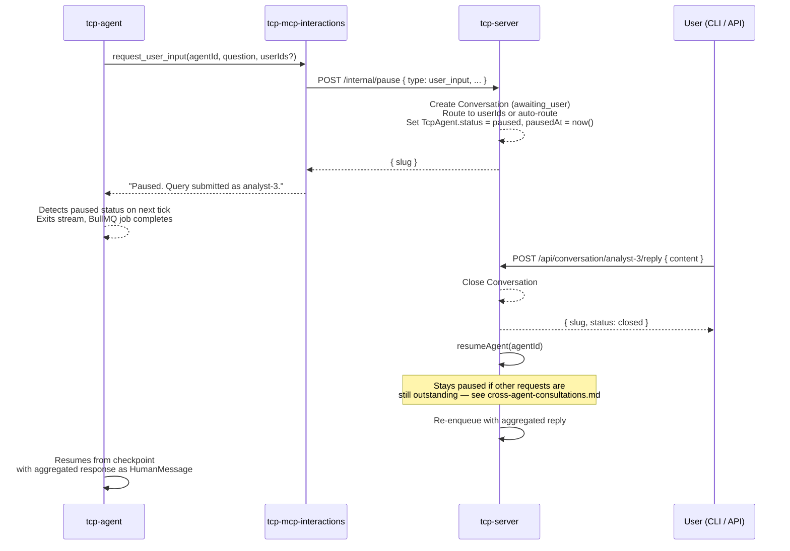

# User Input Conversations

An agent can pause mid-task and ask one or more human users a question, then resume once it gets a reply. This document describes the end-to-end flow.

See [tcp-mcp-interactions.md](tcp-mcp-interactions.md) for the MCP tool reference, [tcp-cli.md](tcp-cli.md) for the CLI commands used to respond, and [cross-agent-consultations.md](cross-agent-consultations.md) for the agent-to-agent equivalent of this flow.

---

## Flow

### 1. Agent requests user input

The agent calls `request_user_input(agentId, companyId, question, context?, userIds?)` on tcp-mcp-interactions. `userIds` (from `list_available_contacts`) targets specific company users directly; if omitted, the question is auto-routed based on its content.

```
Agent ──► interactions__request_user_input
            │
            └──► POST /internal/pause (tcp-server)
                  │
                  ├── Creates Conversation record (slug = role-3, status = awaiting_user)
                  ├── Routes to userIds if given, otherwise auto-routes by
                  │     matching knowledgeDomains / roles against the question
                  └── Sets TcpAgent.status = paused, pausedAt = now()
            │
            ◄── Returns "Paused. Query submitted as analyst-3."
```

### 2. tcp-agent detects the pause

After the tool call returns, tcp-agent checks the agent's status on the next event loop tick. On detecting `paused`, it exits the LangGraph stream cleanly and the BullMQ job completes. No CPU or memory is consumed while the agent waits.

### 3. User sees and responds to the query

```bash
# See all open queries
./tcp-cli.sh list-open-queries

# Read the full question
./tcp-cli.sh read-query analyst-3

# Reply (triggers agent resume)
./tcp-cli.sh respond analyst-3 "The budget is $50,000 for Q3."
```

Or via the API: `POST /api/conversation/analyst-3/reply`

### 4. Agent resumes

tcp-server closes the conversation and calls `AgentOrchestrationService.resumeAgent` — see [Resume conditions](cross-agent-consultations.md#resume-conditions) for when this actually re-enqueues the agent and what's injected as its `HumanMessage`.

### Sequence diagram



---

## Data model

| Entity                | Key fields                                                                                                                                                        |
| --------------------- | ----------------------------------------------------------------------------------------------------------------------------------------------------------------- |
| `Conversation`        | `id`, `slug`, `agentId`, `companyId`, `roleName`, `roleId`, `question`, `context`, `status`, `routedToIdentifiers`, `createdAt`, `closedAt`, `repliesDeliveredAt` |
| `ConversationMessage` | `id`, `conversationId`, `author` (`user`/`agent`), `authorIdentifier`, `content`, `timestamp`                                                                     |

**Slug generation:** `{role-name}-{queryIndex}` where `queryIndex` is an atomic counter on the `TcpRole` entity, incremented in a transaction. This gives stable, human-readable conversation identifiers.

**Routing:** if the agent supplies `userIds`, each id is validated against `CompanyUser` for the company and used directly as `routedToIdentifiers` — a 400 is returned if any id doesn't belong to the company. Otherwise tcp-server matches `knowledgeDomains` and `roles` from `CompanyUser` records against keywords in the question. If no match is found, the query is routed to all owners. If there are no owners, all company users receive it.

---

## API endpoints

| Method | Path                            | Description                                                                                                                 |
| ------ | ------------------------------- | --------------------------------------------------------------------------------------------------------------------------- |
| `GET`  | `/api/conversation`             | List conversations (filter: `status`, `companyId`)                                                                          |
| `GET`  | `/api/conversation/:slug`       | Get full conversation + messages                                                                                            |
| `POST` | `/api/conversation/:slug/reply` | Submit a user reply; triggers agent resume (subject to [resume conditions](cross-agent-consultations.md#resume-conditions)) |
