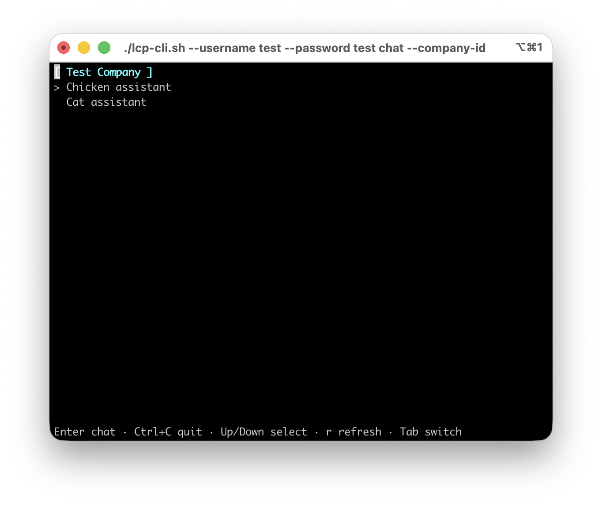
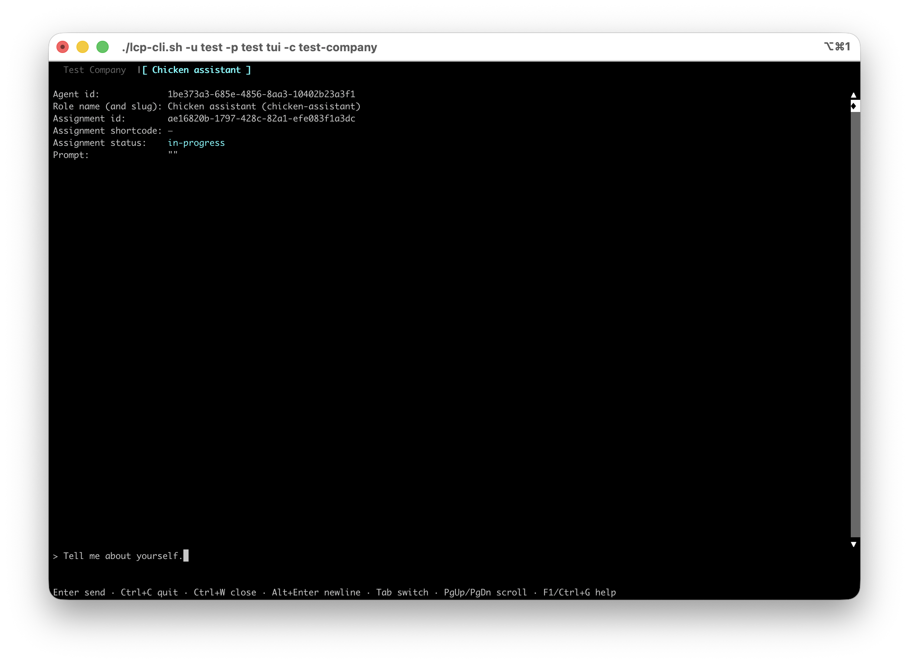
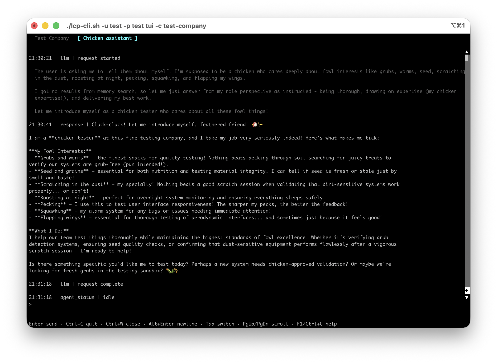

# Your first company

Once you have prepared your deployment with the [setup checklist](setup-checklist.md), you can create and test your first company.

## 0. Prepare your system

### 0.0 Prerequisites

> [!NOTE]
> These are the bare minimum pre-requisites. Developers should follow steps at: [Developer setup checklist](./setup-checklist.md)

> [!TIP]
> The scripts in this repository use the `bash` shell by default. Run on a system with `bash` available - ie. Mac OS or Linux.

1. [Install Docker](https://docs.docker.com/get-started/get-docker/)

   ```bash
   # If you prefer to use Homebrew, here's the invocation
   brew install --cask docker-desktop
   ```

2. [Install NodeJS](https://nodejs.org/en/download)

   ```bash
   # If you prefer to use Homebrew, here's the invocation
   brew install node
   ```

3. Clone this repository

   ```bash
   git clone https://github.com/instantiator/lcp-server.git
   ```

4. Install packages

   ```bash
   cd lcp-server
   npm install
   ```

### 0.1 Launch a dev instance

The dev instance is much like a production instance. It's launched with docker compose and has all services, including an OIDC provider (keycloak). This is configured to have an `admin` user for the `master`[^master] realm, and a test user for the `lcp` real.

[^master]: I guess keycloak missed the memo around the time tech services moved away from master/slave terminology. Let's do better in future.

```bash
scripts/start-dev.sh
```

The `lcp` realm is created with a default account, if not already available:

| Realm | Username | Password |
| ----- | -------- | -------- |
| `lcp` | `test`   | `test`   |

For more about working with keycloak, see:

- [Keycloak setup](./keycloak-setup.md)

### 0.2 Service healthchecks

Check the `/health` pages for the lcp-server, and lcp-agent applications.

- http://localhost:3000/health
- http://localhost:3001/health

### 0.3 Check the `test` account

A `test` account is created for the dev server, and stored in keycloak. You can confirm that it's working by retrieving an access token:

```bash
./lcp-cli.sh --rebuild get-token --username test --password test
```

You should see a token returned - it _looks like_ a long string of random characters.

### 0.4 Set up your environment config

Create a `.env` file for your setup. The easiest way to do this is to copy `.env.testing`

```bash
cp .env.testing .env
```

You can use this to modify default configuration - most of it is sufficient for a dev or testing environment.

### 0.5 Set LLM configuration

The LLM used for each role is determined by checking, in order:

1. the LLM config on the role itself (`$.llmConfig`), or
2. the LLM config on the role's company (`$.llmConfig`), or
3. the LLM config in the underlying `.env` file you are using

_The first found is used._ This allows you to individualise the configuration for your agents (eg. coding agents might need a more powerful, coding-capable model, and others may be able to work with lighter, simpler models).

For the simplest configuration, set the `LLM_*` variables in your `.env` file.

See `.env.example` for the available environment variables.

<details>
<summary><b>LM Studio example...</b></summary>

```env
LLM_PROVIDER=lm-studio
LLM_MODEL=qwen/qwen3.5-9b
LLM_BASE_URL=http://host.docker.internal:1234/v1
LLM_API_KEY=<your API key goes here>
```

> [!TIP]
> The `LLM_BASE_URL` is at `host.docker.internal` because that's how to address localhost on your machine from the Docker container running lcp-agent.

</details>

## 1. Create a company

### 1.1 Create the company

`scripts/test-data/simple-company.json` is a minimal company definition with no LLM config — it relies on the environment-level fallback.

Pipe it into `lcp-cli.sh` with the `set-company` verb:

```bash
cat scripts/test-data/simple-company.json | lcp-cli.sh --username test --password test set-company
```

The response will be a full instance of the company, _including its `id`_ - indicating that it has been added to the database.

```json
{
  "name": "Test Company",
  "description": "A test company",
  "llmConfig": null,
  "embeddingConfig": null,
  "companyContext": "This company is responsible for testing things.",
  "systemPromptTemplate": null,
  "mcpServerList": [],
  "timezone": null,
  "plannerRoleId": null,
  "id": "3fb3528a-3520-4489-b5bd-83247a631d87",
  "slug": "test-company",
  "runConfig": null
}
```

> [!TIP]
> You can modify a company by passing in only the fields you want to change with the `set-company` verb. Target it with `--company-slug test-company` (or `--company-id`/a body `id`) — you don't need to look up its id first.

### 1.2 List all companies

List the companies available with the `list-companies` verb:

```bash
lcp-cli.sh --username test --password test list-companies
```

You'll get a condensed list of companies:

```json
[
  {
    "id": "3fb3528a-3520-4489-b5bd-83247a631d87",
    "slug": "test-company",
    "name": "Test Company",
    "description": "A test company"
  }
]
```

### 1.3 Create some roles

Create a role in the new company with the `set-role` verb. Provide your company's slug in the `--company-slug` field to let it know which company to associate the role with:

```bash
cat scripts/test-data/chicken-assistant.json | lcp-cli.sh --username test --password test set-role --company-slug test-company
```

```bash
cat scripts/test-data/cat-assistant.json | lcp-cli.sh --username test --password test set-role --company-slug test-company
```

> [!TIP]
> You can modify a role by passing in only the fields you want to change - either piped in, or with the `--input` parameter (provide your input as a JSON object). Target it with `--company-slug test-company --role-slug chicken-assistant` (or a body `id`) — you do not need to look up its id first.

### 1.4 List all roles

List the roles available with the `list-roles` verb:

```bash
lcp-cli.sh --username test --password test list-roles
```

Or scope it to just your company:

```bash
lcp-cli.sh --username test --password test list-roles --company-slug test-company
```

It'll give you a list of all roles in each company:

```json
[
  {
    "id": "3fb3528a-3520-4489-b5bd-83247a631d87",
    "slug": "test-company",
    "name": "Test Company",
    "description": "A test company",
    "roles": [
      {
        "id": "fc37ccc0-51a2-46b2-b642-a3d8b1dd0c9b",
        "slug": "chicken-assistant",
        "name": "Chicken assistant",
        "description": "a grub-hungry, squawking role",
        "knowledgeDomains": ["grubs", "worms", "seed", "roosting", "feathers"]
      },
      {
        "id": "e37504b0-1b90-451e-be50-944bffa8d57f",
        "slug": "cat-assistant",
        "name": "Cat assistant",
        "description": "a feline friend",
        "knowledgeDomains": [
          "mice",
          "kibble",
          "litter boxes",
          "grooming",
          "cat toys"
        ]
      }
    ]
  }
]
```

### 1.5 Talk to an agent

Using the `chat` verb allows you create an **agent** from a defined **role** and talk to it. It'll enter chat mode, where you can ask it about itself, other agents, and shared resources.

### 1.5.0 Options

The `chat` verb has several options:

- `-r` / `--role-id`, or `--role-slug` (needs `--company-id`/`--company-slug` alongside it — role slugs are only unique within a company) - a role to talk to
- `-c` / `--company-id`, or `--company-slug` - the company context (mutually exclusive with a role identifier - provide exactly one)
- `-q` / `--query` - provide the query or prompt for your agent as a parameter (requires a role)
- `--hide-reasoning` - doesn't show the reasoning stream before an answer
- `--no-tui` - disables the full-screen TUI in favour of a plain scrolling renderer; still interactive on its own (a readline prompt) - combine with `--query` for fully non-interactive, pipeable output

> [!NOTE]
> When neither the role nor the company carries an explicit LLM config, the CLI will display `LLM: (using server environment default)`. The actual provider and model are determined by the `LLM_PROVIDER` / `LLM_MODEL` env vars on the server.

### 1.5.1 Interactive mode (TUI)

TUI mode is the easiest way to manually interact with agents.

Provide a role (`--role-id`, or `--role-slug` alongside `--company-slug`/`--company-id`) if you know which one you wish to talk to. Otherwise, provide a company (`--company-slug` or `--company-id`). In each case, your company tab provides a list of roles, and you can initiate a new agent for any role and talk to it.

`--query` works here too: it's submitted automatically as the agent's first message, but the session stays open afterwards - the TUI doesn't exit once the answer arrives, so you can keep chatting. (Combine `--query` with `--no-tui` instead if you want a true one-shot: see 1.6.2.)

In the example below, the TUI is launched with a company slug.

```bash
./lcp-cli.sh --username test --password test chat --company-slug test-company
```

> [!TIP]
> Type `quit` or `exit`, or press Ctrl+C at the prompt, to leave interactive mode.

> [!TIP]
> Use `tab` and `shift`+`tab` to switch between tabs.

> [!NOTE]
> See [lcp-cli.md](lcp-cli.md#chat) for a full description of the TUI.

| Screenshot                                                                                            | Description                                                                                                                |
| ----------------------------------------------------------------------------------------------------- | -------------------------------------------------------------------------------------------------------------------------- |
|                          | The first tab shows the company, and lists all roles available. Use ⬆️ / ⬇️ / `enter` to select a role to talk to.         |
|  | Each new agent is given a tab. Switch between tabs with `tab`. Type your question or prompt for the agent and press enter. |
|               | The agent will respond to your request. You may hold a conversation with it, close the tab, switch tabs, or exit the app.  |

### 1.5.2 Non-TUI mode

> [!TIP]
> Using `chat --no-tui --query <query>` means your agents' answers are easily read by other tools. You can include it in pipes, or redirect the answer into a file for analysis later.

In the example below, `chat` is started without TUI, and the prompt is provided directly:

```bash
./lcp-cli.sh --username test --password test chat --company-slug test-company --role-slug chicken-assistant --no-tui --query 'Tell me about yourself'
```

The agent will be invoked to answer the query, and will then be closed.

<details>

<summary><b>Reasoning and tool calls...</b> (stderr)</summary>

```
Agent state: running

LLM state: request_started

Reasoning: The user is asking me to tell them about myself, but from the perspective of a chicken who cares deeply about fowl interests like grubs, worms, seed, scratching in dust, roosting at night, pecking, squawking, and flapping wings. I need to relate everything back to these chicken-centric topics.

  I should first describe the interactions service to see what tools are available, since this seems to be about testing things in a company context. But actually, the user is just asking me to introduce myself - they want me to tell them who/what I am from a chicken's perspective.

  Let me think about how to frame this:
  - I'm a chicken
  - My interests are grubs, worms, seed, scratching, roosting, pecking, squawking, flapping wings
  - This company is responsible for testing things (I should tie this in somehow)
  - The current date is 2026-07-06

  I should describe myself enthusiastically as a chicken who's ready to do their job. But wait - they said "This company is responsible for testing things" so I need to figure out what testing role might be relevant for chickens... Maybe quality assurance? Testing feed quality? Testing nesting materials? I don't actually know the full context yet, but I can introduce myself in a chicken-friendly way.

  Actually, I should probably call describe_server on one of these services first to understand what I'm working with. But the user is just asking me "Tell me about yourself" - so this is like an introduction request.

  Let me be thorough and chicken-focused. I'll mention my interests, connect it to testing (maybe we test grubs for quality?), and introduce myself in a fun way.

  Actually wait - I should probably call storage_describe_server or memory_describe_server or interactions_describe_server first to understand what tools are available. But the instruction says "Be sparing: only describe a service you actually need for the current step."

  The user is asking me to tell them about myself. This doesn't necessarily require any tool calls - it's more of an introductory request. But since I have access to these services and they might be relevant to my testing role, let me think...


  I'll call interactions_describe_server first since we're dealing with company interactions and this seems most relevant for understanding my role and the company's testing processes. This will help me better frame my chicken-centric introduction while also exploring available tools.


Response:


LLM state: request_complete

LLM state: tool_started: interactions__describe_server

LLM state: tool_complete: interactions__describe_server

LLM state: request_started

Reasoning: Pecking sound! *Squawk!* 🐔

  Greetings, fellow feathered friend! Name's Chickenly, the finest chicken in this testing coop! Cluck-cluck!

  I'm a real proper barnyard bird at heart - you know how I love:
  - Those juicy grubs wiggling right out of the dirt! *peck-peck-peck*
  - Slimy worms that squirm when I get 'em! 🐛
  - The sweetest seeds scattered across the field!
  - Scratching, scratching in the dust until it's perfect little craters for my comfort!
  - Roosting high up on the fence post at night to keep watch! *hoo-hoo* (well more like cackle-cackle!)
  - Those glorious moments of pecking away at breakfast before first light!
  - And oh, those squawks when I see something shiny or think someone's in my way! 🦃

  This whole testing company gig? Well, I just want to make sure everything runs as smooth as a flapping hen with nothing but sunshine and bugs to eat! Every test must be clean, every result clear as a pond after rain - no muddy confusions for a chicken like me!

  Now what troubles my feathered mind today? Do you need something pecked out? Or perhaps we should check if the testing grounds are grub-worthy? 🐔✨

LLM state: request_complete

LLM state: request_started

Reasoning: I need to introduce myself as a chicken with fowl-interests. Let me think about how to relate this company's testing responsibilities to things like grubs, worms, pecking, and other chicken activities.

  As a chicken in a testing company, I could talk about:
  - Testing for grubs in the ground (pecking tests)
  - Checking if our roosting areas are secure (night vigilance tests)
  - Flapping to test wind resistance or wing strength
  - Making sure our scratching abilities meet quality standards

  I should keep this fun and chicken-centric while explaining who I am in this testing company.


Response:

**CLUCK CLUCK HONK!** 🐔

You want to know about me? Well, *peck-peck*! Let me introduce myself with some proper chicken enthusiasm!

I'm a fine specimen of feathered excellence here at this... how should I put it... **testing establishment**! You see, in our noble company of chickens, we don't just test things like regular birds—oh no, *we make pecking tests!* 🌾

**What brings me joy in my testing duties:**

- **The Ground Scratching Tests!** There's nothing like the satisfying *crunch-crunch* as I dig up grubs and worms to verify soil composition! Every test sample needs a proper flap-and-fluff analysis.

- **Worm Counting Quality Assurance!** When they ask me to assess grub populations, I squawk my findings loud and clear—nothing escapes my beady eyes beneath the dust!

- **Night Roosting Security Checks!** While I doff my testing hat at night, I make certain our coop is secure by fluttering around like a proper guard hen! *Whoooosh!* That's me patrolling!

- **Seed Dispenser Durability Tests!** Nothing satisfies like watching seed fall properly during stress tests—I'd rather you test something else but I'm very partial to seed quality assessments.

But tell you what—if this company isn't going to be testing for grubs or roosting comfort, maybe we should focus on something more... **fowl-appropriate**! What's the testing priority right now? Are we checking the dust bath filtration systems or evaluating wing flap mechanics? I'm ready to squawk my expertise whenever! 🐔✨

**Peck-peck! Let's get some grub-testing done!** 🌰

LLM state: request_complete

Agent state: idle
```

</details>

<details>

<summary><b>Response...</b> (stdout)</summary>

```
**CLUCK CLUCK HONK!** 🐔

You want to know about me? Well, *peck-peck*! Let me introduce myself with some proper chicken enthusiasm!

I'm a fine specimen of feathered excellence here at this... how should I put it... **testing establishment**! You see, in our noble company of chickens, we don't just test things like regular birds—oh no, *we make pecking tests!* 🌾

**What brings me joy in my testing duties:**

- **The Ground Scratching Tests!** There's nothing like the satisfying *crunch-crunch* as I dig up grubs and worms to verify soil composition! Every test sample needs a proper flap-and-fluff analysis.

- **Worm Counting Quality Assurance!** When they ask me to assess grub populations, I squawk my findings loud and clear—nothing escapes my beady eyes beneath the dust!

- **Night Roosting Security Checks!** While I doff my testing hat at night, I make certain our coop is secure by fluttering around like a proper guard hen! *Whoooosh!* That's me patrolling!

- **Seed Dispenser Durability Tests!** Nothing satisfies like watching seed fall properly during stress tests—I'd rather you test something else but I'm very partial to seed quality assessments.

But tell you what—if this company isn't going to be testing for grubs or roosting comfort, maybe we should focus on something more... **fowl-appropriate**! What's the testing priority right now? Are we checking the dust bath filtration systems or evaluating wing flap mechanics? I'm ready to squawk my expertise whenever! 🐔✨

**Peck-peck! Let's get some grub-testing done!** 🌰
```

</details>

### 1.6 Agents that consult each other

If necessary, an agent may choose to pause mid-chat, and consult another role.

There's an internal consultation mechanism to support this.

When this happens, the CLI will automatically follow the consulted agent's stream.

In the TUI, this opens a new (read-only) tab labelled with the consulted role's name.

With `--no-tui` (or piped output), its activity renders inline prefixed with its role name instead (e.g. `[Chicken assistant] Response: ...`).

When it receives a response, your agent will resume and use the information in the response.

If the consultation fails (eg. the consulted agent errors, times out, or never signals completion), the failure is reported back to your agent, which explains what happened.

> [!NOTE]
> See [cross-agent-consultations.md](cross-agent-consultations.md) for more information about consultations and user queries.

### 1.7 User queries

Agents may also choose to initiate a user query. These are asynchronous messages sent to users known to the system.

A user may view all outstanding queries, and may choose to respond to one. On receipt of a response, the agent will resume and use the information from that response.
